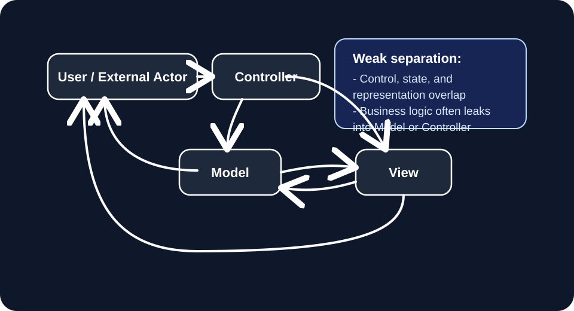
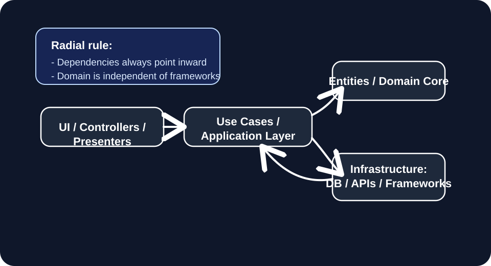
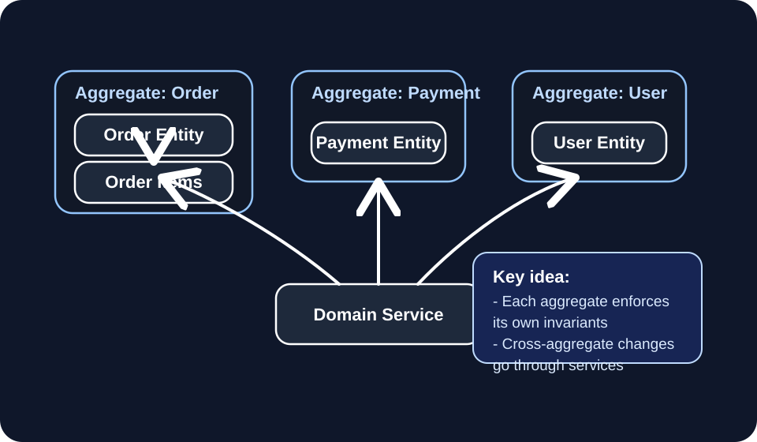
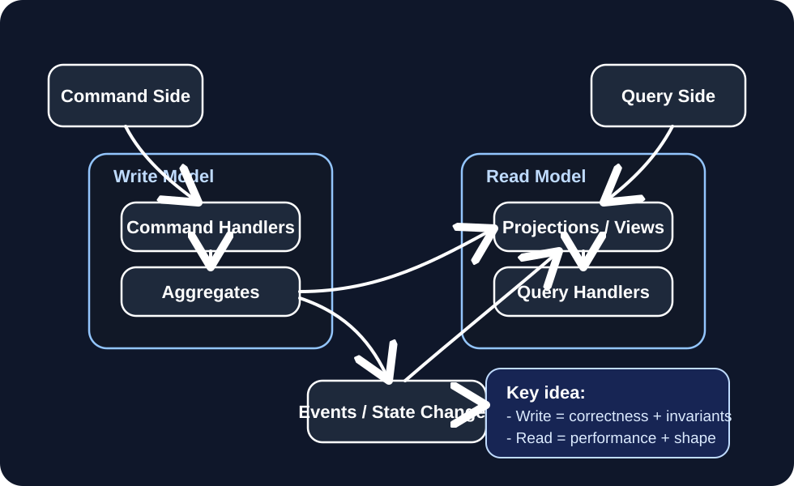

Below is a **single unified mental model** that shows how MVC, Clean Architecture, DDD, and CQRS differ by **what they “separate” in the system’s control graph**.

The key idea is:

> All architectures are just different ways of partitioning **state, control, and representation boundaries**.

---

# 1. Canonical mental diagrams (Mermaid)

## (A) MVC — weak separation across all 4 axes

Everything is still entangled around a single request flow.

### Key property:

* Controller orchestrates everything
* Model becomes mixed state + logic
* View sometimes reads model directly

> **No strict boundary guarantees**

---

## (B) Clean Architecture — strong radial separation

Everything flows inward toward domain truth.

### Key property:

* Domain is isolated from IO + frameworks
* Use cases orchestrate domain logic
* Infrastructure is replaceable

> **Separation of dependency direction**

---

## (C) DDD — strong state boundary separation (aggregates)

Focus is not layers, but **consistency boundaries in state space**.

### Key property:

* Hard boundary around state consistency
* Mutation is local to aggregates
* Cross-boundary logic is explicit

> **Separation of state ownership domains**

---

## (D) CQRS — strong representation + transition split

Write model ≠ read model.

### Key property:

* Dual model system
* Event or sync bridge between them
* Optimized separately

> **Separation of “changing state” vs “observing state”**

---

# 2. Compression comparison table

## Core philosophy + problem solved + when to use

| Pattern            | Core Philosophy                                                        | What it separates                    | Problem it solves                             | Real-world use cases                                           |
| ------------------ | ---------------------------------------------------------------------- | ------------------------------------ | --------------------------------------------- | -------------------------------------------------------------- |
| MVC                | “Keep UI, logic, data structured together enough to move fast”         | Weak separation of UI / logic / data | Simple UI-driven app structure                | CRUD apps, dashboards, monolith web apps                       |
| Clean Architecture | “Dependency direction must not corrupt domain truth”                   | IO vs application vs domain          | Framework coupling, long-term maintainability | SaaS backends, enterprise systems, evolving APIs               |
| DDD                | “Business complexity must live inside explicit consistency boundaries” | State ownership (aggregates)         | Complex business rules, invariant explosion   | Fintech, logistics, trading, booking systems                   |
| CQRS               | “Reading and writing are fundamentally different workloads”            | Representation vs mutation           | Read scaling, model conflict, performance     | High-scale systems, analytics-heavy apps, event-driven systems |

---

# 3. One-line intuition compression

## MVC

> “Organize code so requests don’t look chaotic”

---

## Clean Architecture

> “Make business logic independent of everything else”

---

## DDD

> “Make correctness local to explicit state boundaries”

---

## CQRS

> “Separate thinking (writes) from seeing (reads)”

---

# 4. Unified meta-model (deep insight)

All four are solving the same underlying system:

> a directed graph of **state transitions + observations + control flow**

They differ only in what they treat as the *primary axis of decomposition*:

| Axis                 | Who optimizes it |
| -------------------- | ---------------- |
| Control flow         | MVC / Clean      |
| Dependency direction | Clean            |
| State consistency    | DDD              |
| Read/write asymmetry | CQRS             |

So:

> They are not competing architectures — they are **orthogonal constraint systems over the same underlying computation graph**.

---

# 5. Practical decision heuristic (how to choose in real systems)

If you're designing something:

### Step 1: Is the system simple CRUD/UI?

→ MVC or lightweight Clean

### Step 2: Will it evolve over years with many teams?

→ Clean Architecture

### Step 3: Does business correctness matter more than speed?

→ DDD (aggregates first)

### Step 4: Is read load or query complexity dominant?

→ CQRS

### Step 5: Is it AI / agent / tool system?

→ Clean + CQRS + selective DDD

---

# 6. Final compression (single sentence)

> MVC organizes structure, Clean Architecture enforces dependency direction, DDD enforces state correctness boundaries, and CQRS splits cognition (write) from perception (read).

---

If you want next step, I can compress this further into a **single “LLD architecture selection decision tree” that tells you exactly which one to use given a problem description in interviews or real system design.**
