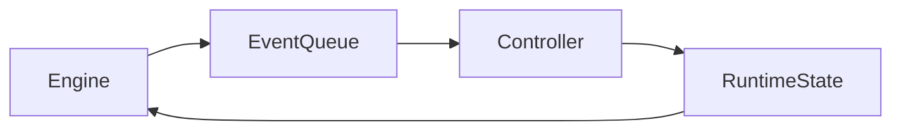

These are exactly the right questions. I'll answer them from a systems-design perspective rather than just an OCaml perspective.

---

# 1. Your controller is already much closer to FP than OOP

You said

> I'm doing `controller.func(state, event)` and an engine runs the controller.

That is **not** the controller pattern people criticize.

What people criticize is

```rust
controller.start();
controller.stop();
controller.pause();
controller.resume();
```

where the controller *owns* hidden mutable state.

Your design is closer to

```rust
fn step(
    &self,
    state: &mut RuntimeState,
    event: Event,
)
```

or even

```rust
fn step(
    state: RuntimeState,
    event: Event,
) -> RuntimeState
```

The engine owns the loop.



This is basically an interpreter.

Algebraically

Let

* (S) = states
* (E) = events

Your controller is

$$
\delta : S \times E \rightarrow S
$$

while the engine computes

$$
\delta(e_n)\circ\cdots\circ\delta(e_2)\circ\delta(e_1)(s_0).
$$

So your controller is really an **algebra** for the event functor.

I actually think that's a very clean design.

---

# 2. Why have a controller object at all?

You asked

> what if my controller needs to exist because i'm existing in a functional loop

Exactly.

Pure FP doesn't require the transition function to be literally a free function.

Suppose the controller contains configuration

```rust
struct Controller {
    parser: Parser,
    validator: Validator,
}
```

then

```rust
controller.step(state,event)
```

is mathematically

$$
(\text{Controller},S,E)\rightarrow S
$$

The controller is simply an immutable environment.

Equivalent to

```haskell
Reader Controller
```

or

```ocaml
let step controller state event
```

So having a controller object is perfectly reasonable if it stores immutable dependencies or strategy. It becomes problematic only if it also becomes the owner of the mutable application state.

---

# 3. Phantom types

This is one of the nicest type-level techniques.

Suppose

```rust
struct Connected;
struct Disconnected;
```

These are **marker types**.

Then

```rust
struct Socket<State> {
    fd: RawFd,
    _marker: PhantomData<State>,
}
```

Notice

```
State
```

is never stored.

Memory layout

```
Socket<Connected>

fd

Socket<Disconnected>

fd
```

Exactly identical.

The compiler simply treats them as different types.

---

Now define

```rust
impl Socket<Disconnected> {
    fn connect(self)
        -> Socket<Connected>;
}
```

and

```rust
impl Socket<Connected> {
    fn send(...);
}
```

Now

```rust
socket.send(...)
```

fails to compile until

```rust
connect()
```

has been called.

No runtime check.

---

Algebraically

Instead of

$$
Socket \times Bool
$$

where

```
connected = true
```

or

```
false
```

you define two separate sets

$$
Socket_{Disconnected}
$$

and

$$
Socket_{Connected}
$$

and

$$
connect :
Socket_{Disconnected}
\rightarrow
Socket_{Connected}
$$

Illegal transitions literally do not exist.

This is much stronger than checking a Boolean.

---

# 4. Combinators

A combinator is simply

> a function whose purpose is to compose other functions.

Example

```rust
iter
    .filter(...)
    .map(...)
    .take(...)
    .collect()
```

Every one is a combinator.

They don't solve the problem directly.

They build larger computations.

Suppose

$$
A
\xrightarrow{f}
B
\xrightarrow{g}
C

```

A combinator builds

$$
g\circ f.
$$

Rust has combinators everywhere.

```

map

filter

fold

and_then

or_else

inspect

flatten

zip

chain

````

Even

```rust
Option::map
````

is a combinator.

---

# 5. First-class modules

Normal modules

```rust
mod auth;
mod storage;
```

are compile-time namespaces.

You cannot write

```rust
let m = auth;
```

Rust modules are **not values**.

---

OCaml can make modules behave almost like values.

Conceptually

```
module Storage = ...
```

can later become

```
storage_impl
```

passed into functions.

So instead of

```rust
trait Storage { ... }
```

they may pass an entire implementation.

It is similar in spirit to passing a trait object, but the abstraction lives at the module level rather than the object level.

---

# 6. Incremental computation

No.

It is **runtime**, not compile time.

Suppose

```
A

↓

B

↓

C
```

where

```
C = B + 1

B = A * 2
```

Initially

```
A = 3

B = 6

C = 7
```

Now

```
A = 4
```

Normal evaluation

```
compute A

compute B

compute C
```

Incremental

```
A changed

↓

only recompute B

↓

only recompute C
```

Suppose instead

```
A
 \
  \
   D

↓

B

↓

C
```

Changing

```
D
```

doesn't touch

```
B
```

This is a dependency graph.

Jane Street's Incremental library maintains this graph at runtime and propagates only the affected changes. It is analogous to spreadsheet recalculation or modern reactive UI frameworks.

---

# 7. Why Async instead of callbacks?

Callbacks

```
download(
    |x|
        parse(
            x,
            |y|
                process(...)
        )
)
```

become deeply nested.

Composition becomes difficult.

---

Async represents a computation as a value.

Instead of

```
download()
```

you have

```
Deferred<File>
```

which means

> "a file that will exist later."

Then

```ocaml
let%bind file = download ()
```

or in Rust

```rust
let file = download().await;
```

Algebraically,

instead of

$$
A

```

you work in

$$
T(A),
$$

where \(T\) is a computation functor (often modeled as a monad). Functions compose inside this context without exposing callback plumbing.

---

# 8. Why Async instead of threads?

Threads model

```

CPU ownership

```

Async models

```

computation waiting

````

If 10,000 network requests are waiting on I/O:

- OS threads typically require many kernel-managed stacks and context switches.
- Async tasks are lightweight state machines suspended until they can make progress.

Mathematically, both represent computations, but they differ in scheduling:

- **Threads:** the operating system schedules execution.
- **Async:** a user-space executor schedules resumable computations.

So the scheduler changes from

$$
OS : Threads \rightarrow CPU
$$

to

$$
Executor : Future(A) \rightarrow A
$$

when each future becomes ready.

---

# 9. How this fits your architecture

Based on the runtime architecture you've been describing, I would structure it as:

```mermaid
flowchart LR

Engine --> EventQueue
EventQueue --> Controller
Controller --> RuntimeState
Controller --> Effects
Effects --> Engine
````

where

* **Engine** owns the event loop.
* **Controller** is an immutable interpreter of events.
* **RuntimeState** is the mutable or persistent state being evolved.
* **Effects** describe I/O or external actions, which the engine executes before producing more events.

This keeps the controller close to a pure algebra

$$
\delta : S \times E \rightarrow (S,; \text{Effects}),
$$

while the engine remains responsible for orchestration. That separation is very much in line with the architecture used in many functional systems, even if your implementation language is Rust rather than OCaml.
