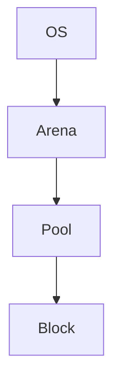

The intent is to understand the **algorithmic design patterns** underlying memory allocators. These patterns are far more general than memory management—they appear throughout databases, operating systems, distributed systems, networking, storage engines, and software engineering.

## The optimization problem

A general allocator tries to optimize several competing objectives:

$$
\min {
\text{allocation latency},
\text{fragmentation},
\text{memory overhead},
\text{OS calls},
\text{cache misses},
\text{lock contention}
}
$$

subject to

$$
\text{correctness} \land
\text{safety} \land
\text{bounded memory}.
$$

No allocator is optimal for every workload, so different algorithms optimize different trade-offs.

---

# 1. Amortization

**Idea**

Pay one expensive cost, then spread it across many cheap operations.

Mathematically,

if one expensive operation costs

$$
O(k)
$$

and serves (k) future operations,

then the average cost becomes

$$
\frac{O(k)}{k}=O(1).
$$

### Memory example

Instead of

```text
malloc()
malloc()
malloc()
malloc()
```

do

```text
malloc(1 MB)

↓

serve 20,000 allocations
```

One expensive OS call replaces thousands.

---

### Industry examples

* CPython arenas
* JVM heap expansion
* Go heap
* Rust `Vec`
* C++ `std::vector`
* Database page allocation
* Network packet batching
* Kafka fetch batches
* GPU command buffers

This is one of the most universal optimization techniques in systems.

---

# 2. Size Classes

Instead of allowing arbitrary sizes,

```text
13
14
17
19
22
```

normalize them

```text
16
16
24
24
24
```

Benefits

* simple indexing
* constant-time lookup
* reduced fragmentation

Used in

* `pymalloc`
* `jemalloc`
* `tcmalloc`
* `mimalloc`
* kernel slab allocators

---

# 3. Free Lists

Maintain reusable objects.

Instead of

```text
free()

↓

OS
```

store

```text
Block

↓

Block

↓

Block
```

Next allocation pops one.

Complexity

$$
O(1)
$$

Used in

* memory allocators
* object pools
* database page caches
* connection pools

---

# 4. Segregated Storage

Separate objects by type or size.

Instead of

```text
16
128
24
40
512
```

organize

```text
Pool A

16

Pool B

32

Pool C

64
```

Benefits

* predictable layout
* better cache locality
* less fragmentation

Used in

* `pymalloc`
* Linux slab allocator
* `jemalloc`
* `mimalloc`

---

# 5. Slab Allocation

Pre-build objects of one type.

Example

```text
TCP Socket

↓

Slab

↓

Socket
Socket
Socket
Socket
```

Every allocation becomes

```text
pop()

instead of

construct()
```

Used heavily by operating systems.

Examples

* Linux kernel
* BSD kernel
* networking stacks
* inode caches

---

# 6. Buddy Allocation

Memory splits recursively.

Example

```text
1024 KB

↓

512 + 512

↓

256 + 256
```

When neighbors become free,

```text
256 + 256

↓

512
```

Advantages

* easy merging
* logarithmic complexity

Disadvantages

* internal fragmentation

Used by

* Linux page allocator
* embedded systems
* GPU drivers

---

# 7. Best Fit / First Fit / Next Fit

These are classic allocation algorithms.

Suppose

```text
Free

100
50
20
70
```

Need

```text
30
```

### First Fit

Take the first large enough.

Fast.

---

### Best Fit

Find the smallest adequate block.

Less wasted memory.

Slower.

---

### Worst Fit

Take the largest block.

Rarely used today.

---

Used in

* classic `malloc`
* embedded allocators
* teaching allocators

---

# 8. Bump Allocation

Simplest allocator.

Maintain one pointer.

```text
□□□□□□□□□□□□
^

allocate

□□□□□□□□□□□□
    ^
```

Never reuse memory until reset.

Complexity

$$
O(1)
$$

Used by

* compilers
* parsers
* AST construction
* game engines
* Rust arena crates

---

# 9. Object Pools

Instead of repeatedly creating

```text
Connection

↓

destroy

↓

Connection

↓

destroy
```

Reuse

```text
Pool

↓

checkout

↓

return
```

Used for

* database connections
* HTTP clients
* thread pools
* worker pools
* game bullets
* particle systems

---

# 10. Caching

Recently freed memory is likely to be reused.

Example

Thread cache.

Instead of

```text
Thread

↓

Global allocator
```

maintain

```text
Thread

↓

Local cache
```

Reduces locking.

Used by

* `jemalloc`
* `tcmalloc`
* `mimalloc`

---

# 11. Locality Optimization

Keep related objects together.

Instead of

```text
A

...

B

...

C
```

allocate

```text
ABCABCABC
```

Benefits

* fewer cache misses
* fewer TLB misses
* better prefetching

Critical for

* databases
* game engines
* scientific computing

---

# 12. Lazy Initialization

Don't allocate until needed.

Instead of

```text
start

↓

allocate 500 MB
```

wait until

```text
first use

↓

allocate
```

Used everywhere.

Examples

* JVM
* Python modules
* caches
* page tables

---

# 13. Recycling

Instead of destroying objects,

reset them.

Example

```text
HTTP Request

↓

reset()

↓

reuse
```

Common in

* web servers
* parsers
* protobuf
* networking

---

# 14. Lock-Free Allocation

Avoid mutexes.

Instead of

```text
Thread

↓

Mutex

↓

Allocator
```

use atomic operations.

Benefits

* high throughput
* lower latency

Used by

* modern allocators
* lock-free queues
* concurrent hash tables

---

# 15. Hierarchical Allocation

This is exactly what `pymalloc` uses.



Each level solves a different scale of the problem:

* **OS:** acquires virtual memory.
* **Arena:** amortizes expensive OS allocations.
* **Pool:** organizes memory by size class and tracks free space.
* **Block:** is the unit returned to the application.

This hierarchical decomposition is common in systems design.

---

# Category-theoretic perspective

Many of these techniques can be viewed as **structure-preserving decompositions**. Let:

* (R) be the set of allocation requests,
* (S) be normalized size classes,
* (P) be pools,
* (A) be arenas.

A typical allocation pipeline factors into composable maps:

$$
R
\xrightarrow{\text{round}}
S
\xrightarrow{\text{lookup}}
P
\xrightarrow{\text{allocate}}
B.
$$

Each stage reduces complexity by restricting the search space before the next stage. This "factor a hard problem into simpler morphisms" pattern appears well beyond memory management.

---

# Where these ideas reappear across industry

| Pattern                 | Memory allocators     | Databases                  | Distributed systems      | Networking           | ML / AI                        |
| ----------------------- | --------------------- | -------------------------- | ------------------------ | -------------------- | ------------------------------ |
| Amortization            | Arenas                | WAL batching               | Kafka batching           | Packet batching      | GPU kernel launches            |
| Size classes            | Pools                 | Fixed-size pages           | Message buckets          | MTU buckets          | Tensor bucketization           |
| Free lists              | Blocks                | Free pages                 | Worker reuse             | Buffer pools         | Tensor reuse                   |
| Object pools            | Reuse objects         | Connection pools           | Thread pools             | Socket pools         | Inference worker pools         |
| Bump allocation         | Arena allocators      | Query execution arenas     | Temporary state          | Packet parsing       | Computation graph construction |
| Hierarchical allocation | Arena → Pool → Block  | Tablespace → Page → Record | Cluster → Node → Process | NIC → Queue → Buffer | Device → Memory pool → Tensor  |
| Locality optimization   | Cache-friendly layout | Page clustering            | Data partitioning        | Ring buffers         | Contiguous tensors             |
| Lock-free algorithms    | Concurrent allocators | Lock-free indexes          | Queues                   | Ring buffers         | Work-stealing schedulers       |

These are not merely "memory algorithms"; they are recurring **systems design patterns**. Once you recognize them in allocators, you'll start seeing the same principles—amortization, partitioning, indexing, reuse, locality, and hierarchical decomposition—in high-performance software across databases, operating systems, storage engines, networking, and distributed systems.
