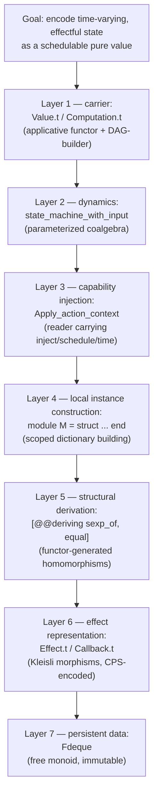

Intent, stated precisely: you want a **decomposition of the abstraction inventory** actually instantiated across those five snippets — not the four generic OCaml mechanisms from earlier, but the specific ones Bonsai code repeatedly reaches for — with each one's *use pattern* pinned down, not just its definition.

Funneling from the top: everything in these snippets serves one goal — *"represent a piece of interactive, effectful, time-varying state as a pure value that Bonsai's incremental engine can schedule."* Every abstraction below is a means to that end, at a specific layer.

## Layer 1 — `Value.t` as an applicative functor, `Computation.t` as its DAG-building monad

**Where used:** every `let%map`, `let%arr`, `Bonsai.both`, and the top-level `graph` parameter threaded through all five snippets.

**Formalization.** $\mathrm{Value}$ equips a functor $F : \mathbf{Set} \to \mathbf{Set}$, $F(A) = \mathrm{Value}(A)$, with
$$\mathrm{map2} : \mathrm{Value}(A) \times \mathrm{Value}(B) \to \mathrm{Value}(A \times B)$$
satisfying the applicative laws (identity, composition, interchange) — this is what lets `let%map store = store_value and interactive = interactive_value in ...` build a *product in the category of incremental values* without ever leaving Layer 1. `Computation.t` sits one level up: it's the monad whose `bind` is graph-construction itself (composing DAG fragments), and `graph` (of type `Bonsai.graph`, a linear witness per the ICFP note) is the *token proving you're currently inside the graph-building phase* — every primitive that allocates state (`Bonsai.state_machine_with_input`, `Bonsai.Edge.on_change'`) demands it as a capability parameter, not because it's data, but because it's a **linear proof obligation**: you cannot call these outside phase-1 construction.

## Layer 2 — `state_machine_with_input` as a parameterized coalgebra

**Where used:** `mirror'` (via `Edge.on_change'`, a degenerate case), `effect_throttle`, `pipe`, `state_machine1_dynamic_model`.

**Formalization.** Already given as $\delta : Q \times \Sigma \times \mathrm{Ctx} \to Q \times \mathrm{Eff}(\Sigma)$ — the *reusable* move across all four snippets is that they never write a bespoke incremental primitive; they specialize this **one** signature by choosing $Q$, $\Sigma$, and the guard structure on $\delta$. This is the textbook move of building a family of automata as instances of a single **parameterized coalgebra functor** $\mathrm{SM}(Q, \Sigma) = \{ \delta : Q \times \Sigma \to Q \times \mathrm{Eff}(\Sigma) \}$, rather than five unrelated state-machine implementations.

## Layer 3 — `Apply_action_context` as a capability-carrying reader

**Where used:** `ctx` in `effect_throttle`'s `apply_action`; `context` in `pipe`'s `apply_action`.

**Formalization.** $\mathrm{Ctx}$ bundles three morphisms as a record of capabilities:
$$\mathrm{Ctx} = \{\, \mathrm{inject} : \Sigma \to \mathrm{Eff}(\mathrm{unit}),\;\; \mathrm{schedule\_event} : \mathrm{Eff}(\mathrm{unit}) \to \mathrm{unit},\;\; \mathrm{time\_source} : \mathrm{TimeSource} \,\}$$
This is the **Reader-pattern**: instead of a global ambient effect system, the capability to re-inject an action into *this specific* state machine is passed as an explicit value, so `perform_effect` in `effect_throttle` can build `run_effect_and_wait = effect input >>= inject Resolve_effect >>= sleep >>= inject Finish_sleep` — a Kleisli composition entirely *closed over* the capabilities `ctx` provides, with no ambient mutable global.

## Layer 4 — local `module M = struct ... end` as scoped dictionary construction

**Where used:** `mirror'`'s `M`/`M2`, `pipe`'s `Model`/`Action`.

**Formalization.** This is *not* the parametric functor from your earlier question — no configuration is passed in. It's the other classical use of modules: given a locally abstract type `(type m)` bound by the enclosing function, construct on the fly a structure
$$M \;\in\; \mathrm{Mod}(\text{sig } t; \; sexp\_of\_t : t \to \mathrm{Sexp}; \dots\text{ end})$$
scoped to that single call of `mirror'`. Since OCaml has no ambient typeclass resolution, this is the idiomatic substitute: **build the dictionary (the record of operations for type `m`) as an anonymous module, right where it's needed**, then hand it to a downstream function (`Bonsai.Edge.on_change'`) that's polymorphic over "any type with these operations." Set-theoretically it's exactly instantiating $\mathrm{Mod}(S)$ at a single point of use rather than exposing a named, reusable element of that set.

## Layer 5 — `[@@deriving sexp_of, equal]` as compiler-synthesized homomorphisms

**Where used:** `M2.t` in `mirror'`; `Model.t`, `Action.t` in `pipe`.

**Formalization.** Given a type built as a product/coproduct of fields, the deriver synthesizes, *without you writing them*, the canonical structural maps
$$\mathrm{sexp\_of\_t} : t \to \mathrm{Sexp}, \qquad \mathrm{equal\_t} : t \times t \to \mathbb{B}$$
compositionally from the same maps on the constituent fields — i.e. it's a **functor on the category of type definitions**: it takes the *shape* of a type (its product/sum structure) and produces the corresponding structure-preserving map into `Sexp` (a free term algebra) or into $\mathbb{B}$ (an equality congruence). This is why `M2.t = { store : model option; interactive : model option }` gets an `equal` that's automatically $\mathrm{Option.equal}\ M.equal$ applied fieldwise — the deriver is literally computing the homomorphism a mathematician would call "extend equality to the product/option functor pointwise."

## Layer 6 — `Effect.t` / `Callback.t` as CPS-encoded Kleisli morphisms

**Where used:** `perform_effect` in throttle; the entire `previous`/`run` module; `respond_to` in `pipe`.

**Formalization.** $\mathrm{Effect}(A)$ is not run eagerly — it's a *description*, i.e. an element of $\mathrm{Eff}(A) \cong (A \to \mathrm{unit}) \to \mathrm{unit}$, the classic **continuation-passing encoding** of a Kleisli morphism $\mathrm{unit} \to T(A)$. `Effect.Private.make ~evaluator` is precisely defining this function-of-a-continuation directly; `Callback.respond_to` is invoking the stored continuation once a value becomes available — this is what lets `pipe`'s `dequeue` block *without* Bonsai needing threads: the "blocking" is just a continuation sitting in `queued_receivers` until `Add_action` supplies its argument.

## Layer 7 — `Fdeque` as a free monoid used as persistent queue state

**Where used:** `pipe`'s `Model.t`.

**Formalization.** $\mathrm{Fdeque}(A)$ is (up to the front/back ends both being efficient) the free monoid on $A$, $(A^{*}, \mathbin{+\!\!+}, \varepsilon)$, realized persistently (immutably) so that `Fdeque.enqueue_back`/`dequeue_front` return *new* values rather than mutating — this matters causally because Bonsai's model must be an immutable, comparable value the incremental engine can diff between frames; a mutable OCaml `Queue.t` would break the state-machine contract that $\delta$ is a pure function $Q \times \Sigma \to Q$.