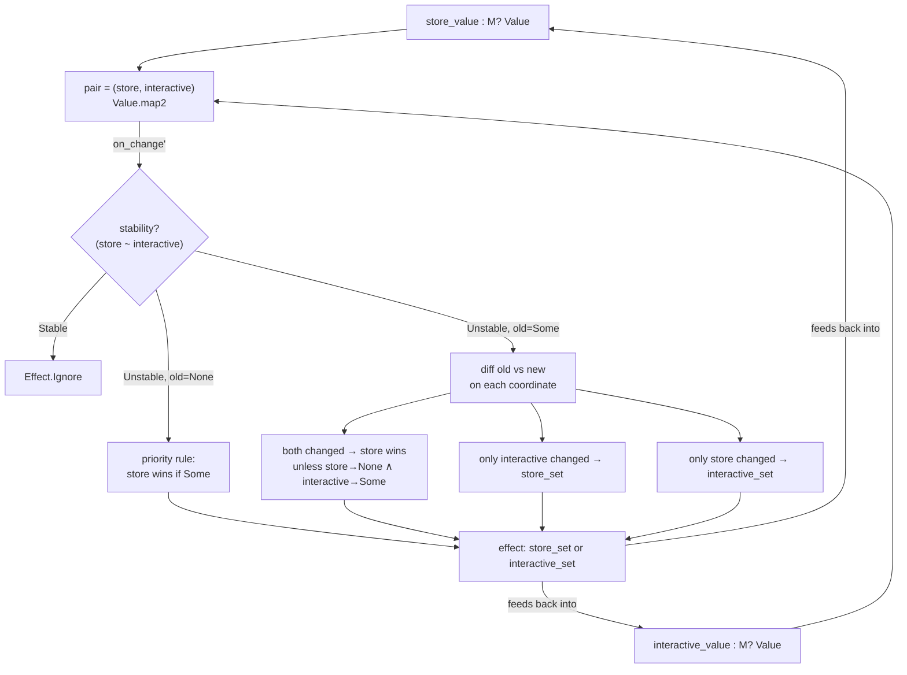
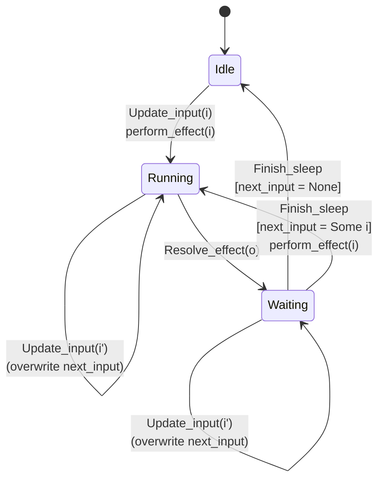
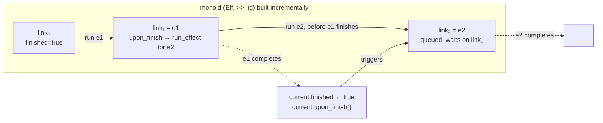
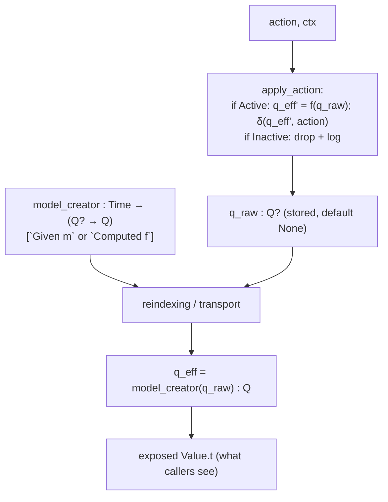
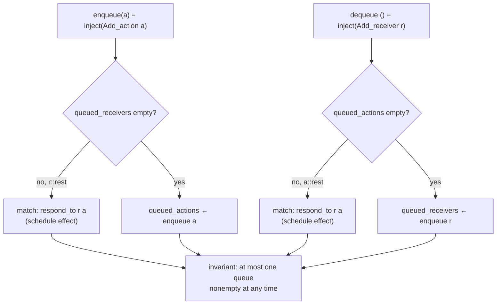

Intent, stated precisely: you've handed me five **Bonsai combinators** — `mirror`/`mirror'` (bidirectional state reconciliation), `effect_throttle`/`value_throttle` (rate-limited effect scheduling), the `previous`/`create`/`run` triple (an effect sequencer, Jane Street's "Svar"-style construct), `state_machine1_dynamic_model`/`state_machine0_dynamic_model`/`state_dynamic_model` (state machines with an externally-recomputed default model), and `pipe` (an async rendezvous channel). You want each **formalized** (set/category-theoretically, laws made explicit) and diagrammed in mermaid, using Bonsai's actual architecture — two-phase graph-building (`Computation.t`, `Value.t`) then runtime dataflow — as the ambient framework, per the framework I confirmed from the Bonsai docs.

I'll take these in a funnel: first fix the ambient categorical setting all five live in, then formalize each as a specialization of it.

## 0. Ambient setting: Bonsai's two-phase model, formalized

Per Bonsai's own architecture, a program has a **graph-building phase** producing a static DAG, then a **runtime phase** where data flows through it. Set-theoretically:

$$\mathrm{Value}(A) = \{\, v : \mathrm{Time} \rightharpoonup A \,\} \quad\text{(a time-indexed, incrementally-recomputed element of } A\text{)}$$
$$\mathrm{Computation}(A) = \text{a DAG-construction action that yields a } \mathrm{Value}(A) \text{ plus private state}$$

A **state machine** (the primitive underlying all five snippets) is a classical Mealy-style coalgebra
$$\delta : Q \times \Sigma \to Q, \qquad q_0 \in Q$$
where $Q$ = model type, $\Sigma$ = action type — but Bonsai's `apply_action` is *effectful* on the output side: it carries a context $\mathrm{ctx}$ letting the transition also **schedule** an element of a free monad of effects, so the honest signature is
$$\delta : Q \times \Sigma \times \mathrm{Ctx} \to Q \times \mathrm{Eff}(\Sigma)$$
— i.e. a Mealy machine whose "output alphabet" is *itself* a set of programs that can re-inject actions. This self-injecting property (`Apply_action_context.inject : Action -> unit Effect.t`) is exactly what makes it a **coalgebra with feedback**, not merely a function.

Every snippet below is this shape specialized.

## 1. `mirror` / `mirror'` — reconciliation as convergence toward the diagonal

**Formalization.** You have two independent `Value(M option)` sources, $s$ (store) and $i$ (interactive), and two setters $s\!\to\!() $, $i\!\to\!()$. Define the **agreement relation**
$$\Delta = \{(x,y) \in (M\mathbin{?})^2 \mid x \sim y\}, \quad x\sim y \iff \mathrm{Option.equal\ equal}\ x\ y$$
`mirror'` is a controller that, on every change of the pair $(s,i)$, computes whether $(s,i) \in \Delta$ (`Stable`) or not (`Unstable`), and if unstable, applies a **priority rule** derived from *which coordinate changed since the last observation* to pick a correcting effect — this is a discrete control law converging the pair toward $\Delta$, i.e. `mirror` implements a retraction toward the diagonal subobject of $(M\mathbin?) \times (M\mathbin?)$, using the *previous* pair as memory (so the controller is really a Mealy machine on states = "last observed pair," not memoryless).

## 2. `effect_throttle` / `value_throttle` — a rate-limited Mealy machine over $Q = \{\text{Idle}, \text{Running}, \text{Waiting}\}$

**Formalization.** $Q$ is a 3-element (parameterized) sum:
$$Q \cong \underbrace{O\mathbin?}_{\text{Idle}} \;\sqcup\; \underbrace{O\mathbin? \times I\mathbin?}_{\text{Running}} \;\sqcup\; \underbrace{O \times I\mathbin?}_{\text{Waiting}}$$
$\Sigma = \{\mathrm{Update\_input}(I), \mathrm{Resolve\_effect}(O), \mathrm{Finish\_sleep}\}$. The transition function $\delta: Q \times \Sigma \to Q$ (with side-effect scheduling on some arrows) is exactly a **debounce/throttle automaton**: it enforces the invariant *at most one in-flight effect application, plus at most one pending input, at any time* — set-theoretically this is projecting the unrestricted product $Q_{\text{naive}} = I\mathbin{list} \times O\mathbin?$ (arbitrary queue of pending inputs) down to the quotient that only remembers the *most recent* pending input, i.e. $\delta$ factors through a **coequalizer** collapsing all-but-the-latest queued input to a single representative. The `sleep` step makes this a **timed automaton**: `Waiting` has an outgoing transition gated not by an action alone but by a real-time delay, `Finish_sleep` firing after `wait`.

## 3. `previous` / `create` / `run` — building the composition operator of the Kleisli category at runtime

**Formalization.** Effects under Bonsai's `Effect.t` form a Kleisli category on some monad $T$: objects = OCaml types, morphisms $A \to T(B)$, composed by `bind` (associative, with `return` as identity). Ordinarily *you* write the composition `e1 >>= fun () -> e2` statically. This module instead builds a **runtime, dynamically-extensible chain** of such compositions: `t = previous ref` is a mutable pointer to "the current tail of the composition," and each call to `run` does
$$t \;:=\; \big(t_{\text{old}} \,\gg\, \text{new effect}\big)$$
by installing a callback (`upon_finish`) that either fires immediately (if the previous link already finished — this is the *unit law* $\mathrm{id} \gg e = e$ applying degenerately) or is deferred until the previous one signals completion (the *associativity* of sequencing, realized as a **continuation-passing linked list**, i.e. building the word of a free monoid $(\mathrm{Eff}, \gg, \mathrm{id})$ one generator at a time, where the "already reduced prefix" is discarded via mutation rather than kept as an explicit list).

## 4. `state_machine1_dynamic_model` — a state machine fibered over a *recomputed* default model

**Formalization.** An ordinary Bonsai state machine has a *fixed* $q_0 \in Q$ (declared once, statically). Here the "default model" is instead a function
$$f : \mathrm{Time} \to (Q\mathbin? \to Q)$$
(`model_creator`, either given directly or `Computed`), applied lazily: the underlying primitive stores $Q\mathbin?$ (raw, possibly-uninitialized model) and *re-derives* the effective model as $q_{\mathrm{eff}}(t) = f(t)(q_{\mathrm{raw}}(t))$ on every read. This is precisely a **fibration**: base category = time-indexed values of $f$, total space = pairs $(f, q_{\mathrm{raw}})$, and the "effective model" is the *reindexing/transport* operation carrying a raw state along whatever the current fiber-defining function $f$ happens to be — i.e. it's a state machine indexed by a moving parameter rather than a fixed initial object, and `state_machine0_dynamic_model` / `state_dynamic_model` are successive degenerations (dropping the input, then dropping the action type down to "replace model entirely").

## 5. `pipe` — a CSP-style rendezvous channel: mutual-exclusion of two dual queues

**Formalization.** Model = a pair of FIFO queues, $(\mathcal{A}, \mathcal{R})$ — queued actions of type $A$, queued receiver-callbacks of type $\mathrm{Callback}(A)$. The invariant the automaton maintains is the **mutual-exclusivity condition**
$$\mathcal{A} \neq \varnothing \implies \mathcal{R} = \varnothing \qquad\text{and}\qquad \mathcal{R} \neq \varnothing \implies \mathcal{A} = \varnothing$$
i.e. $(\mathcal{A}, \mathcal{R})$ always lies in the subset $(\mathcal{A}^* \times \{\varnothing\}) \cup (\{\varnothing\} \times \mathcal{R}^*)$ of the naive product $\mathcal{A}^* \times \mathcal{R}^*$ — never both populated. `Add_action` and `Add_receiver` are the two constructors of $\Sigma$; each either (a) enqueues onto its own queue (when the dual is empty — nothing to match against) or (b) immediately dequeues the *other* queue's head and **matches** the two (scheduling the callback response as an effect) — this matching step is exactly a **pushout/handshake**: two independently-arriving morphisms $() \to A$ (receiver waiting) and $\ast \to A$ (action arriving) get unified into a single scheduled effect the instant both exist, which is the standard denotational reading of a CSP/Go-style unbuffered channel.

**Cross-cutting observation** (funnel closing back to §0): all five are the *same* coalgebra $\delta: Q \times \Sigma \times \mathrm{Ctx} \to Q \times \mathrm{Eff}(\Sigma)$ from §0, differing only in what extra structure is imposed on $Q$ — a diagonal-convergence order (`mirror`), a timed-transition guard (`throttle`), a free-monoid-built-by-mutation (`previous`), a fibration over a moving index (`dynamic_model`), or a mutual-exclusion invariant on a queue pair (`pipe`). Recognizing which invariant is being enforced is the fastest way to read any new Bonsai state-machine combinator you encounter in the wild.