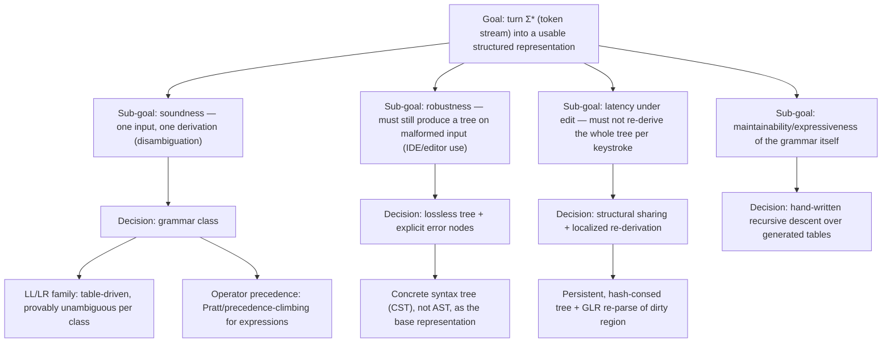

## Framing the request

Semantically, this is a **survey-and-formalization task**: (1) enumerate the dominant *parsing architectures* used in production compilers/tooling, (2) decompose the design space **teleologically** — from top-level correctness/robustness goals down to concrete implementation choices — and (3) give each architecture an **algebraic semantics** (initial algebras, monads/Kleisli categories, monoid actions) rather than an operational-only description.

### The goal funnel (causal decomposition of the design space)

Each leaf of this funnel is a real industrial choice; below, each gets an algebraic reading.

## 1. The base object: AST-as-initial-algebra, parsing-as-inverse-homomorphism

Take a signature of node constructors (e.g. `Add`, `Mul`, `Lit`, `Ident`). This signature determines a functor $F : \mathbf{Set} \to \mathbf{Set}$ that is a sum of products — e.g. $F(X) = 1 + (X \times X) + (X \times X) + \mathbb{Z} + \mathrm{String}$ for the constructors above. The AST type is the **initial algebra** $\mu F$ of this functor: the smallest set closed under the constructors, with the universal property that any other $F$-algebra $(A,\alpha)$ receives a unique structure-preserving map $\mathrm{fold} : \mu F \to A$ (a catamorphism).

Separately, tokens live in the free monoid $\Sigma^{*}$ (concatenation as composition, empty string as identity — this *is* a one-object category). "Printing" a tree to source text is a homomorphism

$$h : \mu F \longrightarrow \Sigma^{*}$$

built as a catamorphism (fold each constructor to its concrete token sequence). **Parsing is computing $h^{-1}$.** This single equation explains the whole taxonomy of pathologies:

- $h$ not injective ⇒ the grammar is *ambiguous* (two trees, one string).
- $h$ not surjective onto some target string ⇒ that string is a *syntax error*.
- An unambiguous grammar is exactly one where $h$ restricted to well-formed input is a bijection, so $h^{-1}$ is a genuine (partial) function, computable by a deterministic parser.

## 2. Hand-written recursive descent + Pratt parsing (the industrial default for expressions)

This is what rustc-adjacent tooling (Ruff's Python parser) and most modern frontends actually ship: a hand-written recursive descent parser that uses Pratt parsing to handle operator precedence when building the AST.

Algebraically: a parser combinator has the shape

$$\mathrm{Parser}\,a \;\cong\; \mathrm{String} \to \mathbf{P}(a \times \mathrm{String})$$

i.e. a **Kleisli arrow** for the composite monad $\mathrm{StateT}\;\mathrm{String}\;\mathbf{P}$, where $\mathbf{P}$ is a nondeterminism monad. Sequencing (`>>=`) is Kleisli composition; that's why recursive-descent parsers compose so cleanly — you're just composing morphisms in one Kleisli category.

Pratt parsing specifically is the operational form of a **binding-power algebra**: each operator token carries a pair $(\mathrm{lbp}, \mathrm{rbp}) \in \mathbb{N}\times\mathbb{N}$ (left/right binding power), and the parse loop is literally computing the unique parenthesization consistent with the total preorder these numbers induce on operators — precedence and associativity are nothing but a chosen linear (or partial) order on the operator alphabet, and Pratt's algorithm is a direct fold over that order. This goes back to Pratt's technique of associating parsing semantics with tokens rather than grammar rules, which is why it composes so well with hand-written descent for everything else.

## 3. PEG / parser combinators: changing the choice-monoid, not the monad

Where recursive-descent-with-backtracking uses $\mathbf{P} = \mathrm{List}$ (full nondeterminism, `mplus` commutative and associative — a genuine free-monoid choice), **PEGs** replace that with **prioritized choice**: where CFGs express nondeterministic choice between alternatives, PEGs instead use prioritized choice, formalized by Ford in "Parsing Expression Grammars: A Recognition-Based Syntactic Foundation," POPL 2004.

Algebraically, this swaps the choice operator's monoid structure: ordinary CFG-alternative is commutative ($a \mid b = b \mid a$ as *languages*), but PEG's `/` obeys $a/b \ne b/a$ in general — it's a **left-biased, idempotent, non-commutative monoid** ($a/a = a$, but no commutativity). This is exactly the "Maybe"/short-circuit monoid rather than the list monoid, and it's *why* PEGs give up the expressive symmetry of CFGs in exchange for guaranteed linear-time, deterministic parses (packrat memoization over this monoid never has to explore both branches once one commits).

## 4. LR/LALR: the Chomsky–Schützenberger view

The classical algebraic fact underwriting table-driven parsing: every context-free language is a homomorphic image of the intersection of a **Dyck language** (balanced brackets — the free monoid modulo the relation $x\bar x = 1$, i.e. literally the syntactic monoid of matched parens) with a **regular language**:

$$L = h(D_n \cap R)$$

Bracket-matching (the Dyck part) is exactly what a pushdown stack tracks; the regular part is exactly what the LR automaton's finite-state table tracks. An LR(k) parser is therefore best understood as *simultaneously* running a Dyck-monoid stack machine and a DFA over lookahead — the "conflict" cases (shift/reduce, reduce/reduce) are precisely the points where this factorization is locally non-unique for the fixed grammar-to-automaton construction.

## 5. Losslessness + error recovery: green/red trees as hash-consed algebra + derivative-as-zipper

This is the mechanism behind Roslyn (C#) and, downstream, rust-analyzer's `rowan` library: the idea of red/green syntax trees originated in the Roslyn C# compiler, was adopted by Swift's libsyntax, and was extended further by rust-analyzer's rowan crate with dynamically typed nodes. The **green tree** is the base tree representing concrete syntax with no position information, where nodes are immutable so subtrees of the same shape can be shared.

Two distinct algebraic facts are being exploited:

- **Structural sharing** is hash-consing $\mu F$: instead of building fresh terms, you build them modulo a quotient by *syntactic equality of subterms*, so structurally identical fragments (the same identifier token appearing twice, say) literally become the same node in memory — a persistent, referentially-transparent realization of the initial algebra rather than a naive tree.
- The **red tree** (parent-pointers + absolute offsets layered on top, per rowan's design of a lossless syntax tree inspired in part by Swift's libsyntax) is a **zipper**, and a zipper is not an ad hoc gadget — Conor McBride's result is that for any regular (polynomial) type $T = \mu F$, the type of "$T$ with one designated subtree replaced by a hole, plus the path back to the root" is exactly the **type-theoretic derivative** $\partial F$ of the constructor functor. Concretely: differentiate the sum-of-products signature term-by-term (product rule, sum rule, just like $\frac{d}{dx}$), and the resulting type *is* the one-hole context. That the industrial "red tree" and the theoretical "zipper-as-derivative" are the same construction is not a coincidence — it's why the API affords cheap, local mutation-in-place semantics while the underlying green data stays a pure, shareable value.

The concrete syntax tree choice itself (rather than AST) is what makes error recovery representable at all: the parser is designed to be resilient and full-fidelity — representing every character of source, including invalid syntax — with the CST bridging between a cursor position in source and a node in the tree.

## 6. Incremental re-parsing: GLR as a powerset-monad automaton + fold-locality

Tree-sitter is the canonical industrial instance: it parses using Generalized LR (GLR), which makes it possible to write a grammar for essentially any programming language, uses incremental parsing for efficient re-parse after edits, and has an error-recovery technique that still produces a usable tree on invalid input. Mechanically, it inserts explicit error nodes into the tree when it encounters invalid or incomplete code, using its GLR mechanism for recovery, so tools built on it keep working while you're mid-edit, and GLR parsing itself works by bifurcating the parse stack at shift/reduce or reduce/reduce conflicts to explore multiple grammatical hypotheses in parallel, merging stacks when they reconverge and discarding ones that fail.

Algebraically:

- **GLR as a monad shift.** Ordinary LR runs in the identity monad over a single stack (deterministic automaton). GLR runs the *same* automaton but lifted into the **powerset monad** $\mathbf{P}$: the "current configuration" is a *set* of stacks, union at merge points, and transition is applied pointwise then unioned. This is exactly the standard subset-construction move (turning an NFA-like process into a computation over $\mathbf{P}(\text{states})$), just applied to a pushdown rather than finite automaton.
- **Incrementality as fold-locality.** Since a parse is a catamorphism over the token sequence into the (hash-consed) green algebra, and hash-consing makes equal subterms literally identical values, re-parsing after an edit only needs to recompute the fold on the sub-range whose *token sequence changed* — everywhere else, the previously computed green subtree is byte-for-byte reusable because the fold is guaranteed to produce the same value on the same input (referential transparency). This is precisely why any tree that intersects the edit needs to be re-parsed while other subtrees are just reused, using an efficient copy-on-write structure that lets the update happen on a background thread even while a previous snapshot is being read elsewhere — it's compositionality of the fold, not a special-cased optimization.

## Summary table (decision ↦ algebra ↦ industrial instance)

| Design decision | Algebraic object | Industrial instance |
|---|---|---|
| AST shape | Initial algebra $\mu F$ of a polynomial functor | universal, all of the below |
| Expression precedence | Total/partial order (binding powers) folded via Pratt | Ruff/rustpython parser (hand-written recursive descent + Pratt) |
| Backtracking search | Kleisli category over $\mathrm{StateT\;String}\;\mathbf{P}$ | generic parser combinators |
| PEG ordered choice | left-biased idempotent non-commutative monoid | Ford's PEG, POPL 2004 (Ford, POPL 2004, 111–122) |
| Table-driven grammars | Dyck monoid ∩ regular language (Chomsky–Schützenberger) | yacc/bison-style LALR |
| Lossless/error-tolerant tree | hash-consed $\mu F$ (green) + derivative/zipper (red) | Roslyn, rust-analyzer `rowan` (originating in Roslyn, adopted by Swift libsyntax, extended by rowan) |
| Incremental re-parse | powerset-monad automaton (GLR) + fold-locality via referential transparency | tree-sitter (stack bifurcation/merge at conflicts) |

**Primary citations:** Ford, *Parsing Expression Grammars: A Recognition-Based Syntactic Foundation*, POPL 2004 (ACM SIGPLAN Notices 39(1):111–122); Pratt's top-down operator precedence technique as used in production (Ruff/rustpython parser docs); tree-sitter's GLR + incremental design (tree-sitter/Zed engineering write-ups); Roslyn/rust-analyzer `rowan` red-green tree design docs. If you want, I can also point you to McBride's "The Derivative of a Regular Type is its Type of One-Hole Contexts" for the zipper-as-derivative result itself, or to the Hutton–Meijer monadic-parsing paper for the Kleisli-category framing — neither came up in search since they're stable, pre-cutoff academic results rather than "industrial" claims needing verification.