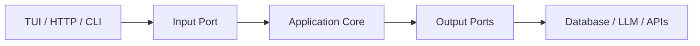
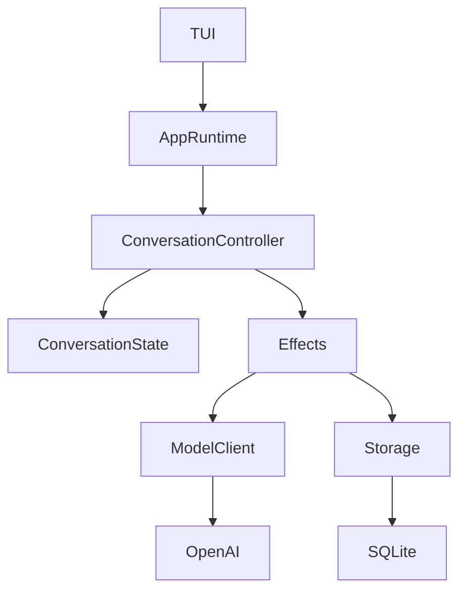

## Hexagonal Architecture (Ports and Adapters) — Formal Model

Hexagonal architecture is fundamentally a **dependency direction rule**:

> The core application logic should not depend on external mechanisms. External systems depend on the core through explicit interfaces.

The original motivation is to make the **domain/application behavior invariant** while allowing the environment to change.

---

## 1. Core idea

The system is split into:

$$\boxed{Core + Ports + Adapters}$$

where:

* **Core** = business/domain rules
* **Ports** = abstract capabilities/interfaces
* **Adapters** = concrete implementations

The dependency graph:

$$Adapters \rightarrow Ports \rightarrow Core$$

or visually:



The important property:

$$Core \not\rightarrow Adapter$$

The core does not know SQLite exists.

---

## 2. Algebraic view

Let:

$$C$$

be your core application.

Let external worlds be:

$$E_1,E_2,...,E_n$$

Examples:

$$E = \{TUI, SQLite, OpenAI, Auth0\}$$

The mistake in traditional architecture:

$$C \rightarrow E$$

The core directly depends on concrete things.

Example:

```rust
conversation.save_to_sqlite()
```

Now:

$$C = C(SQLite)$$

The domain is coupled.

---

Hexagonal architecture introduces a morphism:

$$P:E \rightarrow C$$

where:

$$P$$

is a port.

Example:

```rust
trait ConversationStorage {
    fn save(
        &self,
        conversation: &Conversation
    );
}
```

Now:

$$C$$

only knows the algebra:

"something can store conversations."

It does not know:

* PostgreSQL
* SQLite
* S3
* filesystem

---

## 3. Ports

There are two types.

### Input ports

Things that drive your application.

Examples:

* CLI commands
* HTTP requests
* TUI events
* WebSocket messages

Formal:

$$InputEvent \rightarrow ApplicationState'$$

Example:

```rust
trait ConversationCommandHandler {
    fn handle(
        &mut self,
        command: Command
    );
}
```

Your TUI is an input adapter.

---

### Output ports

Things your application needs.

Examples:

* database
* model API
* filesystem
* telemetry

Formal:

$$ApplicationState \rightarrow Effect$$

Example:

```rust
trait Storage {
    fn save(&self, data: Data);
}
```

---

## 4. Your agent harness mapping

Your architecture naturally fits:



---

### Core

Your core:

```text
core/
|
├── ConversationState
├── AgentState
├── Events
├── Reducers
└── Domain Errors
```

No:

* SQLite
* Tokio runtime
* HTTP
* terminal libraries

---

### Input adapters

Examples:

```text
tui/
cli/
http/
```

They translate:

```text
keyboard input

↓

ConversationEvent
```

Example:

```rust
KeyEvent::Enter

becomes

ConversationEvent::UserMessage(...)
```

---

### Output adapters

Examples:

```text
sqlite/
openai/
auth0/
```

They implement ports.

Example:

```rust
struct SqliteStorage;

impl ConversationStorage
for SqliteStorage {
}
```

---

## 5. Why ApplicationRuntime exists

Your runtime is the hexagonal "application service".

It coordinates:

$$(State, Event) \rightarrow (State', Effects)$$

Example:

```rust
pub struct ApplicationRuntime {
    conversation_controller: ConversationController,
    storage: Box<dyn Storage>,
    model: Box<dyn ModelClient>,
}
```

It is the bridge between:

* input ports
* domain logic
* output ports

---

## 6. Relation to your controller design

Your controllers are inside the hexagon.

Example:

```text
          Outside

TUI
 |
 | adapter
 |
 v

ApplicationRuntime
 |
 | input port
 |
 v

ConversationController
 |
 v

ConversationState


          Inside
```

The controller is not an adapter.

It is domain/application logic.

---

## 7. Why this is useful

Suppose today:

```text
TUI
SQLite
OpenAI
```

Tomorrow:

```text
VSCode extension
Postgres
Claude
```

With hexagonal:

Change:

$$Adapters$$

Keep:

$$Core$$

---

Without hexagonal:

```rust
conversation.openai_call()
conversation.save_sqlite()
conversation.render_terminal()
```

Now your domain has become:

$$Conversation = f(OpenAI, SQLite, Terminal)$$

You cannot replace anything.

---

## 8. Relationship with your state-machine thinking

They complement each other.

State machine:

$$(S,E)\rightarrow(S',Effects)$$

Hexagonal:

$$Effects\rightarrow Adapters$$

Combined:

$$\boxed{(S,E) \rightarrow (S',Effects) \rightarrow External\ World}$$

Example:

```text
User presses key

↓

TUI adapter

↓

ConversationEvent

↓

ConversationController

↓

ConversationState'

↓

Effect::Persist

↓

SQLite adapter
```

---

## 9. Practical rule for your project

Your crates should roughly become:

```text
mini-codex

├── core
│   └── domain states/events/controllers
│
├── application
│   └── ApplicationRuntime
│
├── ports
│   └── traits
│
├── adapters
│   ├── tui
│   ├── sqlite
│   ├── auth0
│   └── llm
│
└── cli
```

The test:

Ask of every dependency:

> "If I replace this technology tomorrow, does the domain model change?"

If yes, the boundary is wrong.

The deepest abstraction is:

$$\boxed{Hexagonal\ Architecture = Separating\ stable\ semantic\ transformations\ from\ unstable\ mechanisms}$$

For your agent harness, the stable center is:

$$ConversationEvent \rightarrow ConversationState \rightarrow Effects$$

Everything else is an adapter.