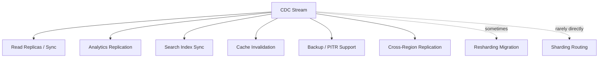
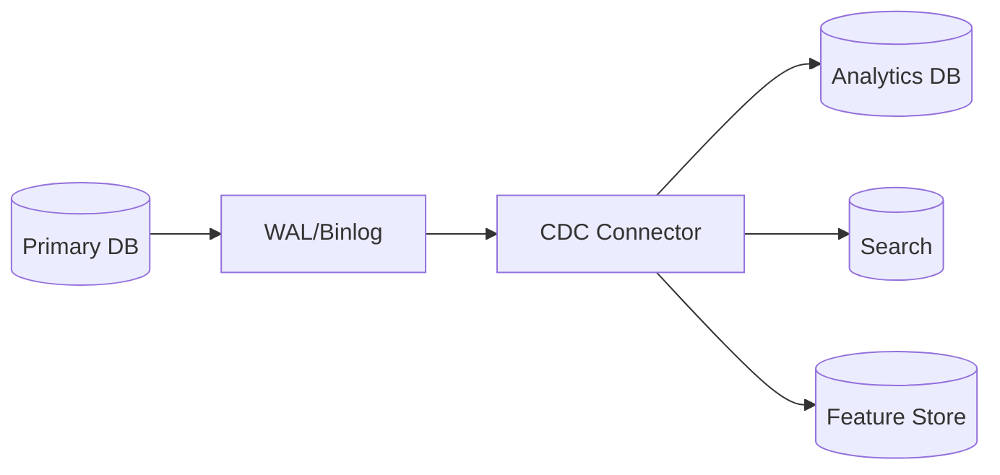
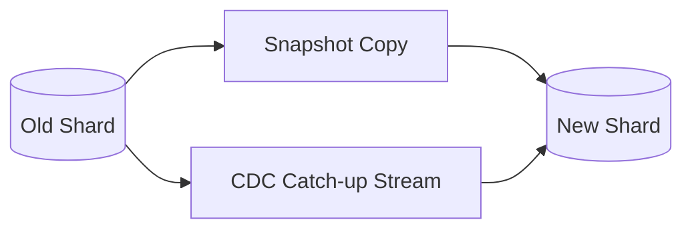
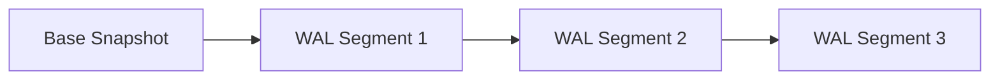
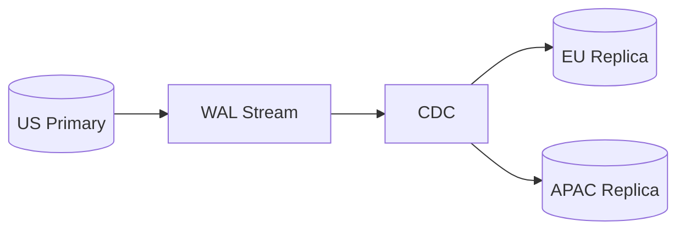
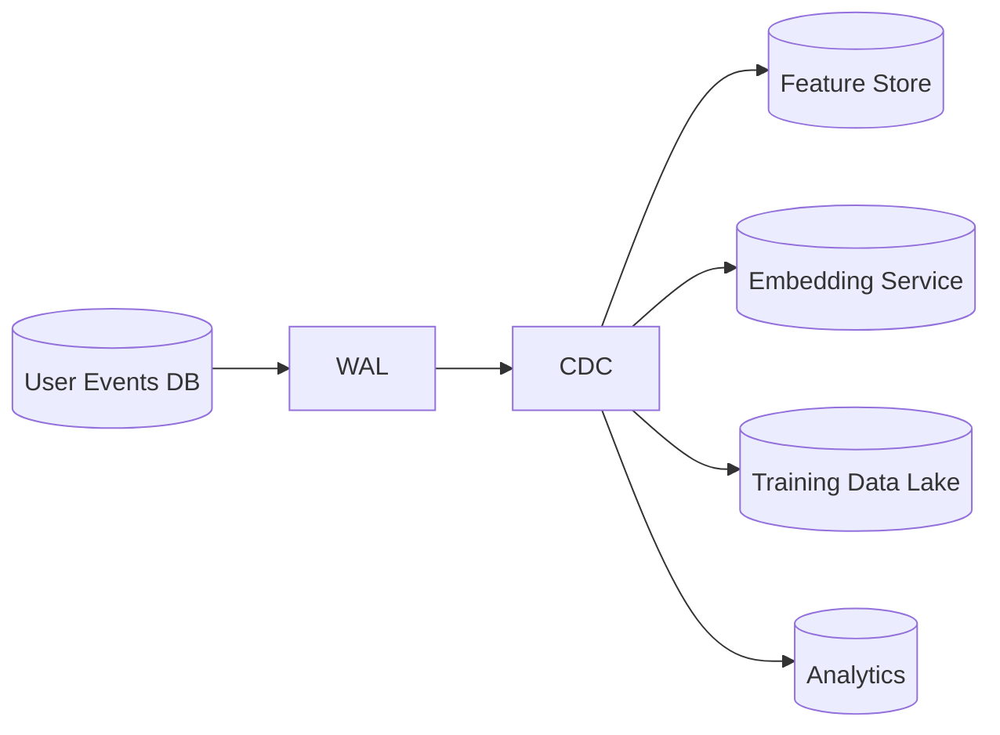

Yes. CDC is widely used for **database synchronization**, **replication**, and **backup-related workflows**, but its role differs in each case.



## 1. Database Syncing — Extremely Common

This is probably the canonical CDC use case.



Examples:

* MySQL → PostgreSQL migration
* PostgreSQL → Snowflake
* MySQL → Elasticsearch
* PostgreSQL → Redis cache
* Operational DB → feature store

This is essentially:

```text
materialized view maintenance
```

---

## 2. Sharding — Usually Not for Routing, Sometimes for Migration

CDC is generally **not used to determine which shard receives writes**.

Routing usually looks like:

```text
shard = hash(user_id) mod N
```

or

```text
shard = consistent_hash(user_id)
```

The application or proxy computes this directly.

---

### Where CDC *is* used in sharding

During shard splitting or rebalancing.

Example:



Migration steps:

1. Copy existing data.
2. Continue serving traffic on old shard.
3. CDC streams changes that occur during copy.
4. Wait until lag reaches zero.
5. Switch traffic to new shard.

Without CDC:

```text
downtime required
```

With CDC:

```text
online migration
```

This is one of the largest production uses of CDC in large systems.

---

## 3. Backup — Yes, Especially Incremental Backup

There are two concepts:

### Full backup

```text
copy entire database
```

### Incremental backup

```text
store only changes
```

CDC naturally provides:

```text
Δ1, Δ2, Δ3, ...
```

instead of:

```text
S1, S2, S3, ...
```

---

### Point-in-Time Recovery (PITR)



Recovery:

```text
Restore snapshot
Replay WAL until desired timestamp
```

This is how many databases implement recovery internally.

Strictly speaking this is WAL replay rather than CDC, but conceptually they are very closely related.

---

## 4. Cross-Region Replication

Very common.



Examples:

* disaster recovery
* geographic failover
* read locality

---

## 5. Recommendation Systems

CDC is often the glue between operational and ML systems.



For example:

```text
INSERT click(user=5,item=100)
```

becomes:

* update user embedding
* increase item popularity
* add positive training sample
* update CTR statistics

all without querying the production database.

---

## 6. Where CDC Is Usually NOT Used

| Problem                  | Typical Solution  |
| ------------------------ | ----------------- |
| Query routing            | Load balancer     |
| Shard selection          | Hashing           |
| Consensus                | Raft/Paxos        |
| Transaction coordination | 2PC/Saga          |
| Cache lookup             | Redis             |
| Database indexing        | B-trees/LSM trees |

CDC propagates **changes after commit**; it does not participate in deciding where writes go or coordinating transactions.

---

## Formal perspective

If:

```text
S_t
```

is database state and

```text
Δ_t
```

is a committed mutation, then:

```text
S_t + Δ_t -> S_t+1
```

CDC exports:

```text
Δ_1, Δ_2, Δ_3, ...
```

This makes CDC fundamentally a:

```text
state transition distribution mechanism
```

Applications include:

* replication
* synchronization
* migration
* feature updates
* event-driven architectures
* incremental backup
* disaster recovery

Sharding itself is a **partitioning problem**, whereas CDC is a **state propagation problem**. CDC becomes useful once data needs to move between partitions or systems.
