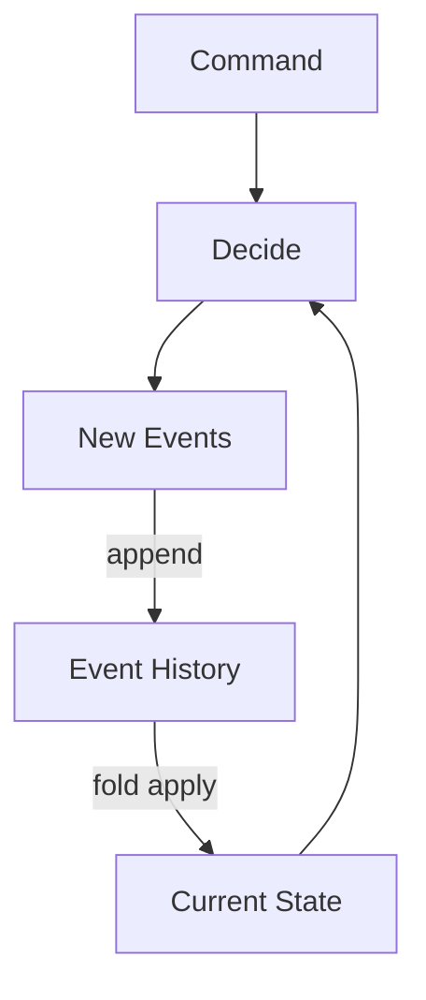

Yes, there is a deep relationship here.

CQRS is not exactly "stateless", but it is very close to **factoring stateful computation into a stateless read side and a state-transition write side**.

The key observation is that most systems actually implement:

[
(State, Command) \to (State', Events)
]

and

[
(ReadModel, Query) \to Result
]

CQRS explicitly separates these two morphisms.

---

## Traditional CRUD

Traditional CRUD endpoint:

[
f : DB \times Request \to DB \times Response
]

```text
(DB, Request)
      │
      ▼
   Endpoint
      │
      ▼
(DB', Response)
```

Every endpoint is both:

* reading state
* mutating state

This is basically the state monad:

[
State~DB~Response
]

---

## CQRS decomposition

CQRS splits this into two algebras.

### Command side

Commands are state transitions:

[
command :
S \times C \to S
]

or more generally

[
command :
S \times C \to S \times E
]

where (E) are emitted events.

```text
(State, Command)
        │
        ▼
(State', Events)
```

Examples:

```text
CreateOrder
ApprovePayment
ShipOrder
```

These are morphisms in the state category.

---

### Query side

Queries become pure projections:

[
query :
R \times Q \to A
]

where:

* (R) = read model
* (Q) = query
* (A) = answer

```text
(ReadModel, Query)
         │
         ▼
       Answer
```

Importantly:

[
query(R,Q)
]

does not mutate (R).

Therefore queries are observationally pure.

---

## Functional interpretation

CQRS says:

> Separate
>
> [
> S \to S'
> ]
>
> from
>
> [
> S \to V
> ]

where (V) is a view or projection.

This resembles the distinction between:

```haskell
modify :: State -> State
view   :: State -> View
```

or in lenses:

```haskell
set :: A -> S -> S
get :: S -> A
```

CQRS is surprisingly close to lens algebra.

---

## Event sourcing version

With event sourcing:

Commands no longer operate on mutable state directly.

Instead:

[
aggregate :
History \times Command \to Events
]

while state itself is reconstructed by a fold:

[
State =
foldl(apply, S_0, History)
]

Thus:

```text
Events
  │
fold
  ▼
State
  │
Command
  ▼
New Events
```

This is extremely functional.

The aggregate itself can be written as a pure function:

[
decide :
State \times Command \to Events
]

or equivalently:

[
decide :
fold(apply, History) \times Command \to Events
]

---

## Why it feels "inverse"

You noticed something important:

> CQRS writing feels stateless somehow, but inverted.

Indeed.

Ordinary stateful systems look like:

[
(State, Input)
\to
(State', Output)
]

while CQRS command handlers often look like:

[
(State, Command)
\to
Events
]

The new state is not returned directly.

Instead:

[
State'
======

fold(apply, State, Events)
]

The write side computes **the delta**, not the new state.

This is somewhat dual to ordinary functional state transitions.

Normal state monad:

```text
state + input
     ↓
new state + output
```

Event sourced CQRS:

```text
state + command
     ↓
events
     ↓
fold
     ↓
new state
```

You can think of events as elements of the free monoid generated by domain actions.

The aggregate emits generators of change rather than performing change itself.

---

## Category theoretic view

Traditional mutable system:

```text
S × C ─────▶ S × R
```

CQRS:

```text
S × C ─────▶ E*
```

where:

[
E^*
]

is the free monoid of events.

The state transition becomes:

[
apply :
S \times E \to S
]

and reconstruction is:

[
foldl(apply,S_0,-)
:
E^* \to S
]

So CQRS plus event sourcing converts:

```text
state transformer
```

into

```text
event generator + fold
```

which is exactly analogous to replacing mutation with immutable append-only logs.

---

## Dependency graph



This is why many functional programmers find CQRS + Event Sourcing natural:

* Commands are pure decision functions.
* State reconstruction is a fold.
* Queries are pure projections.
* Mutation becomes append to a monoid.

In a sense, CQRS does not eliminate state.

It converts

> mutable present state

into

> immutable historical accumulation plus projection.
