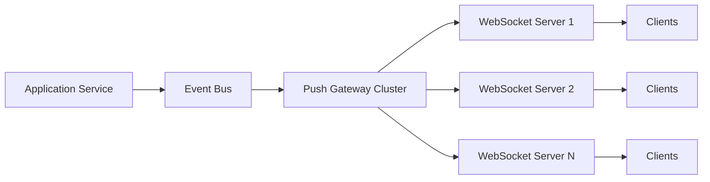
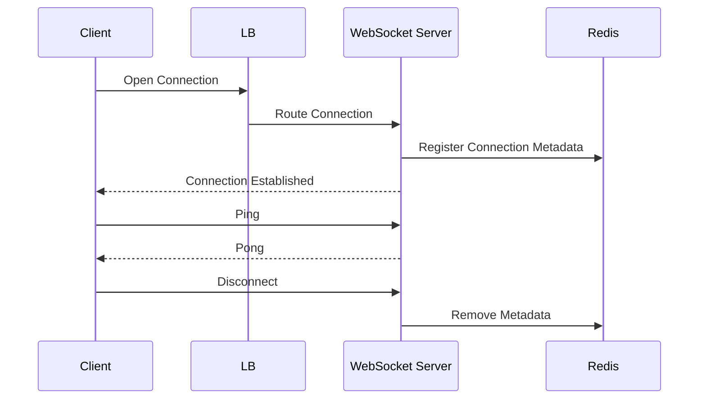
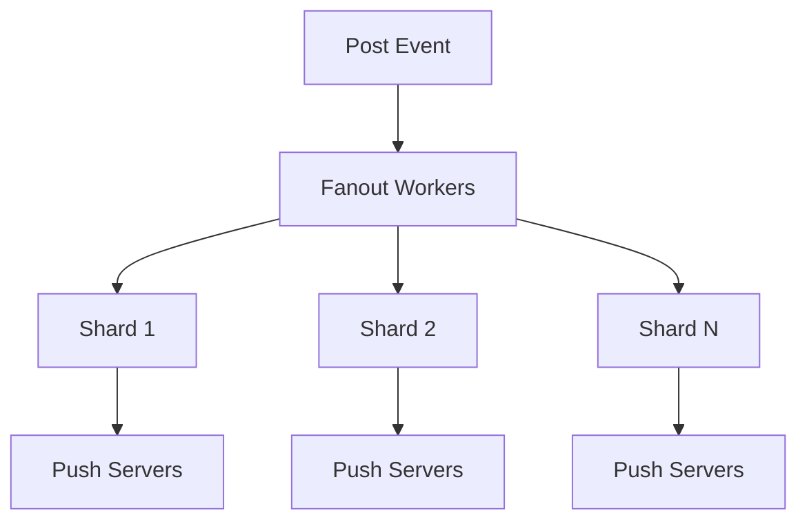
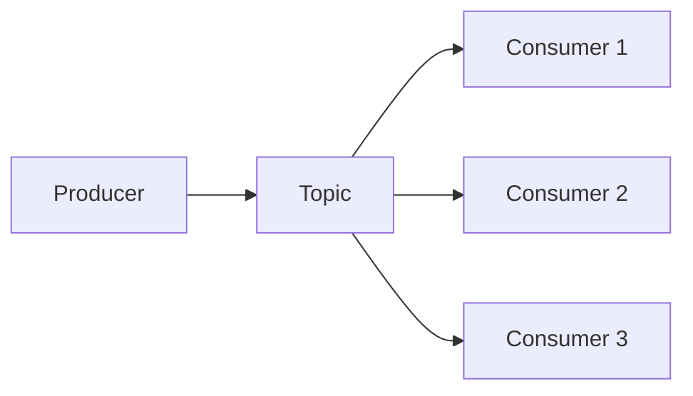
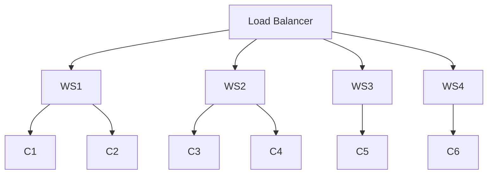
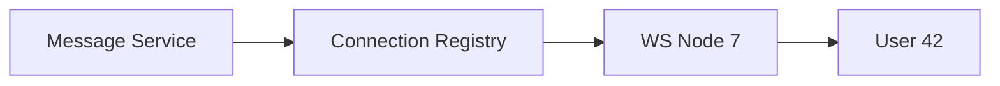
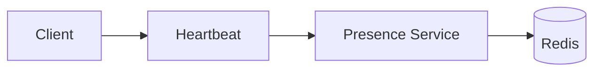
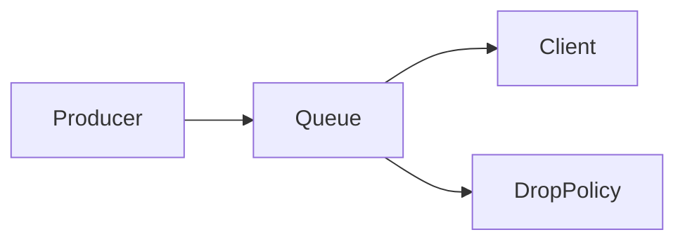
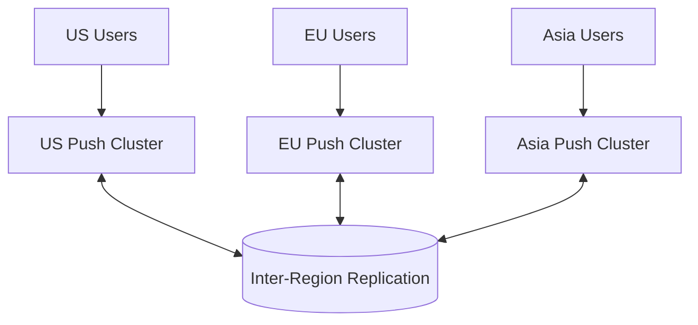
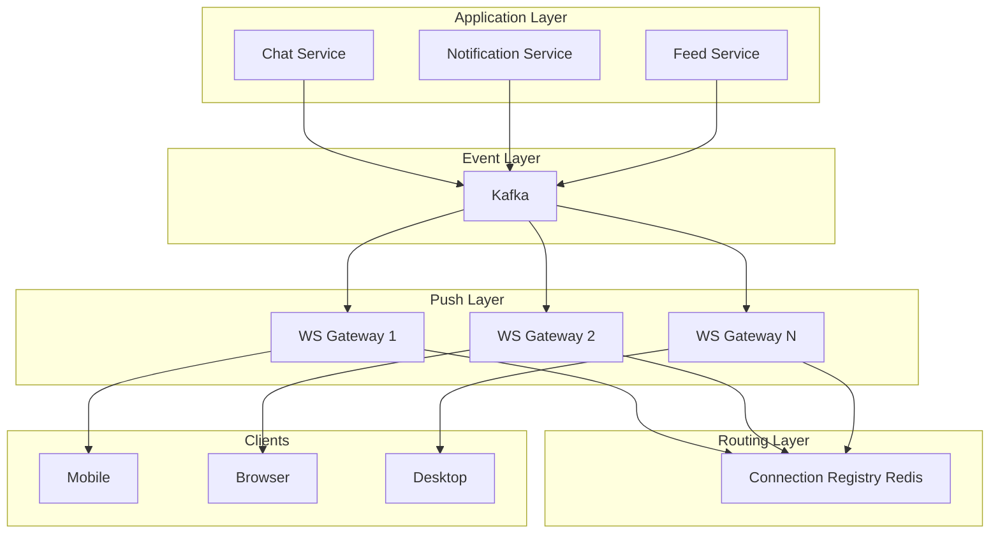

# Real-Time Push Updates System Design: Full Overview

The core problem is:

> **How does a state change in one machine become visible to many other machines with low latency, ordering guarantees, scalability, and fault tolerance?**

This is fundamentally a **state propagation problem**.

---

# 1. Formalization

A push system transforms:

```text
State Change
    ↓
Event Generation
    ↓
Event Routing
    ↓
Connection Selection
    ↓
Delivery
    ↓
Client State Update
```

Mathematically:

```text
f : ΔS → Subscribers(S)
```

where:

* `ΔS` = state delta/event
* `Subscribers(S)` = all clients interested in that state

Examples:

| System               | Event            |
| -------------------- | ---------------- |
| Chat                 | new message      |
| Stock exchange       | price change     |
| Multiplayer game     | player moved     |
| Notification system  | new notification |
| Collaborative editor | document edit    |
| Recommendation feed  | ranking update   |
| Ride sharing         | driver location  |

---

# 2. Canonical Architecture



---

# 3. Connection Lifecycle



---

# 4. Connection Registry

Need mapping:

```text
user_id → websocket_server
```

Example:

```text
42 → ws-node-7
15 → ws-node-3
81 → ws-node-12
```

Stored in:

* Redis
* Consistent hashing ring
* Distributed hashmap
* Service discovery

Without this:

```text
message for user 42
↓
which server owns connection?
↓
unknown
```

---

# 5. Fanout Problem

Suppose:

```text
celebrity posts tweet
followers = 20 million
```

Need:

```text
post_event
↓
20 million deliveries
```

Naive:

```text
for user in followers:
    send()
```

This melts the system.

Instead:



---

# 6. Publish Subscribe Layer

Usually implemented using:

* Kafka
* Redis PubSub
* NATS
* Pulsar

Architecture:



Producer never knows consumers.

This gives:

* decoupling
* replay
* durability
* scaling

---

# 7. WebSocket Cluster



Each node stores:

```text
connection_id
user_id
subscriptions
heartbeat timestamp
```

---

# 8. Event Routing

Suppose:

```text
message for user 42
```

Need:

```text
42 -> ws-7
```

Architecture:



---

# 9. Presence Service

Tracks online/offline state.



Stored:

```text
user42:
    last_seen = timestamp
    status = online
```

Timeout:

```text
if now-last_seen > 60s:
    offline
```

---

# 10. Heartbeats

TCP connections silently die.

Need:

```text
ping
pong
ping
pong
```

Example:

```text
server sends ping every 30s

if no pong after 90s:
    disconnect
```

---

# 11. Ordering Guarantees

Chat example:

Bad:

```text
hello
world
```

arrives:

```text
world
hello
```

Solutions:

### Sequence Numbers

```text
101 hello
102 world
```

Client buffers:

```text
if seq != expected:
    wait
```

---

### Partition Ordering

Kafka provides:

```text
ordering inside partition
```

Common key:

```text
chat_room_id
```

---

# 12. Reliability

Push delivery can fail.

Need:

```text
send
↓
ack?
↓
retry
```

---

## At Most Once

```text
send once
```

May lose messages.

Examples:

* presence updates
* typing indicators

---

## At Least Once

```text
retry until ack
```

Duplicates possible.

Examples:

* chat
* notifications

---

## Exactly Once

Very expensive.

Usually simulated via:

```text
idempotency key
```

---

# 13. Offline Users

User disconnected.

Options:

## Drop

Example:

```text
typing indicators
```

---

## Store And Forward

```mermaid
flowchart LR

Event
--> Message Store

User Connects
--> Fetch Missed Events
```

Used by:

* chat systems
* notifications

---

# 14. Backpressure

Slow clients cause memory explosion.

```text
producer rate > consumer rate
```

Solutions:

* bounded queues
* message dropping
* disconnect slow consumers
* batching

---



---

# 15. Horizontal Scaling

Connections are stateful.

HTTP scaling:

```text
request independent
```

WebSocket scaling:

```text
connection persistent
```

Need:

* sticky sessions
* connection registry
* distributed routing

---

# 16. Regional Architecture



---

# 17. Real Production Architecture



---

# 18. Transport Choices

| Transport         | Duplex  | Persistent | Server Push | Typical Use             |
| ----------------- | ------- | ---------- | ----------- | ----------------------- |
| Polling           | No      | No         | No          | Legacy                  |
| Long Polling      | Half    | Temporary  | Limited     | Notifications           |
| SSE               | One-way | Yes        | Yes         | Market data             |
| WebSocket         | Full    | Yes        | Yes         | Chat                    |
| gRPC Streaming    | Full    | Yes        | Yes         | Microservices           |
| QUIC/WebTransport | Full    | Yes        | Yes         | Future realtime systems |

---

# 19. Canonical Design Patterns

| Pattern             | Problem Solved                     |
| ------------------- | ---------------------------------- |
| Pub/Sub             | decoupling producers and consumers |
| Connection Registry | locate user connections            |
| Fanout Service      | massive broadcasts                 |
| Presence Service    | online tracking                    |
| Event Sourcing      | replay missed events               |
| CDC                 | database-triggered updates         |
| Backpressure        | overload protection                |
| Sharding            | horizontal scale                   |
| Consistent Hashing  | stable ownership                   |
| Idempotency         | duplicate suppression              |

---

# 20. Mental Compression

Almost every push system reduces to:

```text
state changed
↓
emit event
↓
route event
↓
find subscribers
↓
deliver event
↓
update local replica
```

or in one line:

```text
ΔState
 → Event
 → Routing
 → Delivery
 → Replica Convergence
```

Chat systems, stock exchanges, collaborative editors, live sports scores, multiplayer games, recommendation feeds, and notification systems are all variations of this same architecture with different trade-offs in:

* latency
* ordering
* durability
* consistency
* fanout size
* replay requirements
* delivery guarantees
