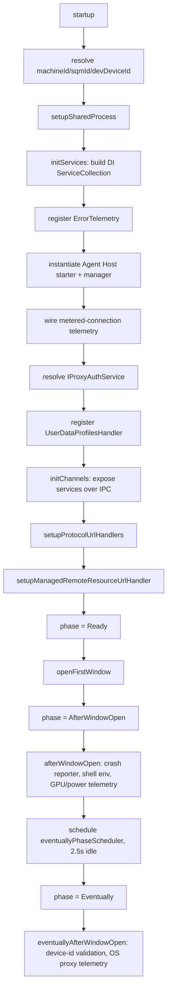
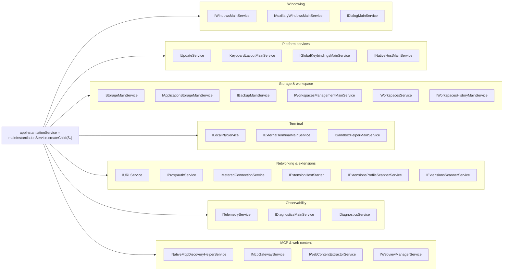
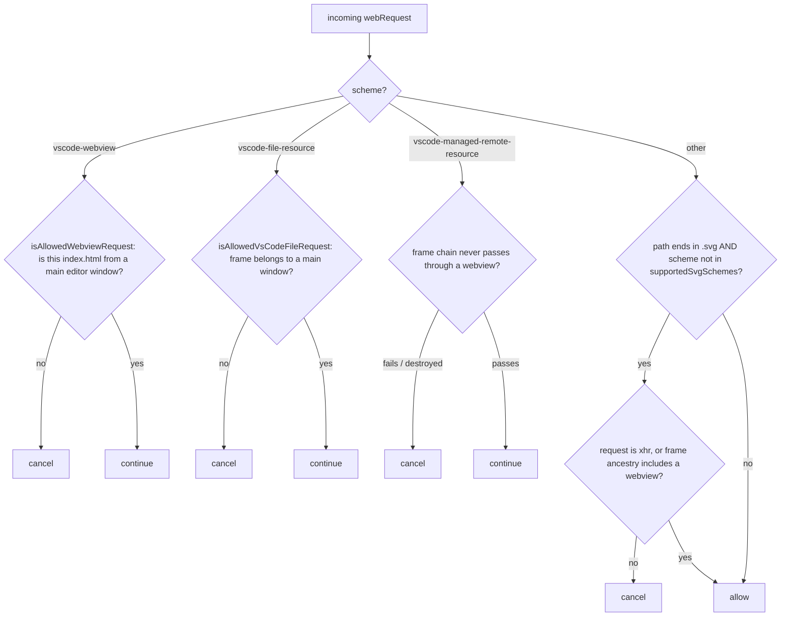
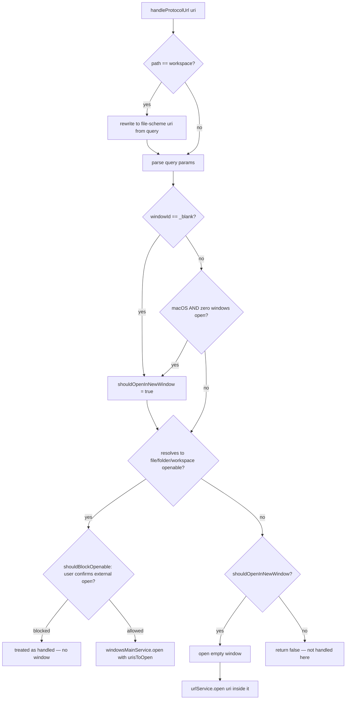

## What this file *is*, goal-first

**Terminal goal:** stand up exactly one Electron main-process instance and hand control to it. Everything else is a means to that end. Reading `CodeApplication` as a decision funnel:

1. **Harden the process boundary** (session security policy) — must happen before anything touches untrusted content.
2. **Stand up cross-process transport** (Electron IPC server, Node IPC server, shared process, MCP gateway) — the substrate every later service depends on.
3. **Compose the dependency-injection (DI) graph** (`initServices`) — this is the *composition root*: the one place object graphs get wired instead of self-constructing.
4. **Expose that graph over IPC** (`initChannels`) — turn in-process services into cross-process contracts.
5. **Resolve intent** (protocol URLs, CLI args, macOS `open-file` events) into a concrete "what window(s) do we open."
6. **Open windows, then degrade priority** through lifecycle phases (`Ready → AfterWindowOpen → Eventually`), deferring non-critical telemetry work until the event loop is idle.

$$
\text{startup} \;=\; \text{harden} \;\triangleright\; \text{wire}(D) \;\triangleright\; \text{resolve\_intent} \;\triangleright\; \text{open} \;\triangleright\; \text{degrade\_priority}
$$

where $\triangleright$ is sequential composition and $D$ is the service graph below.

## Formalizing the DI container (set-theoretic, then categorical)

Let $S$ be the finite set of service tokens registered in `initServices` (e.g. `IWindowsMainService`, `ITelemetryService`, …). Registration is a **partial function**

$$
\mathrm{reg} : S \rightharpoonup D
$$

into a set of descriptors $D$, where each descriptor is either an already-built instance, or a `SyncDescriptor(ctor, args)` — a *recipe*, not a value.

Because `SyncDescriptor` defers construction until some `IInstantiationService` runs it, $\mathrm{reg}(s)$ isn't an implementation of $s$ directly — it's a computation that *produces* one. That's exactly the shape of a Kleisli morphism for the thunk monad $M X = (\text{InstantiationContext}) \to X$:

$$
\mathrm{reg}(s) : 1 \longrightarrow M(\mathrm{Impl}(s))
$$

`mainInstantiationService.createChild(services)` at the end of `initServices` is then a concrete set operation: if $S_0$ is the parent's already-registered token set and $S_1$ is the set newly bound in this file, the child's registration is the **coproduct of two partial functions with disjoint domains**:

$$
\mathrm{reg}_{\text{child}} = \mathrm{reg}_{\text{parent}} \cup \mathrm{reg}_{\text{new}}, \qquad \mathrm{dom}(\mathrm{reg}_{\text{parent}}) \cap \mathrm{dom}(\mathrm{reg}_{\text{new}}) = \varnothing
$$

The child can *see* everything the parent bound (union), but the parent can never see the child's bindings — the inclusion $S_0 \hookrightarrow S_0 \cup S_1$ is monic in one direction only. That asymmetry is *why* `appInstantiationService` (child) exists at all instead of registering everything on `mainInstantiationService` directly: it scopes app-lifetime services away from earlier-phase (pre-app) services.

## Security predicate: `webRequest.onBeforeRequest`

This is a **classification function** $\text{allow} : \text{Request} \to \{0,1\}$ built as a conjunction of scheme-specific guards, each itself a decision procedure over the frame ancestry chain.

## Protocol-URL resolution funnel: `handleProtocolUrl`

If you want, I can also formalize `shouldBlockOpenable`'s trust boundary (it's a nice small example of a **Galois-connection-shaped** confirm/deny gate between `Schemas` and user consent) or diagram the shared-process handshake (`connect → whenReady → MessagePortClient`) as a two-stage promise pipeline.