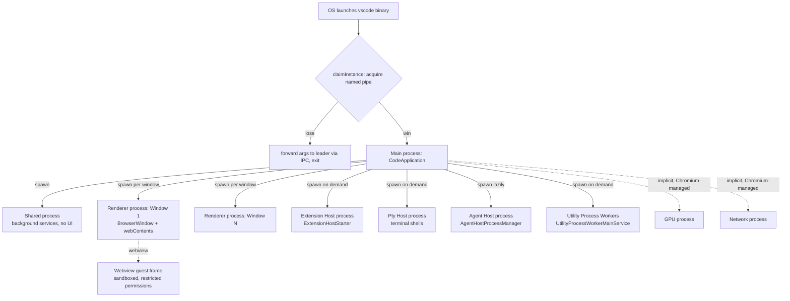

## Why leader election exists here — the causal chain

The goal isn't fault tolerance (there's no failover, no replicas serving traffic). It's a **singleton constraint over a shared mutable resource**: the user-data directory (`state.json`, settings, storage databases, lockfiles). Trace the causality backward from failure modes to see why this is forced, not stylistic:

$$
\text{concurrent writers to one file} \;\Rightarrow\; \text{corrupted state/settings} \;\Rightarrow\; \text{unrecoverable user data}
$$

If you double-click the VS Code icon twice, or run `code file.txt` in two terminals, both process launches would otherwise try to construct their own `StateService`, `ConfigurationService`, `UserDataProfilesMainService` — all pointed at the *same* files on disk. Electron/VS Code has no optimistic-concurrency or CRDT-style merge story for that layer; it assumes exactly one writer. So the actual requirement is:

$$
|\{\text{processes holding write access to userDataPath}\}| \leq 1
$$

Leader election (via the named pipe / IPC handle) is the mechanism that *enforces* that cardinality constraint at OS-process granularity, before any of those services are even touched. That's why `claimInstance` runs so early — it's a gate in front of the state-owning services, not a peer-coordination protocol among equals.

The secondary goal is UX, and it rides on the same mechanism for free: if a "second" launch is really just `code somefile.txt` from a fresh terminal, the user wants that file to open *in the already-running window*, not spawn a redundant, resource-duplicating app instance. That's exactly the `otherInstanceLaunchMainService.start(args, env)` forwarding branch — losing the election isn't failure, it's "hand my intent to the incumbent and exit."

## How the processes are actually spun — Electron's multi-process model

This is a different axis entirely from leader election: once *one* process wins the election and becomes `CodeApplication`, it doesn't stay a single process — it **fans out** into a fixed topology of specialized OS processes, each isolated for a specific reason (crash isolation, security sandboxing, or just "this workload doesn't belong in the UI thread").

The naming convention across the file tells you the pattern precisely: every `I*MainService` you saw registered in `initServices` lives **in** the main process; every `*Starter` (`ExtensionHostStarter`, `ElectronPtyHostStarter`, `ElectronAgentHostStarter`) is a **factory that spawns a separate OS process** and proxies to it over IPC. So the DI graph you formalized earlier as a composition root is really constructing two different kinds of morphisms:

- $s \to \mathrm{Impl}(s)$ — an in-process object, for most services.
- $s \to \mathrm{Proxy}(s) \to \text{IPC} \to \mathrm{Impl}(s)$ — a channel to a *different process's* object, for anything spawned (extension host, pty host, agent host, shared process, utility workers).

The `ProxyChannel.fromService(...)` / `ProxyChannel.toService(...)` calls you saw registering channels in `CodeApplication.initChannels` are exactly the serialization boundary where that second kind of morphism gets realized.

## Why the split, causally

Each spawned process exists because collapsing it into the main process would violate a specific goal:

- **Renderer per window** — a renderer crash (bad extension, runaway webview content) must not take down the whole app or other windows. Isolation boundary = blast radius containment.
- **Extension host** — third-party extension code is untrusted-ish and can hang/leak; it must be killable/restartable without touching the UI.
- **Pty host** — terminal processes need to *survive* a window reload (`LocalReconnectConstants.GraceTime` in the file is literally there so closing/reopening doesn't kill your running shell).
- **Shared process** — background work (search indexing, telemetry batching) that all windows want, but shouldn't duplicate per-window.
- **GPU/network processes** — imposed by Chromium itself, same isolation logic one level down.

So: leader election answers *"is this OS-level launch allowed to touch the user's data at all?"* — a one-time, coarse-grained singleton check. Process spawning answers *"once we're the legitimate owner, how do we decompose the workload for fault isolation?"* — an ongoing, fine-grained topology decision. They solve different problems and would still both be necessary even if the other didn't exist.