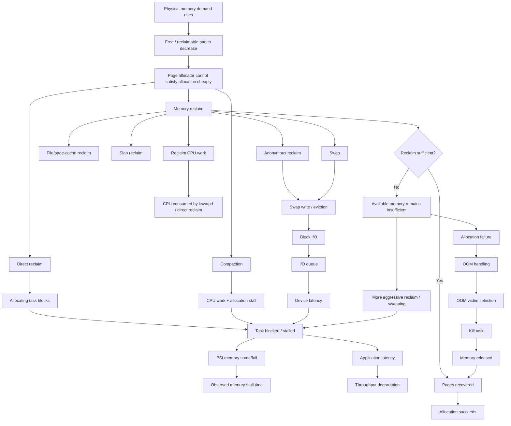
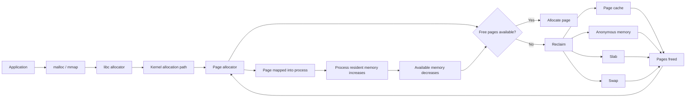
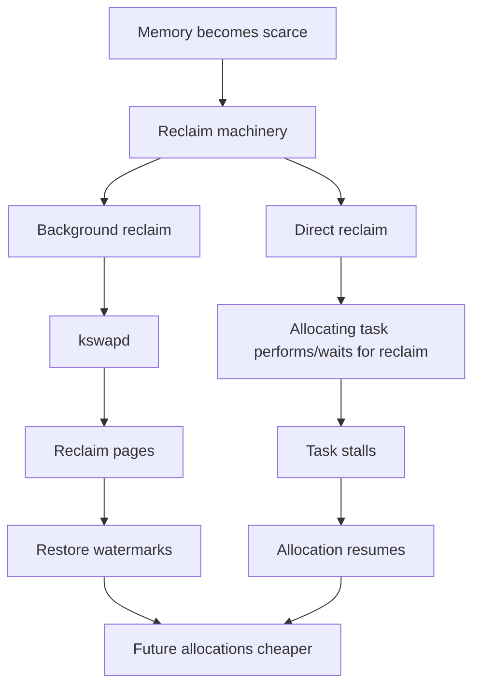
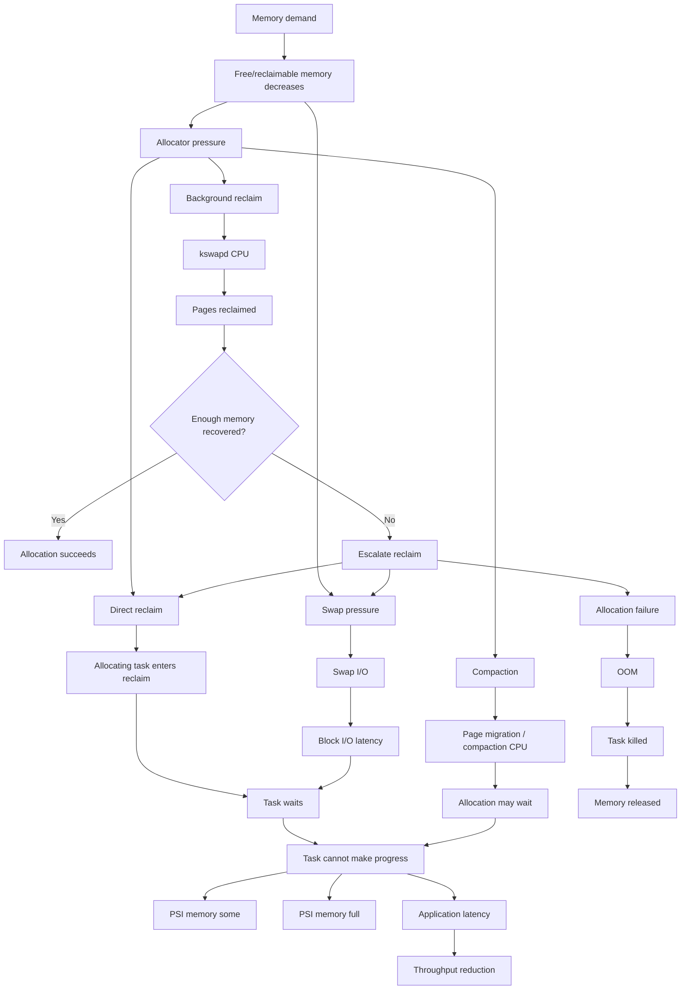
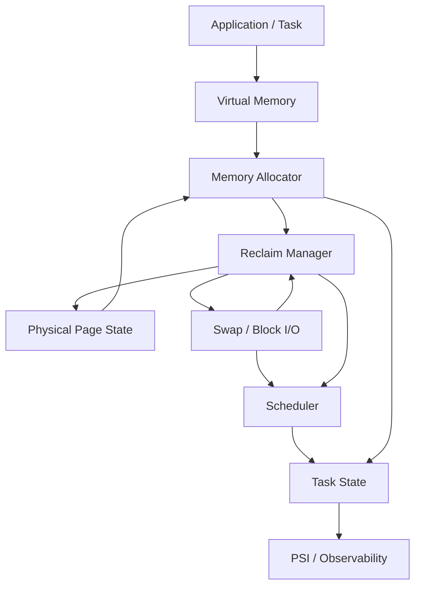

**Intent — causal systems modeling:** you want the complete causal propagation graph of **memory pressure**, from physical/virtual-memory scarcity through the kernel's memory-management machinery, into tasks/processes, I/O, scheduling, PSI, and ultimately observable application behavior.

The key distinction is:

$$
\text{memory pressure}
\neq
\text{“RAM is full”}
$$

More precisely, pressure is a **resource-contention condition** in which the system cannot satisfy memory demands from immediately available memory and therefore must perform reclaim, compaction, swapping, allocation stalls, or eventually invoke the OOM mechanism.

## 1. Full causal chain

The important causal loop is:

$$
\boxed{
\text{demand}
\rightarrow
\text{scarcity}
\rightarrow
\text{reclaim}
\rightarrow
\text{stall}
\rightarrow
\text{latency}
}
$$

with a possible escalation:

$$
\text{scarcity}
\rightarrow
\text{reclaim}
\rightarrow
\text{insufficient recovery}
\rightarrow
\text{allocation failure}
\rightarrow
\text{OOM}
$$

---

# 2. What actually happens when you deliberately create memory pressure

Suppose you run a memory stressor that continuously allocates pages.

At the highest level:

Eventually the system enters a regime where allocation itself becomes expensive.

That gives us three qualitatively different states:

$$
\begin{aligned}
\text{normal allocation}
&:\quad \text{allocate} \rightarrow \text{return} [4pt]
\text{reclaim}
&:\quad \text{allocate} \rightarrow \text{reclaim} \rightarrow \text{return} [4pt]
\text{severe pressure}
&:\quad \text{allocate} \rightarrow \text{reclaim} \rightarrow \text{stall}
\end{aligned}
$$

and eventually:

$$
\text{allocate}
\rightarrow
\text{reclaim}
\rightarrow
\text{still insufficient}
\rightarrow
\text{OOM}
$$

---

# 3. The important kernel objects

A useful formal decomposition is:

$$
\mathcal M =
(P,; V,; R,; A,; S,; I,; T)
$$

where:

* $P$ = physical pages
* $V$ = virtual address mappings
* $R$ = reclaimable memory
* $A$ = allocation requests
* $S$ = swap state
* $I$ = I/O state
* $T$ = tasks

The fundamental resource state is something like:

$$
M(t) =
\left(
F(t),
R(t),
A(t),
S(t),
I(t)
\right)
$$

where:

* $F(t)$ = immediately free memory
* $R(t)$ = reclaimable memory
* $A(t)$ = outstanding allocation demand
* $S(t)$ = swap state
* $I(t)$ = memory-related I/O

---

# 4. Allocation as a state transition

A task requests memory:

$$
a : T \times \mathbb N \rightarrow \mathrm{Request}
$$

For example:

$$
a(t,n) = \text{“task }t\text{ requests }n\text{ pages”}
$$

The kernel allocator then attempts:

$$
\operatorname{alloc}(M,a)
\rightarrow
\begin{cases}
(M',P) & \text{success}\
\operatorname{reclaim}(M) & \text{if insufficient}\
\operatorname{fail} & \text{if unrecoverable}
\end{cases}
$$

So allocation is not merely:

$$
\text{request} \rightarrow \text{memory}
$$

but potentially:

$$
\boxed{
\text{request}
\rightarrow
\text{allocator}
\rightarrow
\text{reclaim}
\rightarrow
\text{I/O / CPU work}
\rightarrow
\text{stall}
\rightarrow
\text{allocation}
}
$$

This is why memory pressure becomes a **system-wide phenomenon** rather than merely a property of the allocating process.

---

# 5. Reclaim is the central transformation

Conceptually:

$$
\operatorname{reclaim} :
M \rightarrow M'
$$

such that:

$$
F(M') > F(M)
$$

or, more precisely, reclaim attempts to increase the set of pages that can satisfy future allocations.

There are multiple transformations.

### File-backed page

$$
\text{resident file page}
\rightarrow
\text{evicted page}
$$

If clean:

$$
\text{RAM}
\rightarrow
\text{discard}
$$

If dirty:

$$
\text{RAM}
\rightarrow
\text{writeback}
\rightarrow
\text{storage}
$$

### Anonymous page

Potentially:

$$
\text{anonymous RAM}
\rightarrow
\text{swap}
\rightarrow
\text{free RAM}
$$

Thus:

$$
\operatorname{reclaim}
======================

\operatorname{evict}
+
\operatorname{writeback}
+
\operatorname{swap}
+
\operatorname{slab\ reclaim}
+\cdots
$$

---

# 6. Why memory pressure causes I/O

This is an important causal edge.

Suppose:

$$
\text{RAM}
==========

\text{anonymous pages}
+
\text{page cache}
+
\text{kernel objects}
$$

and free memory becomes small.

The kernel wants:

$$
|\text{FreePages}| \uparrow
$$

One option is to remove a clean file-backed page:

$$
\text{page cache}
\rightarrow
\text{free page}
$$

But an anonymous page contains state that exists only in RAM.

Therefore:

$$
\text{anonymous page}
\rightarrow
\text{swap storage}
\rightarrow
\text{free page}
$$

This introduces:

$$
\text{memory pressure}
\rightarrow
\text{swap I/O}
\rightarrow
\text{block-device contention}
\rightarrow
\text{task latency}
$$

That is one of the major ways memory pressure propagates into the rest of the OS.

---

# 7. Direct reclaim vs background reclaim

There are two conceptually different consumers of memory pressure.

The distinction is extremely important:

### Background reclaim

The kernel tries to anticipate allocation demand:

$$
\text{low memory}
\rightarrow
\text{background reclaim}
\rightarrow
\text{free pages}
$$

The allocating task may not notice much.

### Direct reclaim

Pressure is already severe enough that the allocating task participates in the recovery path:

$$
\text{allocation}
\rightarrow
\text{insufficient pages}
\rightarrow
\text{direct reclaim}
\rightarrow
\boxed{\text{task stalls}}
$$

This is much closer to the thing PSI observes.

---

# 8. PSI fits into the chain here

PSI is **not a measurement of how hard reclaim worked**.

It measures the consequence experienced by tasks:

$$
\boxed{
\text{task cannot make progress because memory is unavailable}
}
$$

Conceptually define the set of tasks:

$$
T = {t_1,t_2,\ldots,t_n}
$$

At time $t$, define:

$$
B_M(t) \subseteq T
$$

as the tasks stalled because of memory pressure.

Then memory-stall occupancy can be conceptualized as:

$$
\operatorname{PSI}_{memory}
\sim
\frac{
\mu\left(
{t : B_M(t)\neq\varnothing}
\right)
}{
\mu(T)
}
$$

where $\mu$ represents elapsed wall-clock time.

The crucial distinction is:

$$
\boxed{
\text{reclaim work}
\neq
\text{memory stall}
}
$$

For example:

$$
\text{kswapd CPU}
\uparrow
$$

doesn't necessarily imply:

$$
\text{PSI memory}
\uparrow
$$

But:

$$
\text{allocation task waits for reclaim/I/O}
$$

does contribute to task-level memory stall.

---

# 9. The full causal graph including PSI

This gives you the complete causal hierarchy:

$$
\boxed{
\begin{array}{c}
\text{memory demand}\
\downarrow\
\text{resource scarcity}\
\downarrow\
\text{allocator pressure}\
\downarrow\
\begin{cases}
\text{reclaim}\
\text{compaction}\
\text{swap}
\end{cases}\
\downarrow\
\text{CPU / I/O work}\
\downarrow\
\text{task blocking}\
\downarrow\
\text{PSI}\
\downarrow\
\text{application latency}\
\downarrow\
\text{possible allocation failure}\
\downarrow\
\text{OOM}
\end{array}
}
$$

---

# 10. Set-theoretic model

We can make the resource model cleaner.

Let:

$$
P = \text{set of physical pages}
$$

At any instant partition the pages approximately into:

$$
P =
F \sqcup
A \sqcup
C \sqcup
K \sqcup
S
$$

where:

* $F$ = free pages
* $A$ = anonymous resident pages
* $C$ = file-backed/page-cache pages
* $K$ = kernel/slab pages
* $S$ = pages associated with swap state

The important invariant is:

$$
|P| = |F|+|A|+|C|+|K|+|S|
$$

Memory pressure occurs when the allocator's demand:

$$
D(t)
$$

exceeds what can be satisfied cheaply from immediately available memory:

$$
D(t) > |F(t)|
$$

The kernel therefore searches for a reclaim transformation:

$$
r :
P \rightarrow P
$$

such that:

$$
|F(r(P))| > |F(P)|
$$

while preserving the relevant semantic state of the evicted data.

---

# 11. Category-theoretic view

The most useful category-theoretic interpretation here is **not that memory pressure itself is a category**. Instead, we model the OS as a system of state-transition morphisms.

Let:

$$
\mathcal C_{\mathrm{OS}}
$$

be a category whose objects are valid OS memory states:

$$
M_0,M_1,M_2,\ldots
$$

and whose morphisms are state transitions:

$$
f:M_i\rightarrow M_j
$$

For example:

$$
\begin{aligned}
a &: M \rightarrow M' && \text{allocation}\
r &: M \rightarrow M' && \text{reclaim}\
s &: M \rightarrow M' && \text{swap}\
c &: M \rightarrow M' && \text{compaction}\
o &: M \rightarrow M' && \text{OOM action}
\end{aligned}
$$

Then the pressure path is composition:

$$
M_0
\xrightarrow{a}
M_1
\xrightarrow{r}
M_2
\xrightarrow{s}
M_3
\xrightarrow{\text{block}}
M_4
$$

and eventually:

$$
M_4
\xrightarrow{\text{recover}}
M_5
$$

or:

$$
M_4
\xrightarrow{o}
M_5
$$

The important structural property is composition:

$$
g\circ f : M_0\rightarrow M_2
$$

meaning that we don't need to treat every OS phenomenon as an isolated event. The complete behavior is a composition of smaller state transformations.

---

# 12. The most useful abstraction boundary

For your kernel modeling, I would organize it into these layers:

$$
\boxed{
\text{Demand}
\rightarrow
\text{Allocation}
\rightarrow
\text{Memory Management}
\rightarrow
\text{Reclaim}
\rightarrow
\text{Physical Resources}
\rightarrow
\text{Scheduling/I/O}
\rightarrow
\text{Task Progress}
\rightarrow
\text{Measurement}
}
$$

with:

This gives you a very clean conceptual separation:

$$
\boxed{
\text{Memory pressure is a resource-state phenomenon;
PSI is an observed task-stall consequence of that phenomenon.}
}
$$

And the deepest causal distinction to retain is:

$$
\boxed{
\text{pressure}
\rightarrow
\text{kernel response}
\rightarrow
\text{resource contention}
\rightarrow
\text{task stall}
}
$$

rather than incorrectly modeling:

$$
\text{pressure}=\text{reclaim}.
$$

Reclaim is **the kernel's response to pressure**; PSI is **a measurement of the resulting loss of task progress**.
