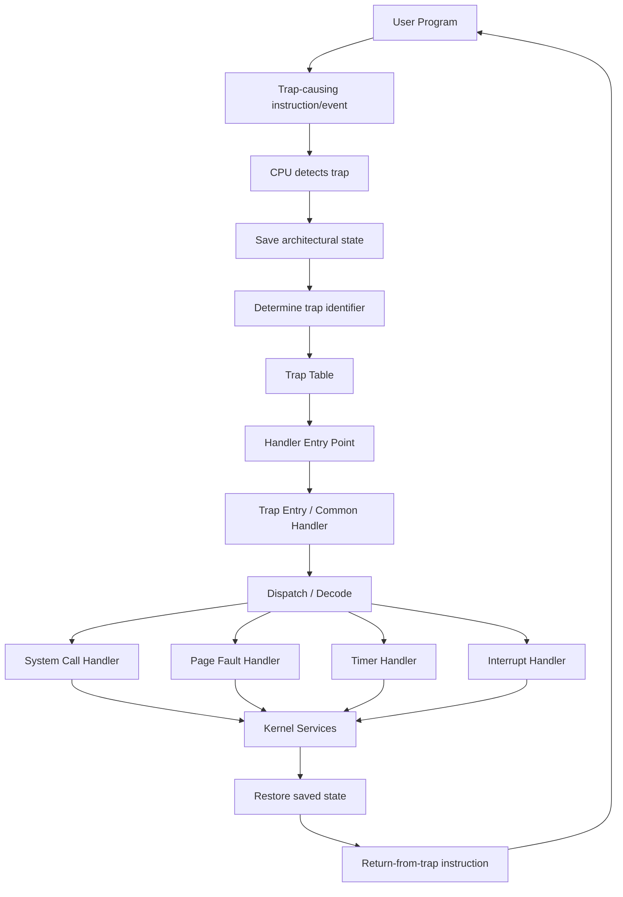
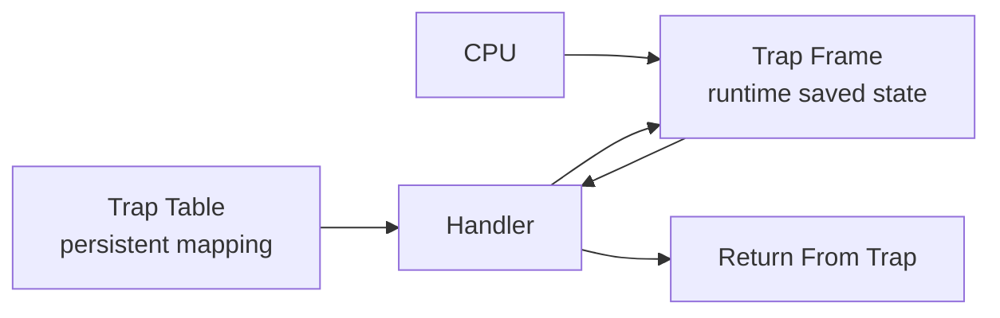

**Intent: formal OS abstraction / trap-entry mechanism.**

A **trap table** is a kernel-defined mapping from a processor's **trap/exception identifier** to the corresponding **trap handler entry point** (and, depending on the architecture, associated metadata).

### 1. Formal definition

Let:

* $T$ = set of possible trap identifiers
* $K$ = set of kernel handler entry points
* $M$ = optional metadata/configuration associated with each trap

Then a simple trap table is a function:

$$
\operatorname{TrapTable}: T \to K
$$

For example:

$$
\operatorname{TrapTable}(t_{\mathrm{syscall}})
  = h_{\mathrm{syscall}}
$$

$$
\operatorname{TrapTable}(t_{\mathrm{pagefault}})
  = h_{\mathrm{pagefault}}
$$

$$
\operatorname{TrapTable}(t_{\mathrm{timer}})
  = h_{\mathrm{timer}}
$$

In a more realistic model:

$$
\operatorname{TrapTable}: T \to K \times M
$$

where $M$ might contain things such as:

* privilege level / gate attributes
* interrupt vs exception information
* handler-specific configuration
* architecture-specific flags

So conceptually:

$$
t
\longmapsto
(\text{handler address},\text{metadata})
$$

The important point is that the **trap table itself does not execute the handler**. It is the lookup structure that tells the CPU **where control should go**.

---

## 2. Set-theoretic view

A table can equivalently be represented as a set of ordered pairs:

$$
\operatorname{TrapTable}
\subseteq T \times K
$$

with the functional property:

$$
\forall t\in T,\;
\exists! k\in K:
(t,k)\in\operatorname{TrapTable}
$$

That uniqueness condition is what makes it a function.

For example:

$$
\{
(t_{\mathrm{syscall}},h_{\mathrm{syscall}}),
(t_{\mathrm{pagefault}},h_{\mathrm{pagefault}}),
(t_{\mathrm{timer}},h_{\mathrm{timer}})
\}
$$

This is essentially the same mathematical structure as a finite map:

$$
T \rightharpoonup K
$$

if some trap numbers are deliberately unhandled.

---

## 3. Where it sits in the trap mechanism

The important distinction is between **hardware state**, **the trap table**, and **kernel software**.

There are actually **two levels of dispatch** here that are useful to distinguish.

### Hardware-level dispatch

$$
\text{trap event}
\to
\text{trap number}
\to
\operatorname{TrapTable}(\text{trap number})
\to
\text{entry address}
$$

This is where the trap table primarily participates.

### Kernel-level dispatch

The entry point may then do something like:

$$
\text{entry}
\to
\text{save/register frame}
\to
\text{decode trap}
\to
\text{specific kernel operation}
$$

So the trap table is **not necessarily the entire dispatch system**.

---

## 4. Relation between trap table and trap frame

A very useful distinction:

$$
\boxed{\text{Trap Table} \neq \text{Trap Frame}}
$$

The **trap table** is persistent kernel configuration:

$$
T \to K
$$

The **trap frame** is per-trap runtime state:

$$
\text{TrapFrame}
=
\{
PC,\;SP,\;registers,\;flags,\;privilege\ldots
\}
$$

Conceptually:

Thus the handler receives **two conceptually different things**:

$$
\text{Handler Input}
=
(\text{trap identity},\text{saved machine state})
$$

The trap table answers:

> **Which code should execute?**

The trap frame answers:

> **What machine state was interrupted?**

---

## 5. Category-theoretic formulation

There is a clean way to view this as a morphism.

Let:

$$
\mathcal{T}
=
\text{category of trap descriptions}
$$

and

$$
\mathcal{K}
=
\text{category of kernel handler entries}
$$

The trap table provides a mapping:

$$
H : T \to K
$$

where $T$ and $K$ can be viewed as objects in **Set**, and $H$ is a morphism:

$$
H \in \operatorname{Hom}_{\mathbf{Set}}(T,K)
$$

The runtime transition then has a different structure:

$$
\operatorname{TrapEvent}
\times
\operatorname{MachineState}
\to
\operatorname{KernelState}
$$

So don't conflate the two:

$$
\boxed{
\operatorname{TrapTable}: T\to K
}
$$

is a **static mapping**, while

$$
\boxed{
\operatorname{TrapTransition}:
(T,S)\to S'
}
$$

is a **dynamic state transition**.

This distinction becomes extremely useful when you later model an OS in Rust: the trap table is closer to **configuration/data**, whereas the trap handler is **behavior**, and the trap frame is **runtime state**.
