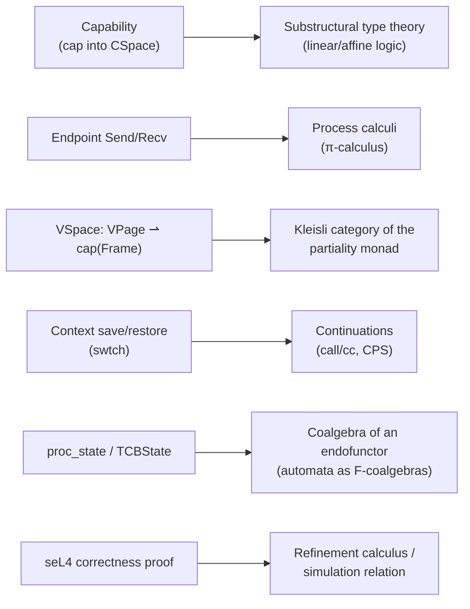
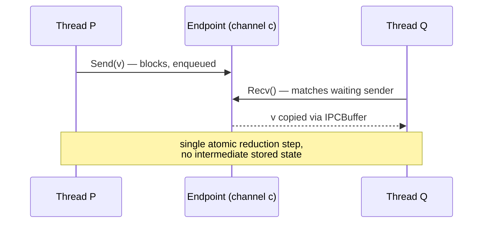

## Intent parse

A **foundations-grounding request**: map each seL4/xv6 mechanism onto the specific branch of theoretical CS whose mathematics it is *actually* an instance of — not analogy-by-resemblance, but identifying which structure is *forced* by the same constraint that forced the OS design. Root goal: for each mechanism, name the theory, give its object, and state the necessity argument for why that theory (and not a different one) is the right formalization.

---

## 1. The map, before the detail

Each edge below is justified causally: the OS mechanism has a property (non-duplicability, rendezvous-not-buffering, undefinedness-on-some-inputs, non-local-exit, mutual-exclusivity-of-tags) that is *exactly* the defining property of the corresponding mathematical object — the correspondence isn't decoration, it's the same constraint recognized twice.

---

## 2. Capabilities — substructural (linear/affine) type theory

A capability is unforgeable and its copying is *controlled*, not free — you cannot manufacture a capability out of nothing, and deriving a weaker capability from a stronger one consumes/attenuates rather than duplicates arbitrarily. This is precisely what ordinary set-theoretic/intuitionistic type theory does **not** model: in $\mathbf{Set}$, every element of a set can be freely duplicated or discarded by any function into it (weakening and contraction hold unconditionally). Linear logic's sequent structure is defined by *removing* those two structural rules:

$$
\text{Weakening: } \dfrac{\Gamma \vdash B}{\Gamma, A \vdash B} \qquad \text{Contraction: } \dfrac{\Gamma, A, A \vdash B}{\Gamma, A \vdash B}
$$

Ordinary (intuitionistic) logic has both freely; **linear logic drops both**, and *affine logic* keeps weakening (you may discard a resource) but drops contraction (you may not duplicate it). Capabilities are affine resources: a `Delete` capability can be discarded (weakening — revocation), but there is no kernel primitive that turns one capability into two independent full-strength capabilities out of thin air (no free contraction) — `Mint`/`Copy` operations exist, but they are explicit morphisms that must be invoked and can attenuate rights, not silent duplication. The categorical semantics of this fragment is a **symmetric monoidal category without a diagonal** $\Delta: A \to A\otimes A$ — the absence of a canonical diagonal *is* the mathematical statement "this object cannot be copied for free," which is the exact property that makes a capability a capability rather than a plain pointer.

$$
\text{CSpace} : \text{Slot} \rightharpoonup \text{KernelObject} \times \text{Rights}
$$
from before is then recognizable as a **context** in the linear-logic sequent-calculus sense: a finite indexed multiset of resources available for consumption by exactly one derivation (one thread's capability invocations), which is why two threads cannot both "spend" the same non-shared capability without an explicit sharing construction (a shared `VSpace` cap is the OS analogue of the linear-logic `!` "of course" modality — the *only* way to reintroduce free duplication is to explicitly mark something as unrestricted).

---

## 3. Endpoint — π-calculus, not shared memory

The defining property you already stated is: an Endpoint holds no data at rest, `Send` with no matching `Recv` blocks, and the transfer happens as an atomic rendezvous. This is not a queue/buffer semantics (that would be modeled by a monoid/multiset, as in the actor model) — it's **synchronous name-passing**, which is exactly Milner's π-calculus communication rule:

$$
\overline{c}\langle v\rangle.P \;\mid\; c(x).Q \;\longrightarrow\; P \;\mid\; Q[v/x]
$$

read as: an output on channel $c$ carrying value $v$, in parallel with an input on the same channel $c$ binding $x$, reduces in one atomic step to the continuations $P$ and $Q$ with $v$ substituted for $x$ — no intermediate state where the value exists independent of the two processes. `Endpoint` *is* the channel name $c$; `Send`/`Recv` *are* $\overline{c}\langle v\rangle$ and $c(x)$; the kernel's copying of IPC-buffer registers TCB-to-TCB *is* the substitution $[v/x]$. The reason this is the *necessary* formalism rather than a queueing theory is that seL4's Endpoint has no capacity parameter and no ordering-of-arrival semantics beyond FIFO-on-the-block-queue — there is no "state of the channel between messages" to model, which rules out Petri nets or the actor model (both of which reify the mailbox as persistent state) and selects π-calculus, where the channel is a bare name with no state of its own, exactly matching $\text{Endpoint} \cong \text{Queue}(\text{TCB})$ carrying *blocked threads*, not messages.

---

## 4. VSpace — the Kleisli category of the partiality monad

$\text{VSpace} : \text{VPage} \rightharpoonup \text{cap}(\text{Frame})$ is a partial function — undefined on unmapped pages, which is a page fault, not an error value silently returned. Modeling "a function that might not be defined" *inside* ordinary total-function set theory requires reifying the failure case as a value, which is exactly the **Maybe/Option monad**:

$$
\text{Maybe}(X) = X + \mathbf{1}, \qquad \eta_X : X \to \text{Maybe}(X), \quad x \mapsto \text{inl}(x)
$$

A partial function $f: A \rightharpoonup B$ is then a total function $f^\dagger : A \to \text{Maybe}(B)$ in ordinary $\mathbf{Set}$, and composing two partial functions (walking a multi-level page table: page directory ⇀ page table ⇀ frame) is Kleisli composition:

$$
(g \bullet f)(a) = \begin{cases} g(b) & \text{if } f(a) = \text{inl}(b) \\ \text{inr}(*) & \text{if } f(a) = \text{inr}(*) \end{cases}
$$

This is the *necessary* reason multi-level page-table walks short-circuit on the first missing level: it's exactly the monad law that Kleisli composition with a "none" input propagates "none" without inspecting the second function — which is precisely what a hardware page-table walker does (stop at the first not-present bit) and precisely what a null-pointer-style short-circuit in Haskell's `do`-notation for `Maybe` does. The **partial** function on plain sets ($\text{VPage} \rightharpoonup \text{cap}(\text{Frame})$) and the **Kleisli category of Maybe** are the same object viewed two ways — the second view is the one that explains *why* page-fault propagation composes correctly across levels rather than needing bespoke case analysis per level.

---

## 5. Context switch — reified continuations

`swtch()` saving `Context` and later restoring it is not merely "copying registers" as an operational fact — structurally, it is exactly what a language runtime does to implement `call/cc` (call-with-current-continuation): capture "everything needed to resume this computation from exactly this point" as a first-class value, store it, and later invoke it to resume. In continuation-passing style, every computation $e$ is transformed so it takes an explicit continuation $k : \text{Answer} \to \text{Answer}$ and never returns normally:

$$
\llbracket e \rrbracket : (\text{Value} \to \text{Answer}) \to \text{Answer}
$$

`struct context` **is** a continuation reified as data (a first-order encoding of "resume here" — `eip` is literally the code pointer the continuation jumps to, the stack pointer plus stack contents is literally the environment the continuation closes over). $\text{save}: \text{Proc} \to \text{Context}$ from your first-turn formalization is the reify-the-current-continuation step; $\text{restore}: \text{Context} \to \text{Proc}$ is continuation invocation. This is why `restore ∘ save ≠ id` is not a defect but definitional: invoking a captured continuation *never returns to the point of capture in the normal control-flow sense* — it transfers control away, exactly as `swtch()` never "returns" to the scheduler in the way an ordinary function call does; it jumps into whichever context was captured last, precisely the semantics of first-class continuations (and precisely why kernel context-switch code is notoriously the one place in a kernel where a C function is entered once and "returns" in a different thread's stack — the same non-local behavior `call/cc` has in Scheme).

---

## 6. proc_state / TCBState — coalgebra of an endofunctor

You already modeled `proc_state` as a bare coproduct $\sum_i \mathbf{1}_{s_i}$, and separately drew the transitions. Formally uniting *both* — states and the transition structure — needs one object, not two: a **coalgebra** for the endofunctor $F(X) = \sum_{\text{event}} X$ (or, with output, $F(X) = O \times X^{A}$ for automata with output $O$ and input alphabet $A$). A coalgebra is a set $S$ (here, the state space) together with a single structure map:

$$
\gamma : S \to F(S)
$$

For the proc/TCB automaton, $F(S) = S^{\{\text{fork},\text{sched},\text{yield},\text{sleep},\text{wake},\text{exit},\text{reap}\}}$ — a function from each event name to the resulting state — and $\gamma$ is exactly the transition table your `stateDiagram-v2` drew as arrows. The reason coalgebra (not algebra) is the necessary dual here: an *algebra* $F(S) \to S$ models how you *build up* a value from constructors (this is the right structure for, e.g., syntax trees); a *coalgebra* $S \to F(S)$ models how you *observe/unfold* behavior from a state one step at a time, which is exactly what a running process does — you never "construct" a process's future behavior in advance, you only ever observe its next transition given its current state and an incoming event. Bisimulation between two coalgebras (two implementations of the same automaton) is then the formally correct notion of "these two kernels' state machines are behaviorally identical even if the state *sets* differ" — which is the precise tool needed to state "Linux's `TASK_INTERRUPTIBLE`/`TASK_UNINTERRUPTIBLE` split refines xv6's single `SLEEPING` tag" as a provable relation rather than an informal claim.

---

## 7. seL4's correctness proof — refinement, not Curry–Howard

One clarification worth being precise about, since it's the most commonly mis-cited connection: seL4's proof is **not** a Curry–Howard "the kernel binary is a proof term" situation — it's a three-level **stepwise refinement**, each level related to the next by a simulation relation:

$$
\text{AbstractSpec} \;\sqsupseteq\; \text{ExecutableSpec} \;\sqsupseteq\; \text{C implementation}
$$

where $\sqsupseteq$ means: every behavior (trace of observable events) the lower level can produce is matched by some behavior the upper level could also produce — formally, a relation $R \subseteq \text{State}_{\text{abs}} \times \text{State}_{\text{conc}}$ such that $s \mathrel{R} t$ and $t \xrightarrow{a} t'$ implies $\exists s'.\, s \xrightarrow{a} s' \mathrel{R} t'$ (a **forward simulation**, the same categorical shape as bisimulation from §6 but one-directional). Curry–Howard *is* still present one level down — the proof steps themselves, machine-checked in Isabelle/HOL, are terms whose types are the propositions being proved (that's what "machine-checked proof" means at the Isabelle level) — but the headline claim "this C code implements this abstract capability model" is a refinement/simulation statement, the same mathematical object used to relate any two automata at different granularities, including the proc-state-coalgebra refinement in §6.

---

## Summary — necessity, not resemblance

$$
\begin{array}{l|l|l}
\textbf{OS mechanism} & \textbf{Foundational structure} & \textbf{Shared defining property} \\ \hline
\text{Capability} & \text{Substructural (affine) type theory} & \text{no free duplication (no diagonal }\Delta\text{)} \\
\text{Endpoint Send/Recv} & \pi\text{-calculus channel communication} & \text{synchronous rendezvous, no state at rest} \\
\text{VSpace mapping} & \text{Kleisli category of Maybe} & \text{undefinedness composes by short-circuit} \\
\text{Context save/restore} & \text{Reified continuations (CPS/call/cc)} & \text{non-local resume, save} \neq \text{inverse of restore} \\
\text{proc\_state transitions} & F\text{-coalgebra} & \text{state observed one step at a time, not built} \\
\text{seL4 correctness} & \text{Forward simulation / refinement} & \text{lower-level traces matched by upper-level ones}
\end{array}
$$