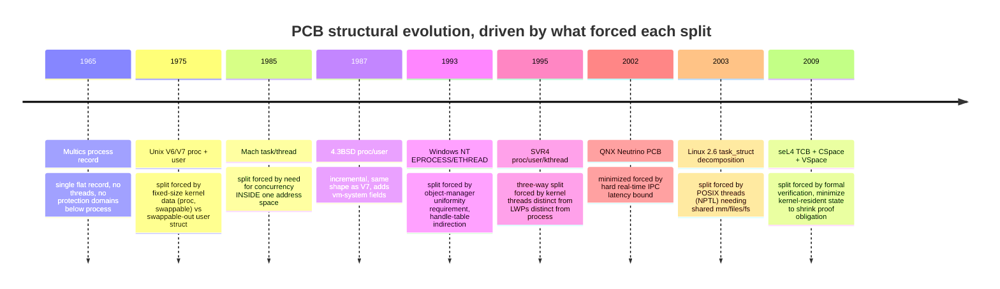
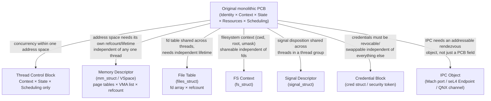

## Intent parse

This is a **generalization request**: broaden the previous point comparison (xv6 vs. seL4/NT/Mach/QNX) into a full **taxonomy + diachronic survey** of the PCB as a data type. Root goal: build the general schema $\text{PCB} : \text{Kernel} \to \text{Type}$ — i.e. treat "PCB" not as one struct but as a *family* of structurally related types indexed by kernel, and identify (a) the invariant sub-schema every instance shares, (b) the historical branch points where the schema was forced to split, (c) the sibling structures (TCB, MCB, credential blocks, IPC objects) that peeled off the PCB as separate types over time.

---

## 1. What a PCB *is*, formally, before any kernel-specific instance

Strip every kernel-specific field and ask what's structurally necessary for *any* preemptible, resumable unit of execution to exist. A PCB is the categorical product of five orthogonal concern-types — orthogonal meaning each is independently variable (you can change one without touching the others):

$$
\text{PCB} \;\cong\; \text{Identity} \times \text{Context} \times \text{State} \times \text{Resources} \times \text{Scheduling}
$$

where each factor is itself a product or coproduct of smaller sets:

$$
\text{Identity} \cong \text{Pid} \times \text{Parent} \times \text{Owner}
$$
$$
\text{Context} \cong \prod_{r \,\in\, \text{Registers}} \text{Word}
$$
$$
\text{State} \cong \sum_{i} \mathbf{1}_{s_i} \quad \text{(a coproduct — mutually exclusive lifecycle tags)}
$$
$$
\text{Resources} \cong \text{AddressSpace} \times \text{FileTable} \times \text{IPCEndpoints}
$$
$$
\text{Scheduling} \cong \text{Priority} \times \text{TimeSlice} \times \text{RunQueueLink}
$$

This is the *universal* shape. Every kernel below is a choice of (i) how tightly these five factors are fused into one struct vs. split into cross-referenced structs, and (ii) whether `Resources` is held by *containment* (direct field) or by *capability* (indirect, revocable reference) — the axis from the previous turn.

---

## 2. Historical timeline — the driving pressures, in causal order

Read this causally, not just chronologically: **every split is a response to a concurrency or verification pressure that the previous monolithic shape couldn't express.** V6→V7 wasn't about concurrency (no threads yet) — it was purely about swappability, a resource-management pressure. Everything after Mach is about concurrency inside a resource domain. seL4 is the only entry driven by a *proof* pressure rather than a *runtime* pressure, which is why it goes further than any concurrency-driven design needed to.

---

## 3. The invariant core vs. the contingent shell

Across all nine points on that timeline, decompose each concrete PCB into what never leaves vs. what gets peeled off into sibling structures:

$$
\text{PCB}_{\text{any kernel}} \;\cong\; \underbrace{\text{Context} \times \text{State} \times \text{Pid}}_{\text{invariant core — never externalized}} \;\times\; \underbrace{\text{Resources} \times \text{Identity}_{\text{extended}}}_{\text{contingent — externalized once concurrency/verification demands it}}
$$

The causal reason the core is invariant: `Context` (registers) and `State` (lifecycle tag) are **per schedulable-entity by definition** — there is no coherent notion of two threads sharing one program counter. `Resources` (address space, fd table) are **per protection-domain by convention**, not by definition, so as soon as a kernel needs N schedulable entities sharing 1 protection domain, this factor is forced out into its own referenced object.

---

## 4. Sibling structures — what peeled off, and the pressure that peeled each one off

Each arrow is labeled with the *specific* sharing or lifetime requirement that made containment insufficient — this is the same causal test each time: **"does this sub-record need a lifetime or a sharing pattern independent of the PCB's own lifetime?"** If yes, it becomes its own object with its own refcount, pointed to rather than embedded.

---

## 5. Concrete structural comparison across the actual kernels

$$
\begin{array}{l|l|l}
\textbf{Kernel} & \textbf{PCB-equivalent} & \textbf{Split-off siblings} \\ \hline
\text{Unix V7} & \texttt{struct proc + struct user} & \text{none yet — user struct is the resource shell, still 1:1} \\
\text{xv6} & \texttt{struct proc} & \text{none — pedagogically regressed to V7 shape} \\
\text{4.3BSD} & \texttt{struct proc + struct user} & \text{vmspace begins separating out} \\
\text{Mach} & \texttt{task + thread} & \text{task = resources+ports, thread = context only} \\
\text{SVR4} & \texttt{proc + user + kthread} & \text{kthread separates schedulable unit from LWP} \\
\text{Linux 2.6+} & \texttt{task\_struct} & \text{mm\_struct, files\_struct, fs\_struct, signal\_struct, cred} \\
\text{NT kernel} & \texttt{EPROCESS + ETHREAD/KTHREAD} & \text{handle table, VAD tree, token (cred) all separate objects} \\
\text{QNX} & \texttt{PCB (minimal)} & \text{everything resource-like is a separate process's responsibility (microkernel)} \\
\text{seL4} & \texttt{TCB} & \text{CSpace, VSpace, Endpoint — all independent, capability-referenced kernel objects}
\end{array}
$$

---

## 6. The general schema, restated as the actual answer to "PCB and related structures"

$$
\text{PCB} \;=\; \text{Context} \times \text{State}
$$

is the *only* part of the original five-factor product that has been true, unchanged, in every kernel on this list, from Multics to seL4 — because it's the only factor that is **structurally forced to be 1:1 with the schedulable entity**, never shareable, never revocable, never usefully indirected through a capability (a capability *to* a context is meaningless — you don't invoke a register file, you *are* it while running). Everything else in the "PCB" as historically named — `Identity`, `Resources`, `Scheduling` metadata — is contingent shell that different kernels, under different pressures (swappability, concurrency, real-time latency, formal verifiability), have progressively externalized into independently-lifetimed sibling structures. What's commonly called "the PCB" in an OS textbook is therefore best understood not as one struct but as **the load-bearing residue left behind after every externalizable concern has been externalized** — xv6's `struct proc` is informative precisely because it's the one data point on this list where *nothing* has been externalized yet, making the full pre-decomposition shape visible in one place.