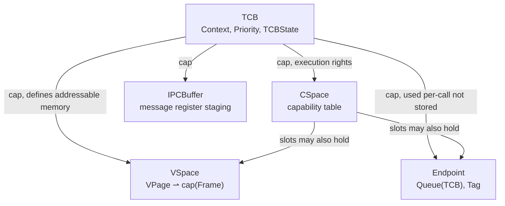

## Intent parse

A **primitive-definition query** on the three seL4 kernel object types you saw named but not unpacked last turn. Goal: give each one a formal type signature, say what capability operations it supports, and show how they compose to give a thread the ability to run and communicate — i.e. reconstruct $\text{TCB}\times\text{VSpace}\times\text{Endpoint}$ from primitives rather than treating them as black boxes.

---

## 1. TCB — Thread Control Block

The schedulable unit itself. In seL4 it is deliberately *not* the union of everything a Linux `task_struct` holds — it's the minimal record that the scheduler needs to run something, plus a set of capability slots pointing at everything else:

$$
\text{TCB} \;\cong\; \text{Context} \times \text{Priority} \times \text{TCBState} \times \text{cap}(\text{CSpace}) \times \text{cap}(\text{VSpace}) \times \text{cap}(\text{Endpoint})_{\text{fault handler}} \times \text{cap}(\text{IPCBuffer})
$$

where $\text{Context}$ is the same register-product as before ($\prod \text{Word}$), and each $\text{cap}(X)$ slot is not a value of type $X$ but a **morphism-selector**: an index into the TCB's own CSpace that, when resolved, yields an arrow you're permitted to invoke against an object of type $X$. This is the load-bearing distinction from xv6/Linux: `struct proc` *contains* `struct context` as a value; a seL4 TCB *contains a right to invoke* a VSpace object that lives elsewhere in the kernel's object space and may be pointed at by other TCBs too.

The kernel operations on a TCB are: `Configure` (wire up its CSpace/VSpace caps), `WriteRegisters`/`ReadRegisters` (touch `Context`), `Resume`/`Suspend` (toggle `TCBState`), `SetPriority`. Nothing else — no file table, no cwd, because those don't exist as kernel concepts.

---

## 2. VSpace — Virtual address space object

Not a struct field, a **kernel object in its own right** — the seL4 name for what other kernels call the page-table root (Linux `mm_struct`'s page table portion, or a Mach `pmap`). Formally it's a partial function from virtual pages to physical frame capabilities, realized concretely as the top-level page directory:

$$
\text{VSpace} : \text{VPage} \rightharpoonup \text{cap}(\text{Frame})
$$

a *partial* map (unmapped pages are simply outside the domain) from the set of virtual page numbers to capabilities on physical frame objects. Multiple TCBs can hold a capability to the *same* VSpace object — that's precisely how you express "these two threads share an address space," i.e. how you implement pthreads: two `TCB`s, one shared `VSpace` cap between them, two distinct `CSpace`s or one shared, depending on what else you want shared.

Structurally, `VSpace` is what happens when you take xv6's `char *mem; uint sz` pair (a bare pointer-plus-size, i.e. an implicit *total*, contiguous, unstructured mapping) and generalize it to an explicit, partial, page-granular, capability-indexed mapping. xv6's version has no independent identity — it's two fields of `struct proc`, deallocated exactly when the proc is. seL4's VSpace is retypable, revocable, and inspectable independent of any TCB pointing at it.

Kernel operations: `Map`/`Unmap` a frame capability at a virtual address, `Retype` untyped memory into page-table/page-directory objects to build the VSpace out of.

---

## 3. Endpoint — synchronous IPC rendezvous object

The mechanism, not a data container at all — it has essentially no persistent state of its own beyond a wait queue. It is the object two TCBs *invoke through* to perform synchronous message passing:

$$
\text{Endpoint} \cong \text{Queue}(\text{TCB}) \times \text{Tag}\big(\text{Sending} \mid \text{Receiving} \mid \text{Idle}\big)
$$

a queue of blocked TCBs tagged by which side of the rendezvous they're waiting on. The operations `Send`, `Recv`, `Call`, `Reply` are all defined as **rendezvous** — a `Send` on an Endpoint with no waiting receiver blocks the sender and enqueues it; when a matching `Recv` arrives, the kernel copies the message registers directly TCB-context-to-TCB-context (through the `IPCBuffer` each TCB holds a cap to) and both threads unblock. No buffering, no persistent message store — the Endpoint mediates a transfer, it doesn't hold data at rest.

This is the seL4/QNX/Mach-port answer to what xv6 handles with `void *chan` + `sleep()`/`wakeup()` — compare directly:

$$
\text{xv6: } \text{chan} : \text{Proc} \to \text{Addr}, \quad \text{sleep/wakeup match by pointer equality on a shared address}
$$
$$
\text{seL4: } \text{Endpoint is itself the addressed object}, \quad \text{Send/Recv match by capability to the same Endpoint}
$$

xv6's channel mechanism is untyped and unsynchronized (any two threads that happen to compute the same pointer value rendezvous, which is why `sleep()` requires a lock to avoid races) — the Endpoint mechanism makes the rendezvous object itself an addressable, capability-protected kernel entity, so only threads holding a capability to that specific Endpoint can participate, and the kernel — not a spinlock discipline the programmer must get right — arbitrates the queue.

---

## 4. How the three compose for one running thread

Two threads sharing an address space (a pthread pair) is exactly: two `TCB` objects, each holding a capability into the *same* `VSpace` object, with distinct `Context`. Two processes communicating is: two `TCB`s, disjoint `VSpace`s, each holding a capability to a shared `Endpoint`. Every concurrency and isolation pattern reduces to "which capability slots point at the same object" — there's no case analysis needed elsewhere in the kernel, because sharing is expressed once, uniformly, at the capability level, rather than needing bespoke shared-vs-private logic per resource type the way `task_struct`'s field-by-field refcounting does.