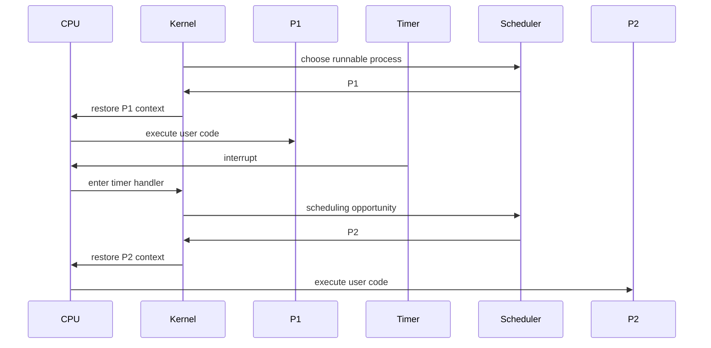
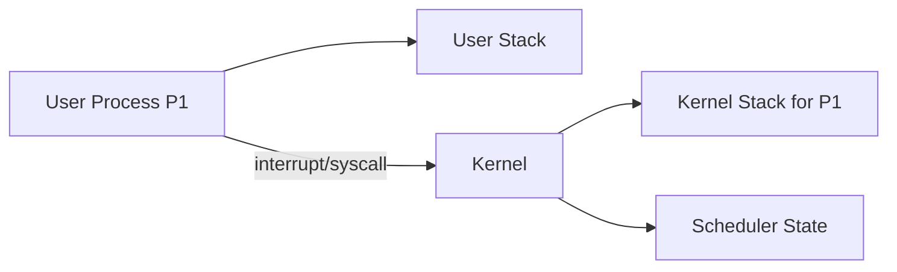

Yes — you're very close. Your intuition is pointing at the distinction between **scheduler state** and **currently executing process state**.

The correction is:

> The scheduler does **not** normally remain "running in the background" as another continuously executing program. Instead, the kernel has persistent state in memory, and hardware mechanisms periodically or asynchronously **re-enter the kernel**, at which point the scheduler can execute.

## 1. First correct the process model

It is slightly misleading to say:

> "the OS runs on a process itself."

A better model is:

$$
\text{CPU}
\rightarrow
\begin{cases}
\text{kernel execution}\\
\text{user-process execution}
\end{cases}
$$

The kernel is generally **not a process** in the same sense as your application.

A process has something like:

$$
P =
(\text{address space},\text{register context},\text{resources},\text{state},\ldots)
$$

while the kernel is privileged code that manages those processes.

---

# 2. What happens when your program starts?

Very roughly:

$$
\text{boot}
\rightarrow
\text{kernel}
\rightarrow
\text{create process}
\rightarrow
\text{scheduler}
\rightarrow
\text{restore process context}
\rightarrow
\text{user code}
$$

Suppose the kernel creates process `P`.

The kernel maintains a process structure somewhere in kernel memory:

```text
Process P
├── PID
├── state = RUNNABLE
├── page-table reference
├── saved registers
├── kernel stack
├── scheduling information
└── ...
```

The process list might conceptually be:

$$
L = [P_1,P_2,P_3,\ldots]
$$

or, more realistically, several scheduler-specific data structures.

But **the process's virtual memory does not normally contain the kernel's process list**.

That's an important correction.

The kernel's process structures live in **kernel memory**, protected from ordinary user code.

---

# 3. Then how does the process actually start?

Suppose the scheduler chooses:

$$
\operatorname{next}(L)=P_2
$$

The kernel loads the CPU context associated with $P_2$.

Conceptually:

$$
C_{P_2}
=
(\operatorname{PC},\operatorname{SP},R_1,\ldots,R_n,\operatorname{page\ table},\ldots)
$$

The kernel restores that context.

In particular:

$$
\operatorname{PC}
\leftarrow
\operatorname{entry}(P_2)
$$

and

$$
\operatorname{SP}
\leftarrow
\operatorname{stack}(P_2)
$$

Then the CPU transitions to user mode.

Now:

$$
\boxed{\text{CPU is executing P2}}
$$

The kernel isn't executing concurrently on that same CPU.

---

# 4. And this is exactly where your intuition kicks in

You're thinking:

> "But if the kernel hands control to P2, how does the scheduler ever get control back?"

**Exactly.**

That's the fundamental problem solved by interrupts.

Suppose:

$$
P_2 \rightarrow \text{CPU}
$$

The kernel has previously configured a timer.

After some interval:

$$
\text{Timer}
\rightarrow
\text{interrupt}
\rightarrow
\text{CPU}
$$

The CPU automatically transfers control to the kernel's timer-interrupt entry point.

So:

$$
P_2
\xrightarrow{\text{timer}}
\boxed{\text{kernel}}
\xrightarrow{\text{scheduler}}
P_3
$$

There doesn't need to be a scheduler spinning somewhere.

---

# 5. The scheduler is more like a function than a daemon

This is the mental model I'd recommend.

Don't imagine:

```text
CPU
 ├── Program
 └── Scheduler running in background
```

Instead imagine:



Notice:

$$
\boxed{\text{Scheduler only executes when the kernel executes.}}
$$

The scheduler isn't continuously consuming CPU cycles.

---

# 6. But the scheduler's *state* is always there

This is probably the thing your intuition is detecting.

The scheduler has persistent data structures:

$$
S =
(\text{runnable tasks},
\text{priorities},
\text{CPU accounting},
\text{current task},
\ldots)
$$

For example:

$$
\operatorname{RunQueue}
=
\{P_1,P_3,P_7,\ldots\}
$$

That data persists in memory while `P2` executes.

So there is a distinction:

$$
\boxed{
\text{scheduler state persists}
\neq
\text{scheduler computation continuously executes}
}
$$

This is exactly analogous to an ordinary function having state stored in a data structure.

---

# 7. What does the CPU remember when it enters the kernel?

This is another crucial abstraction.

Suppose user code is executing:

$$
P_2:\quad
\operatorname{PC}=0x400123
$$

Timer fires.

The CPU needs to preserve enough information to eventually resume:

$$
P_2:\quad
\operatorname{PC}=0x400123
$$

Conceptually:

$$
\text{User Context}
=
(\operatorname{PC},\operatorname{SP},\operatorname{flags},\ldots)
$$

The architecture performs an interrupt/trap entry mechanism, saving the appropriate machine state and transferring execution to a kernel-defined handler.

The kernel can then eventually save/restore a larger **context** as part of a context switch.

---

# 8. So there are actually two different "stacks"

This often clears up the mental model.

A process/thread typically has a **user stack**:

$$
\text{user stack}
\rightarrow
\text{function locals, return addresses, arguments}
$$

But when the CPU enters the kernel, there is also a **kernel stack associated with the thread/process**.

Conceptually:



So when `P1` is executing:

$$
\text{CPU}
\rightarrow
P_1\text{'s user code}
$$

When it makes a syscall or receives an interrupt:

$$
\text{CPU}
\rightarrow
P_1\text{'s kernel execution context}
$$

The kernel can then inspect the saved user context.

---

# 9. The beautiful part: the scheduler doesn't need to be "background active"

This is the key abstraction:

$$
\boxed{
\text{scheduler}
=
\text{persistent state}
+
\text{code invoked at scheduling points}
}
$$

Scheduling points can arise from several sources:

$$
\begin{aligned}
\text{timer interrupt} &\rightarrow \text{preemption}\\
\text{syscall} &\rightarrow \text{possibly reschedule}\\
\text{I/O completion} &\rightarrow \text{wake task}\\
\text{process exit} &\rightarrow \text{choose another}\\
\text{blocking operation} &\rightarrow \text{choose another}
\end{aligned}
$$

So the kernel is **event-driven**.

It spends most of the CPU's time running user code, and hardware/software events cause transitions back into kernel code.

---

# 10. This connects directly to your FastAPI question

There is actually a very nice structural analogy:

### OS

$$
\text{user computation}
\xrightarrow{\text{interrupt/syscall}}
\text{kernel}
\xrightarrow{\text{scheduler}}
\text{another computation}
$$

### Async runtime

$$
\text{coroutine}
\xrightarrow{\text{await}}
\text{event loop}
\xrightarrow{\text{scheduler}}
\text{another coroutine}
$$

The enormous difference is **who can force the transition**.

OS:

$$
\boxed{\text{hardware can forcibly reclaim control}}
$$

Async runtime:

$$
\boxed{\text{coroutine must reach a suspension point}}
$$

Hence:

```python
async def bad():
    while True:
        expensive_cpu_work()
```

can monopolize the event loop.

Whereas an OS process doing:

```c
while (1) {
    expensive_cpu_work();
}
```

can still be preempted by the timer.

---

## The mental model I'd keep

Think of the kernel as **latent control state**, not a background process:

$$
\boxed{
\begin{array}{c}
\text{Kernel code + kernel data structures}\\
\downarrow\\
\text{CPU executes user process}\\
\downarrow\\
\text{interrupt / syscall / fault}\\
\downarrow\\
\text{CPU executes kernel}\\
\downarrow\\
\text{scheduler}\\
\downarrow\\
\text{restore another context}\\
\downarrow\\
\text{CPU executes another process}
\end{array}
}
$$

So your intuition was right about **"something has to remain available to take control back."**

The precise answer is:

> **The scheduler doesn't remain executing in the background; the kernel remains resident and its scheduling state remains available, while interrupts/traps/syscalls provide the mechanisms that periodically or conditionally return CPU control to the kernel.**
