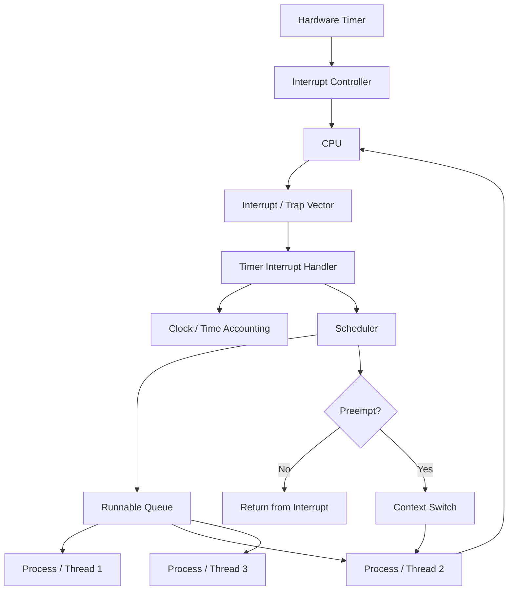
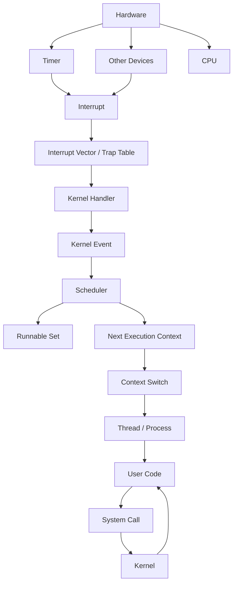

Your intent is **OS scheduling / preemption**: why the kernel needs an external mechanism to regain control of the CPU, and what abstractions implement that mechanism.

## 1. The fundamental problem

Suppose the OS gives a process the CPU:

$$
P_1 \rightarrow \text{CPU}
$$

If `P1` executes an infinite loop:

```rust
loop {
    // never calls the kernel
}
```

then without interrupts, the kernel has **no opportunity to run again**.

The important distinction is:

* **System call**: process voluntarily enters the kernel.
* **Timer interrupt**: hardware forces execution into the kernel.
* **Scheduler**: kernel decides what should run next.
* **Context switch**: kernel changes the CPU's execution context.

So the timer interrupt is fundamentally a **control-reclamation mechanism**.

The kernel needs a way to say:

> "Even if the current process refuses to cooperate, I will eventually get control back."

---

# 2. Why a timer specifically?

The hardware timer periodically generates an interrupt:

$$
\text{timer}
\rightarrow
\text{CPU interrupt}
\rightarrow
\text{kernel}
\rightarrow
\text{scheduler}
$$

For example, imagine a 1 ms timer tick.

```text
P1 runs
P1 runs
P1 runs
      ↓
timer interrupt
      ↓
kernel
      ↓
scheduler
      ↓
P2 runs
```

This gives the OS a notion of **bounded CPU ownership**.

If the scheduler gives `P1` a quantum:

$$
q = 10\text{ ms}
$$

then approximately:

$$
P_1 \xrightarrow{10ms} \text{timer interrupt} \xrightarrow{} \text{scheduler}
$$

The process does **not** get to decide when its CPU allocation ends.

That's what enables **preemptive multitasking**.

---

# 3. The important abstractions

There are several layers. Don't collapse them into "the timer."

| Abstraction                 | Responsibility                              |
| --------------------------- | ------------------------------------------- |
| **Hardware timer**          | Generates interrupts                        |
| **Interrupt controller**    | Routes interrupt to a CPU                   |
| **Interrupt vector/table**  | Maps interrupt → handler                    |
| **Trap/interrupt entry**    | Transfers CPU into kernel mode              |
| **Timer interrupt handler** | Records timer event / scheduler opportunity |
| **Scheduler**               | Chooses next runnable process/thread        |
| **Context switch**          | Changes execution context                   |
| **Process/thread state**    | Represents runnable/running/blocked/etc.    |

The causal chain is:

$$
\boxed{
\text{Timer}
\rightarrow
\text{Interrupt}
\rightarrow
\text{Kernel}
\rightarrow
\text{Scheduler}
\rightarrow
\text{Context Switch}
}
$$

---

## 4. Timer interrupt vs scheduler

This distinction is particularly important.

A timer interrupt **doesn't inherently mean "switch processes."**

Conceptually:

```rust
fn timer_interrupt() {
    clock.tick();

    scheduler.update();

    if scheduler.should_preempt() {
        schedule();
    }
}
```

The timer is an **event source**.

The scheduler is the **decision procedure**.

For example:

$$
\text{timer interrupt}
\mapsto
\text{CPU time accounting}
$$

doesn't necessarily cause:

$$
P_1 \mapsto P_2
$$

The scheduler might decide:

$$
\operatorname{next}(P_1)=P_1
$$

because nobody else is runnable.

---

# 5. What happens mechanically?

A simplified architecture looks like this:



The key thing is that **the timer does not select `P2`**.

It merely creates an opportunity for the kernel to make that decision.

---

# 6. Why can't the scheduler just run periodically itself?

Because the scheduler itself needs CPU execution.

This is the fundamental bootstrap problem:

$$
\text{scheduler cannot schedule itself unless it gets CPU control}
$$

A cooperative system could require:

```rust
loop {
    do_work();
    yield_cpu();
}
```

But then a malicious or buggy program can simply do:

```rust
loop {
    do_work();
}
```

and never call `yield_cpu()`.

The timer breaks that dependency:

$$
\text{process cooperation}
\not\Rightarrow
\text{kernel progress}
$$

Instead:

$$
\text{hardware event}
\Rightarrow
\text{kernel progress}
$$

That's a major architectural property of a preemptive OS.

---

# 7. The deeper abstraction: forced control transfer

You can think of the OS as having two fundamentally different entry mechanisms.

### Voluntary entry

$$
\text{user program}
\xrightarrow{\text{syscall}}
\text{kernel}
$$

Example:

```text
read()
write()
fork()
mmap()
```

The process explicitly requests kernel service.

### Involuntary entry

$$
\text{hardware}
\xrightarrow{\text{interrupt}}
\text{kernel}
$$

Example:

```text
timer
disk completion
network packet
keyboard
```

The kernel doesn't wait for the process.

This gives the OS **asymmetric control**:

$$
\boxed{
\text{process controls its own execution}
\quad\text{but}\quad
\text{hardware can revoke that control}
}
$$

That's the foundation of preemption.

---

## 8. The whole OS abstraction hierarchy

A useful mental model is:



The most important conceptual separation is:

$$
\boxed{
\begin{aligned}
\text{Interrupt} &:\text{ "Kernel, something happened."}\\
\text{Scheduler} &:\text{ "Who should run?"}\\
\text{Context switch} &:\text{ "Change who is running."}
\end{aligned}
}
$$

And the timer's special role is:

$$
\boxed{
\text{Timer interrupt}
\Rightarrow
\text{periodic opportunity for preemption}
}
$$

Without that mechanism, a general-purpose OS would typically have to rely on **cooperative scheduling**, which means the currently running code has substantial power to prevent other code from running.
