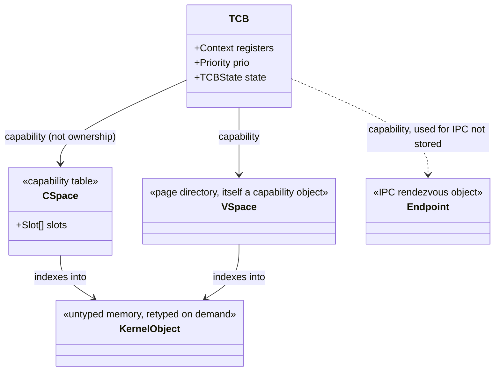
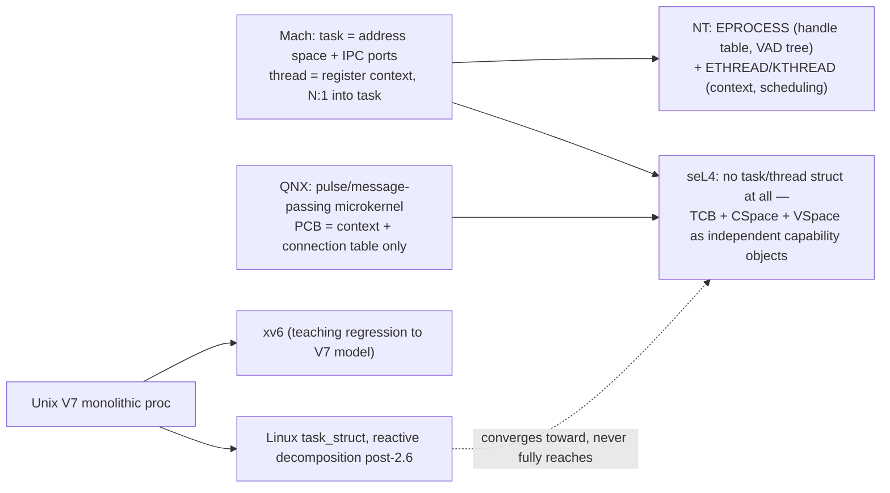

## Intent parse

This is a **generalization query**: take the genealogy edge you already isolated (monolithic `struct proc` → decomposed component model, forced by the *threading* requirement) and ask whether that same causal pressure, when applied by kernels optimized for *provable correctness* or *architectural minimality* rather than incremental compatibility, converges to the same design or a stronger one. So the root goal is: **isolate the design invariant that survives under the strongest engineering constraints**, using xv6/Linux as the weak-constraint baseline.

---

## 1. What "best engineered" cashes out to, causally

Pick the kernels that are held up as reference designs for a *specific* rigor, not popularity:

- **seL4** — formally verified (functional correctness proof, machine-checked, down to binary) → forces radical minimality, because every kernel object you keep is proof surface you must discharge.
- **Mach** — the origin of task/thread separation → forces you to ask "what's the actual atomic unit of scheduling vs. resource ownership" *before* any BSD-compatibility pressure existed.
- **Windows NT kernel** — object-manager-based, designed top-down by a team (Cutler's group) with VMS lineage → forces uniform handle/object semantics rather than ad hoc pointers.
- **QNX** — message-passing microkernel, real-time constraint → forces the PCB down to just what's needed for IPC + scheduling, everything else is a server-owned resource.

The common causal driver across all four, sharpened past what forced Linux's later refactor: it's not merely "support threads," it's **minimize the trusted computing base / kernel-resident state**, which is a strictly harder constraint that subsumes the threading one.

---

## 2. Formal reframing: capability space instead of struct

xv6/Linux's `struct proc` holds *direct pointers* to its resources (`ofile[NOFILE]`, `cwd`, `mm_struct`, …) — resource access is structural containment. The capability-based designs (seL4, and NT's handle table is a weaker version of the same idea) replace direct containment with **indirection through an addressed, permissioned lookup table**. Set-theoretically:

$$
\text{CSpace} : \text{Slot} \rightharpoonup \text{KernelObject} \times \text{Rights}
$$

a *partial* function (not every slot is populated) from a finite index set of slots to a kernel object paired with a rights set. The TCB (thread control block) then holds not resources but a **single capability pointing at its own CSpace**:

$$
\text{TCB} \;\cong\; \text{Context}\times\text{Priority}\times\text{cap}(\text{CSpace})\times\text{cap}(\text{VSpace})\times\text{cap}(\text{Endpoint})
$$

Compare directly to `Proc` from before:

$$
\text{Proc}_{\text{xv6}} \;\cong\; \text{Mem}\times\text{Sz}\times\text{KStack}\times\text{proc\_state}\times\text{Pid}\times\text{Parent}\times\text{Chan}\times\text{Killed}\times\text{OFile}^{NOFILE}\times\text{CWD}\times\text{Context}\times\text{TrapFrame}
$$

The categorical difference: in xv6, `Proc` is a **product object that owns its factors** (they're inline fields — no indirection, no sharing possible without breaking the type). In seL4, `TCB` is a product where **every non-register factor is a morphism** (a capability = an invocation right, i.e. an arrow in the category of kernel objects) rather than an owned value. This is exactly the pushout that Linux was forced into reactively (`task_struct` pointing at shared, refcounted `mm_struct`/`files_struct`) — seL4 just starts there, and pushes it further: even `VSpace` (address space) and `CSpace` (capability space) themselves are *first-class kernel objects*, retrievable/revocable/reasoned-about independently of any thread.

---

## 3. Diagram: seL4 TCB vs xv6 proc, same slots, different arrows

Note what's *absent* relative to `struct proc`: no `ofile[]`, no `cwd`, no `parent`, no `killed`, no `chan`. Those aren't kernel-resident facts anymore — they're **userspace server state** (a filesystem server owns file descriptors; a process-management server owns the parent/child tree). The kernel's job shrank from "know everything about a process" to "schedule a register context and mediate capability invocation."

---

## 4. The other lineages, same axis

The dotted edge is the important causal claim: **Linux's decomposition is convergent-but-incomplete** relative to seL4's. Linux still keeps `mm_struct`, `files_struct`, `fs_struct` as kernel-owned, refcounted, but *directly pointed-to* records — closer to xv6's containment model than to capability indirection. Linux never needed to go further because its constraint was "support threads without breaking POSIX semantics," not "minimize provable kernel state," so the pressure stopped at the point of adequacy, not the point of minimality.

---

## 5. What this tells you about xv6 specifically

xv6's `struct proc` is not a simplification of a good design — it's a **faithful reconstruction of Unix V7's proc/user split**, deliberately regressed to teach the monolithic model *before* showing why it breaks. It sits at node `E → F` in the graph, i.e., historically and pedagogically *upstream* of the fork that produced every "best engineered" kernel on this list. None of seL4/Mach/NT/QNX's improvements are visible from inside xv6 — they're precisely the things xv6 omits so a student can feel the pressure toward decomposition themselves, the same pressure you diagrammed as F→G in the previous turn, just resolved much more aggressively.

**One-line verdict:** the axis "best engineered" moves along is *ownership → capability*; xv6 sits at the ownership extreme by pedagogical design, Linux sits partway across that axis reactively, and seL4/QNX sit at the capability extreme axiomatically — the register-context product type (`Context`/`TCB.registers`) is the one thing that never moves, because it's the one piece of state that is *definitionally* non-shareable (a register file has no meaningful notion of "shared access" the way a file descriptor table does).