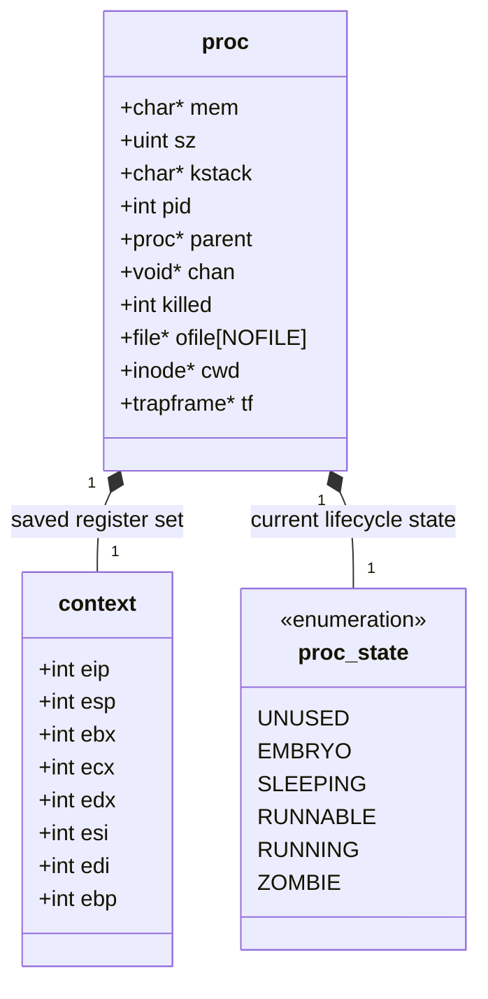
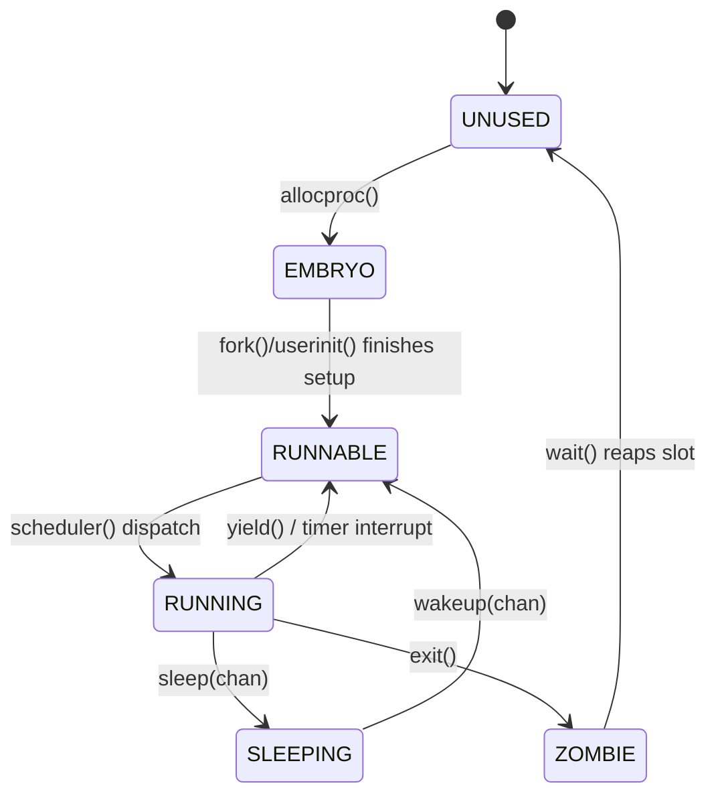
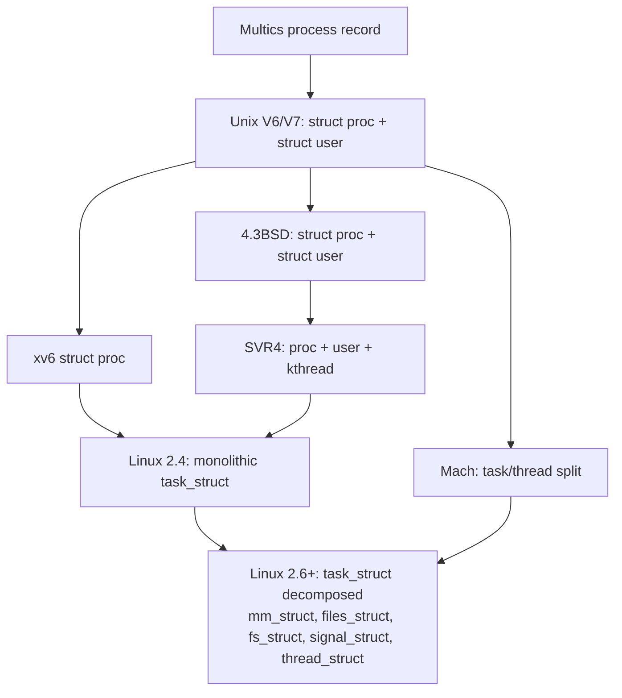

## Intent parse

Two sub-goals, funneled from one root goal ("understand the xv6 PCB design and its place in kernel history"):

1. **Structural elicitation**: render `struct context`, `enum proc_state`, `struct proc` as a *schema* — a product type (`struct`) containing a nested product type (`context`) and a nested coproduct/sum type (`proc_state`) that additionally carries a transition relation (finite-state automaton).
2. **Diachronic comparison**: a genealogy query over PCB (process control block) designs across kernels, asking which structural *invariants* survived reimplementation and which were *contingent* on xv6's specific implementation choices (static allocation, single-threaded process model, x86 32-bit ABI).

---

## 1. Formal shape of the types

`context` is the categorical product of eight register-valued sets — the struct *is* the product object, and each field accessor (`.eip`, `.esp`, …) is a projection morphism:

$$
\text{Context} \;\cong\; \prod_{i=1}^{8} \mathbb{Z}_{2^{32}} \quad=\quad \mathbb{Z}_{2^{32}}^{\,eip}\times \mathbb{Z}_{2^{32}}^{\,esp}\times \mathbb{Z}_{2^{32}}^{\,ebx}\times \mathbb{Z}_{2^{32}}^{\,ecx}\times \mathbb{Z}_{2^{32}}^{\,edx}\times \mathbb{Z}_{2^{32}}^{\,esi}\times \mathbb{Z}_{2^{32}}^{\,edi}\times \mathbb{Z}_{2^{32}}^{\,ebp}
$$

`proc_state` is a coproduct (disjoint union) of six unit sets — a bare finite set until you add the transition relation, at which point it becomes the object-set of a small category (an automaton: states = objects, transitions = generating morphisms, closed under composition for full reachability):

$$
\text{proc\_state} \;\cong\; \mathbf{1}_{UNUSED} + \mathbf{1}_{EMBRYO} + \mathbf{1}_{SLEEPING} + \mathbf{1}_{RUNNABLE} + \mathbf{1}_{RUNNING} + \mathbf{1}_{ZOMBIE}
$$

`proc` is a product that has this coproduct as one of its factors:

$$
\text{Proc} \;\cong\; \text{Mem}\times\text{Sz}\times\text{KStack}\times\text{proc\_state}\times\text{Pid}\times\text{Parent}\times\text{Chan}\times\text{Killed}\times\text{OFile}^{NOFILE}\times\text{CWD}\times\text{Context}\times\text{TrapFrame}
$$

The `swtch()` call implements two maps `save : Proc → Context` and `restore : Context → Proc`. Note `save` is a **partial projection**, not injective on all of `Proc` — it only extracts the callee-saved-register subspace, so `restore ∘ save ≠ id_Proc`: memory, the fd table, and `pid` all ride through a context switch untouched by this pair of maps. `Context` is a lossy quotient view of `Proc`, not an isomorphic copy of it.

## 2. The two diagrams

One implementation note worth flagging causally: canonical xv6's actual `struct context` only has `edi, esi, ebx, ebp, eip` (5 fields) — `esp` is tracked separately as `p->context` *pointer* itself, and `ecx`/`edx` aren't saved at all, because in the cdecl calling convention `eax/ecx/edx` are **caller-saved**: the C compiler already spills them before `swtch()` is called, so the assembly stub only needs to preserve the **callee-saved** set. Your struct including `esp`, `ecx`, `edx` explicitly is a variant (common in OSTEP-style homework versions) — semantically redundant but harmless, since it's a strict superset of the required save set.

## 3. Genealogy — what a PCB had to become

**Causal driver of the one real fork in this tree (F → G):** xv6/early-Unix `proc` is monolithic because xv6 has no in-kernel thread concept — one `proc` = one address space = one control flow, so it's fine for `mem`, `ofile`, `cwd`, and `context` to all live in one struct with 1:1 cardinality. The moment a kernel needs **light-weight processes** (POSIX threads, `clone()`), you need *some* processes to share an address space and fd table while keeping distinct register contexts and stacks. A monolithic struct can't express "share subset A, keep subset B private" — so the struct is forced to decompose into independently refcounted components (`mm_struct`, `files_struct`, `fs_struct`) each pointed to by multiple `task_struct`s, with only `thread_struct` (≈ xv6's `context`) staying strictly 1:1 per schedulable entity. Mach arrived at the same conclusion from the opposite direction, making task/thread separation the *primitive* design rather than a later refactor.

## 4. What lasted vs. what didn't

| Element | Fate |
|---|---|
| `pid`, `parent` pointer | Survived essentially unchanged everywhere |
| `state` enum: RUNNING/RUNNABLE/SLEEPING(blocked)/ZOMBIE | Survived as the semantic core; Linux's `TASK_RUNNING`/`TASK_INTERRUPTIBLE`/`TASK_UNINTERRUPTIBLE`/`EXIT_ZOMBIE` are refinements of the same four ideas |
| saved callee-saved register set (`context`) | Survived as `thread_struct` — the switch-frame concept is universal |
| kernel stack pointer | Survived universally |
| `UNUSED` state | **Did not survive** — it's an artifact of xv6's static `proc[NPROC]` array needing a "free slot" sentinel. Kernels with dynamic (slab) allocation of PCBs just don't allocate a `task_struct` until fork, so there's nothing to mark "unused" |
| `EMBRYO` as an *observable* state | **Mostly did not survive** as a named state — Linux's `copy_process()` builds the struct fully before it's ever externally visible, so there's no window where another thread could observe a half-initialized task |
| monolithic `struct proc` (owning mem + files + cwd + context together) | **Did not survive** once threading became a requirement — replaced by the decomposed, independently-shared component model shown in node G |

The one-line summary of "which ones lasted": the *finite-state-machine skeleton* and the *register-save-set-as-separate-record* idea are structural invariants that every kernel reinvents in some form; the *single flat struct* packaging is what gets discarded, and it gets discarded specifically because it can't express partial sharing between schedulable entities.