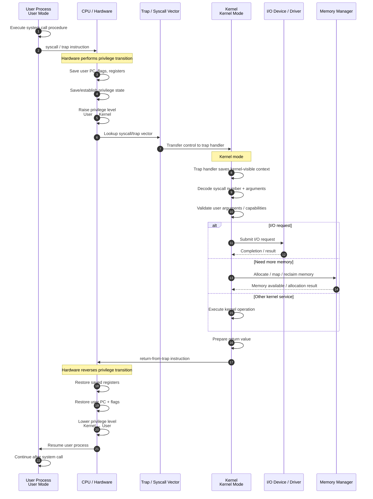
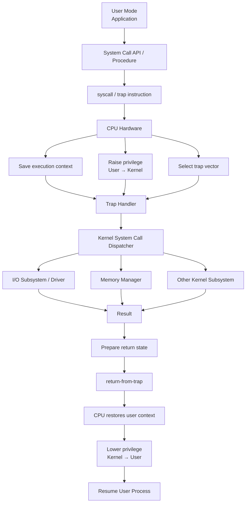

**Intent — OS control-transfer model:** you want the complete causal path from a user-space system call, through the hardware privilege transition and trap handler, into kernel services such as I/O or memory management, and then back to user mode.

The key distinction is that **the procedure call itself does not create the privilege transition**:

$$
\text{User procedure}
\rightarrow
\text{syscall instruction}
\rightarrow
\boxed{\text{hardware-controlled trap}}
\rightarrow
\text{kernel trap handler}
$$

A normal procedure call is essentially:

$$
PC \mapsto f
$$

while a system call is a **controlled change of execution domain**:

$$
(U,; PC,; S_U)
\xrightarrow{\text{syscall}}
(K,; PC_{\mathrm{handler}},; S_K)
$$

where:

* $U$ = user privilege domain
* $K$ = kernel privilege domain
* $S_U$ = saved user CPU state
* $S_K$ = kernel execution state

The return instruction performs the inverse control transfer:

$$
(K,; S_K,; S_U)
\xrightarrow{\text{return-from-trap}}
(U,; S_U)
$$

### The important causal hierarchy

So the **trap handler is the boundary object** between the two execution regimes:

$$
\boxed{
\text{User computation}
;\middle|;
\text{hardware-enforced control transfer}
;\middle|;
\text{Kernel computation}
}
$$

And importantly, **I/O and memory allocation happen after entering kernel mode**; they are not themselves what causes the privilege transition. The `syscall`/trap mechanism causes the transition, while the kernel decides which protected resource operation to perform.
