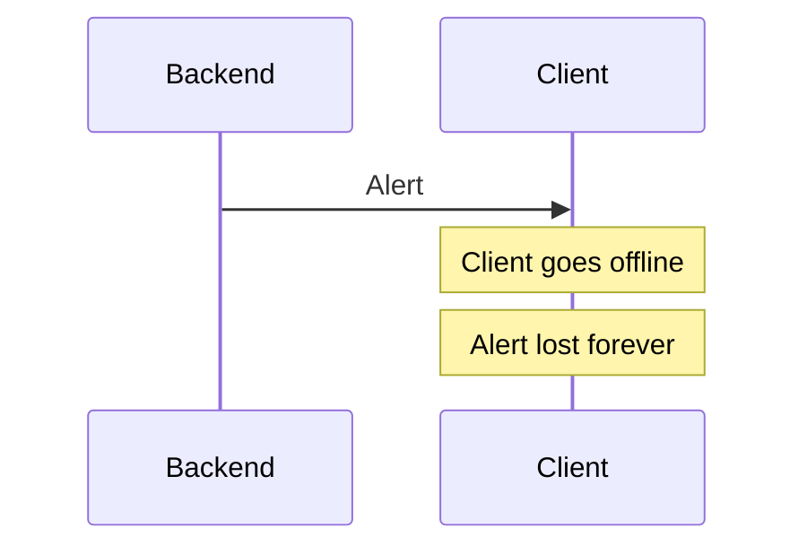
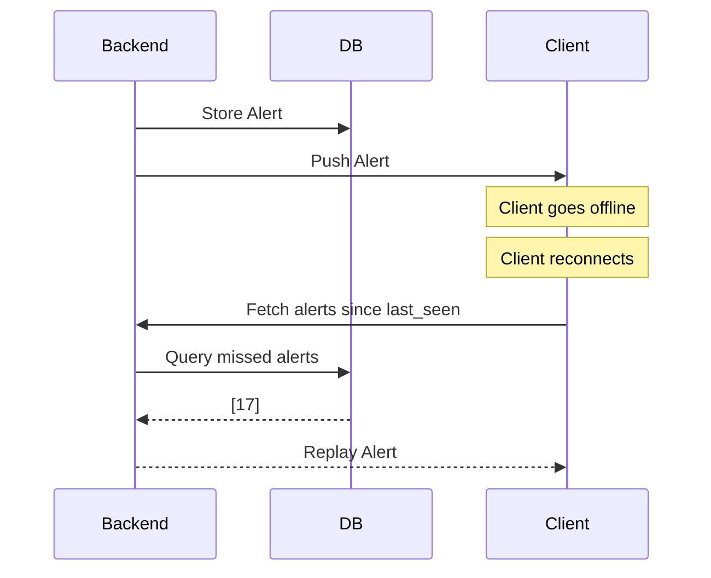
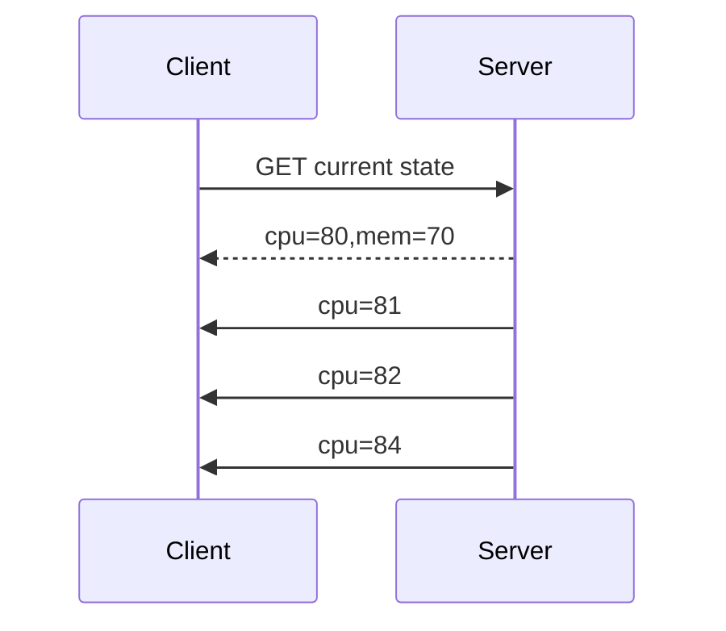
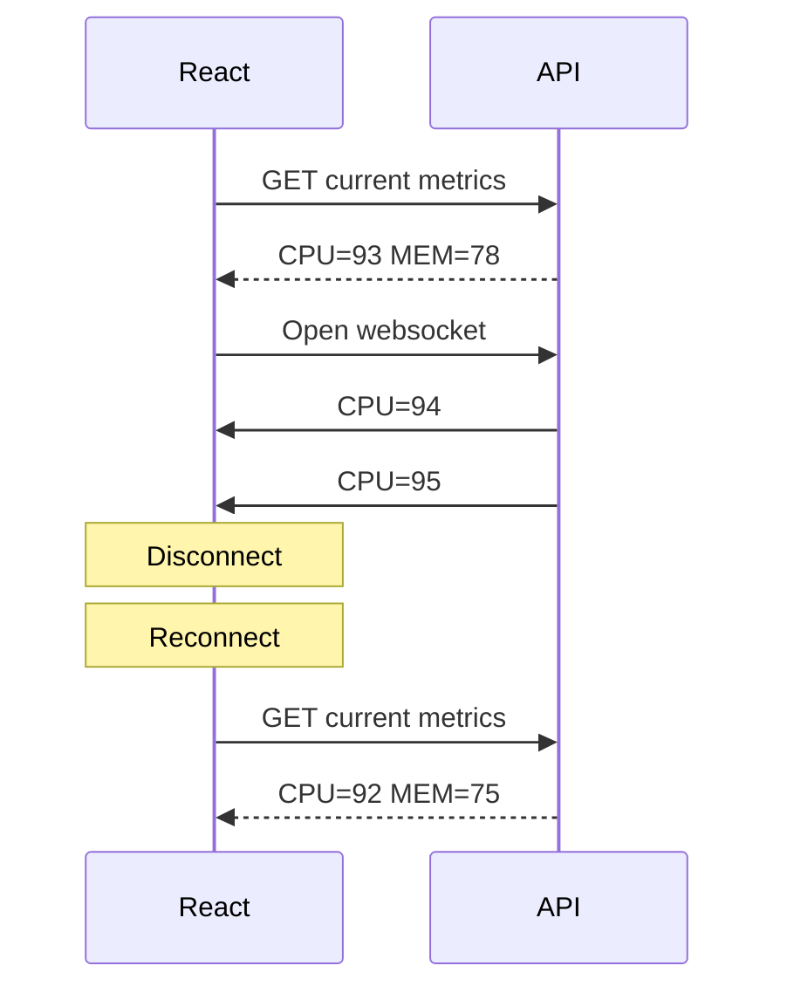
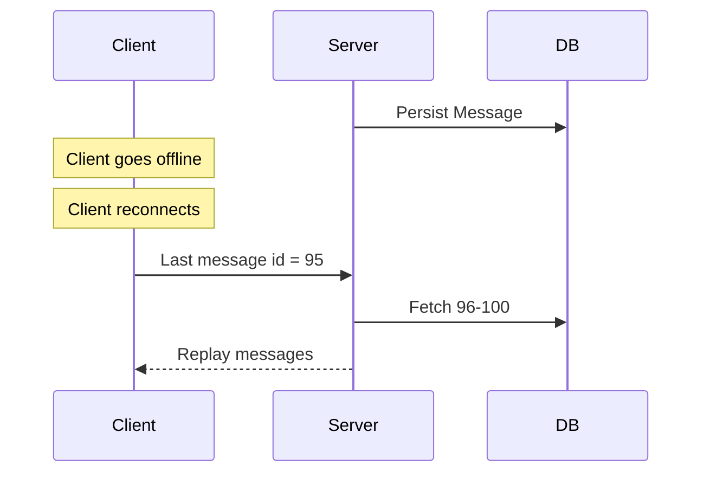
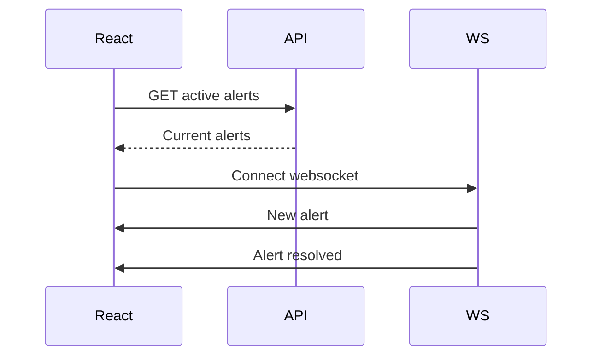
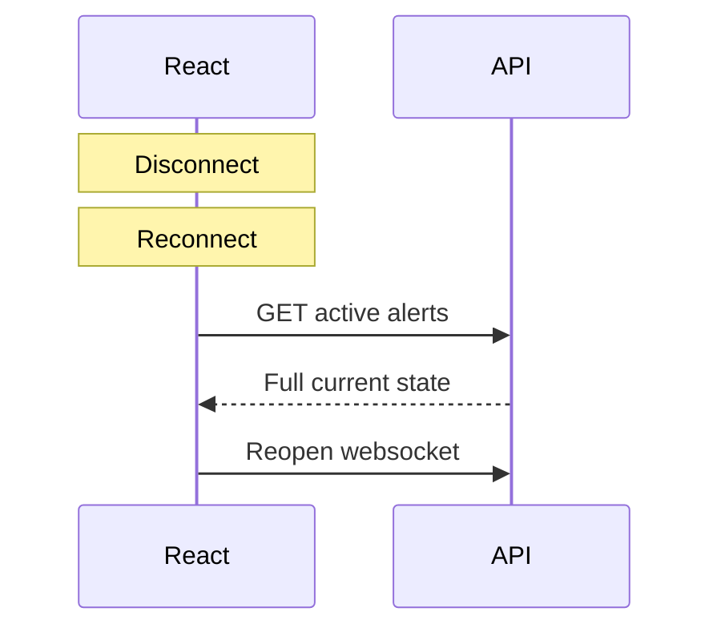

This is one of the central problems of realtime systems:

> **How do clients converge to the correct state if push delivery is unreliable and clients disconnect?**

The answer is almost always:

```text
Push for freshness
Pull for correctness
```

or equivalently:

```text
WebSocket = notification channel
Database/API = source of truth
```

---

# Naive Push Model (Incorrect)



This only works for ephemeral data like:

* typing indicators
* cursor position
* "user is online"
* live mouse movement

---

# Production Model



Push merely reduces latency.

The database guarantees correctness.

---

# Formal Model

Client maintains:

```text
last_seen_event_id = 1042
```

Server stores:

```text
1040
1041
1042
1043
1044
1045
```

Client reconnects:

```http
GET /alerts?after=1042
```

Server returns:

```json
[
    { "id": 1043 },
    { "id": 1044 },
    { "id": 1045 }
]
```

Client catches up.

---

# Sequence Numbers

This is the simplest approach.

```text
event_id
-------
1
2
3
4
5
6
```

Reconnect:

```text
give me everything after 5
```

Used by:

* chat systems
* notification systems
* feeds
* event sourcing systems

---

# Timestamp Based

Alternative:

```text
last_timestamp = 10:05:31
```

Reconnect:

```http
GET /alerts?since=10:05:31
```

Problems:

* clock skew
* duplicate timestamps
* ordering ambiguity

Sequence IDs are usually better.

---

# Snapshot + Delta Pattern

Large systems often do:

```text
load snapshot
+
apply deltas
```

Example:



If websocket disconnects:

```text
ignore missed deltas
reload snapshot
continue receiving deltas
```

This is extremely common.

---

# Monitoring Dashboard Example

Suppose dashboard shows:

```text
CPU: 93%
Memory: 78%
Disk: 40%
```

If client disconnects for 2 minutes:

Do you need:

```text
CPU:
91
92
93
94
95
96
95
94
93
```

Usually no.

Instead:



This is called:

> **snapshot + streaming updates**

and is probably what you want for monitoring.

---

# Chat Example

Chat is different.

Missing:

```text
hello
how are you
want lunch?
```

is unacceptable.

Therefore:



---

# Event Classification

| Event Type       | Store? | Replay? |
| ---------------- | ------ | ------- |
| CPU metric       | No     | No      |
| Typing indicator | No     | No      |
| Presence update  | No     | No      |
| Alert created    | Yes    | Yes     |
| Chat message     | Yes    | Yes     |
| Notification     | Yes    | Yes     |
| Trade execution  | Yes    | Yes     |
| Payment event    | Yes    | Yes     |

---

# Monitoring System Recommendation

For your FastAPI + React monitor:

## Backend

```text
metrics table
alerts table
```

Only alerts are durable.

Metrics can expire after:

```text
1 hour
24 hours
7 days
```

depending on needs.

---

## Frontend Startup



---

## Reconnection



No replay logic required.

---

# General Rule

There are three canonical strategies:

| Strategy         | Example                       |
| ---------------- | ----------------------------- |
| Snapshot only    | dashboard refresh             |
| Snapshot + delta | monitoring systems            |
| Event log replay | chat, finance, event sourcing |

Most realtime dashboards use **snapshot + delta**, while most messaging systems use **event log replay**. The distinction is whether your application cares about the **current state** or the **history of transitions that produced that state**.
