# The Problem

The underlying systems problem is:

> **How can state changes occurring on one machine become visible on another machine with acceptable latency, cost, and consistency guarantees?**

Formally:

```text
Producer ----(state transition)----> Consumer

Goal:
Δt_visibility = t(client observes update) - t(update occurs)

Minimize:
- Latency
- Bandwidth waste
- Server resource usage

Maintain:
- Ordering
- Reliability
- Scalability
```

Examples:

| Domain            | Producer           | Consumer  | Latency Requirement |
| ----------------- | ------------------ | --------- | ------------------- |
| Chat              | sender             | receiver  | <100ms              |
| Stock trading     | exchange           | traders   | <10ms               |
| Twitter feed      | author             | followers | <1s                 |
| Monitoring alerts | monitoring service | operators | <5s                 |
| Email             | mail server        | user      | minutes acceptable  |

---

# The Solution

All approaches answer the same question:

> Who initiates communication?

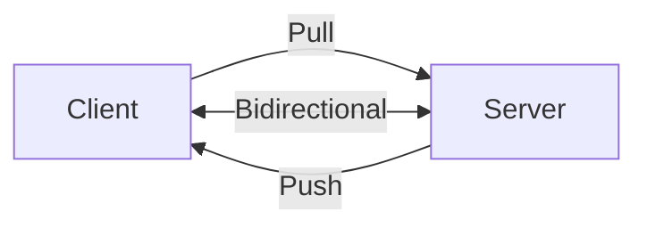

This creates three classes:

| Model  | Initiator |
| ------ | --------- |
| Pull   | Client    |
| Push   | Server    |
| Duplex | Both      |

---

# Client-Server Connection Protocols

## Layer hierarchy

```text
Application Layer
├── HTTP
├── WebSocket
├── SSE
├── WebRTC
│
Transport Layer
├── TCP
└── UDP
│
Network Layer
└── IP
```

---

# Networking 101

## Request-response

Classic HTTP:

```text
Client:
GET /messages

Server:
200 OK
["hello"]
```

Connection lifecycle:

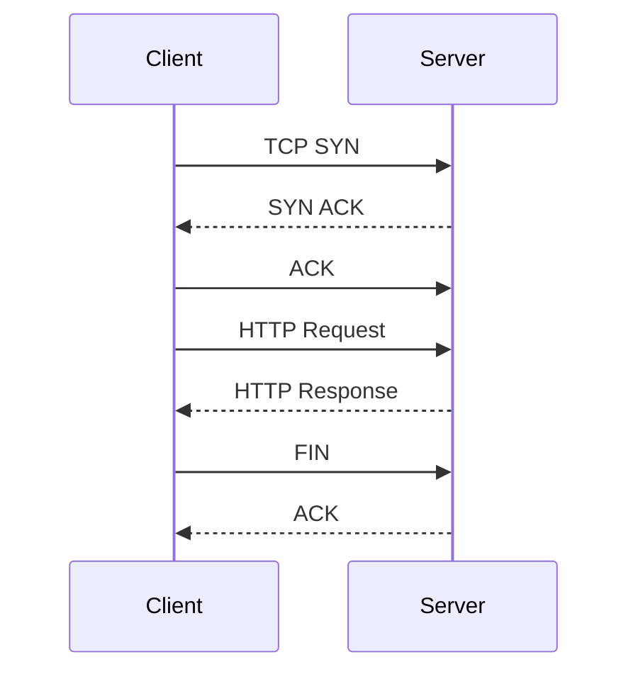

Cost:

```text
Connection establishment:
1 RTT

TLS handshake:
1-2 RTT

Actual request:
1 RTT

Total:
2-4 RTT
```

Repeated polling repeatedly pays this cost.

---

# Simple Polling: The Baseline

## Definition

Client periodically asks:

```text
"Anything new?"
```

Architecture:

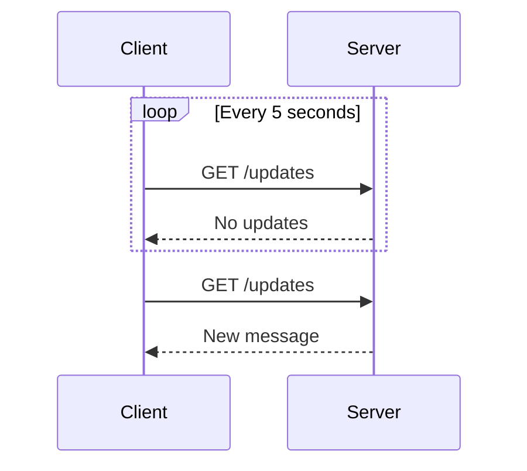

---

## Mathematical model

Polling interval:

```text
P = polling interval

Expected latency:
P/2

Worst latency:
P
```

Example:

```text
poll every 10 seconds

average delay = 5 seconds
worst delay = 10 seconds
```

---

## Server cost

For:

```text
1M users
5 second polling interval
```

Requests:

```text
1,000,000 / 5
=
200,000 requests/sec
```

Even if nothing changes.

---

## Strengths

* Extremely simple
* Works everywhere
* Load balancers understand it
* Stateless servers

---

## Weaknesses

* Wasteful
* High latency
* Doesn't scale

---

# Long Polling: The Easy Solution

Idea:

```text
Client asks once.

Server waits until data exists.
```

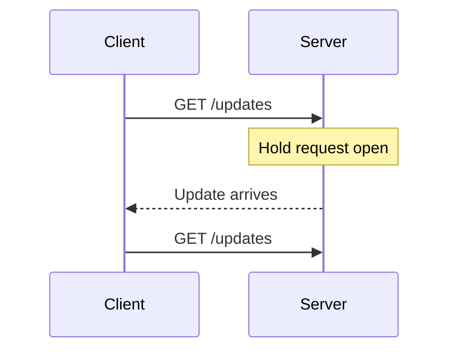

---

## Latency

```text
visibility delay ≈ network RTT
```

Usually:

```text
50-200ms
```

---

## Cost

Instead of:

```text
poll every 5 seconds
```

You have:

```text
1 active request per user
```

---

## Resource issue

Traditional thread-per-request servers:

```text
100k users
=
100k blocked threads
```

Impossible.

Modern async runtimes:

* epoll
* kqueue
* IOCP

solve this.

---

## Usage

Good for:

* notifications
* monitoring alerts
* dashboards

---

# Server-Sent Events (SSE): The Efficient One-Way Street

## Definition

Server opens a permanent HTTP response stream.

```text
GET /events

HTTP 200 OK
Content-Type: text/event-stream
```

Then:

```text
data: hello

data: world

data: alert
```

---

## Architecture

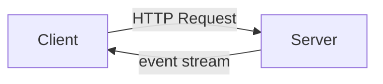

---

## Properties

| Property        | Value           |
| --------------- | --------------- |
| Direction       | server → client |
| Protocol        | HTTP            |
| Binary support  | no              |
| Auto reconnect  | yes             |
| Browser support | excellent       |

---

## Reconnection

Browser automatically reconnects:

```text
EventSource(url)
```

Server can send:

```text
id: 1234
data: hello
```

Client reconnects with:

```text
Last-Event-ID: 1234
```

Server resumes:

```text
1235
1236
1237
```

This is effectively:

```text
checkpoint + replay
```

Very similar to:

* Kafka offsets
* WAL positions
* CDC sequence numbers

---

## Usage

Excellent for:

* dashboards
* monitoring
* logs
* notifications
* AI streaming tokens

---

# WebSockets: The Full-Duplex Champion

## Upgrade process

Starts as HTTP:

```text
GET /chat
Upgrade: websocket
```

Server replies:

```text
101 Switching Protocols
```

Connection becomes:

```text
TCP stream
```

---

## Architecture

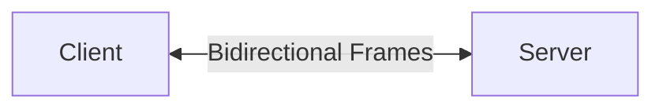

---

## Properties

| Property        | Value         |
| --------------- | ------------- |
| Direction       | bidirectional |
| Transport       | TCP           |
| Ordering        | guaranteed    |
| Binary support  | yes           |
| HTTP compatible | partially     |

---

## Message framing

```text
TCP stream:

001101001010100010101...
```

Websocket frames:

```text
FRAME 1
FRAME 2
FRAME 3
```

Application sees messages rather than bytes.

---

## Scaling issue

Each connection consumes:

* memory
* file descriptors
* heartbeat traffic

Example:

```text
1M sockets
```

Memory:

```text
50KB/socket

=
50GB RAM
```

---

## Fanout architecture

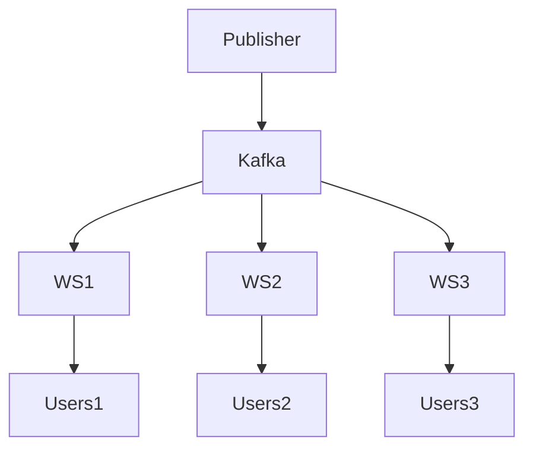

---

## Usage

* chat
* multiplayer games
* collaborative editing
* trading systems

---

# WebRTC: The Peer-to-Peer Solution

## Goal

Remove server relay.

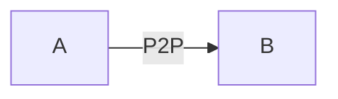

---

## Components

### Signaling

Exchange metadata.

Usually:

* websocket
* HTTP

---

### STUN

Determines public IP.

---

### TURN

Fallback relay server.

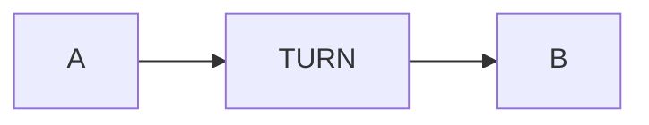

---

### ICE

Tries connection strategies.

```text
direct local
direct public
relay
```

Uses first successful path.

---

## Transport

Uses:

```text
UDP
```

for low latency.

---

## Usage

* video calls
* voice calls
* screen sharing

---

# Overview

| Technology   | Direction     | Latency       | Scale     | Complexity |
| ------------ | ------------- | ------------- | --------- | ---------- |
| Polling      | pull          | high          | excellent | low        |
| Long Polling | push-ish      | medium        | medium    | low        |
| SSE          | server push   | low           | high      | low        |
| WebSocket    | bidirectional | very low      | medium    | medium     |
| WebRTC       | peer-to-peer  | extremely low | variable  | high       |

---

# Server-Side Push/Pull

Most large systems combine both.

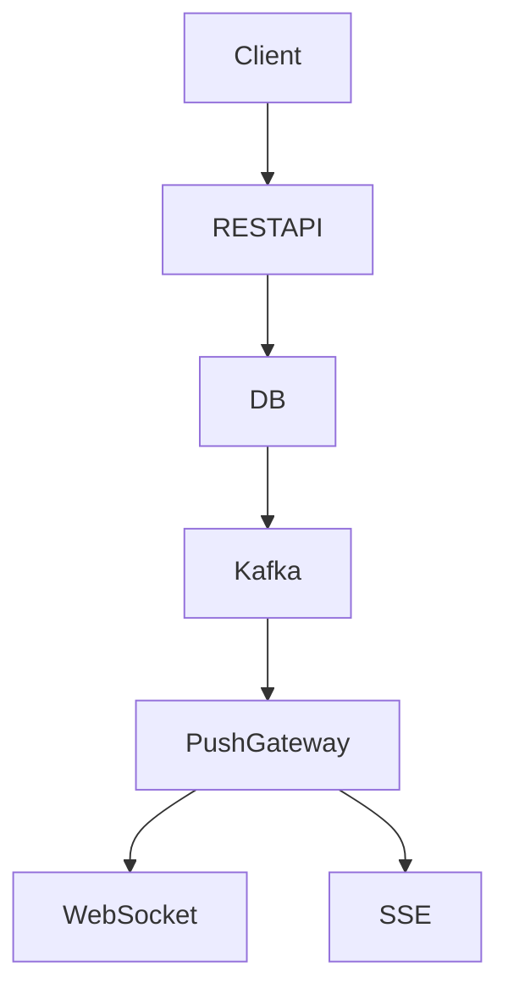

Writes:

```text
client -> server
```

Reads:

```text
server -> client
```

---

## Internal architecture

```text
Database
↓
CDC
↓
Kafka
↓
Consumers
↓
Connection gateways
↓
Users
```

This is the canonical real-time pipeline.

---

# When to Use in Interviews

Interview heuristic:

```text
latency requirement?
fanout size?
communication direction?
```

Decision tree:

```mermaid
flowchart TD

A[Need realtime?]

A -->|No| Polling
A -->|Yes| B

B -->|Server to Client only| C
B -->|Both directions| WebSocket

C -->|Large fanout| SSE
C -->|Small scale| Long Polling
```

---

# Common Interview Scenarios

| Problem              | Typical Choice |
| -------------------- | -------------- |
| Chat                 | WebSocket      |
| Monitoring dashboard | SSE            |
| Notification service | SSE            |
| Collaborative editor | WebSocket      |
| Multiplayer game     | WebSocket      |
| Video call           | WebRTC         |
| Live stock prices    | WebSocket      |
| IoT telemetry        | MQTT/WebSocket |
| Build logs           | SSE            |

---

# When NOT to Use

## Websocket

Avoid when:

* updates occur every minutes
* millions of idle users
* request-response sufficient

---

## SSE

Avoid when:

* client sends frequent updates
* binary protocol required

---

## WebRTC

Avoid when:

* server must inspect traffic
* communication isn't media heavy

---

# Common Deep Dives

# "How do you handle connection failures and reconnection?"

## State machine

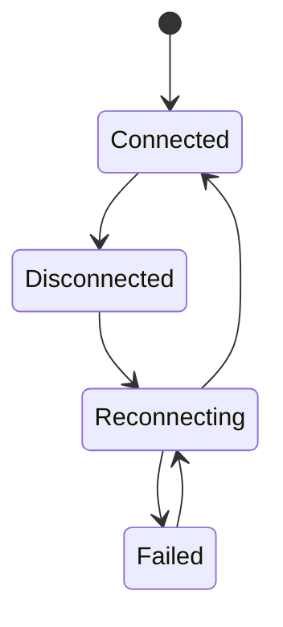

---

## Strategy

```text
1 reconnect after 1s
2 reconnect after 2s
3 reconnect after 4s
4 reconnect after 8s
```

Exponential backoff:

```text
delay = base * 2^attempt + jitter
```

---

## Reliability

Assign:

```text
message_id
offset
sequence_number
```

Client sends:

```text
resume_from=10293
```

Server replays missing events.

---

# "What happens when a single user has millions of followers who all need the same update?"

This is a **fanout problem**.

Example:

```text
Taylor Swift posts tweet.
100M followers receive update.
```

Architecture:

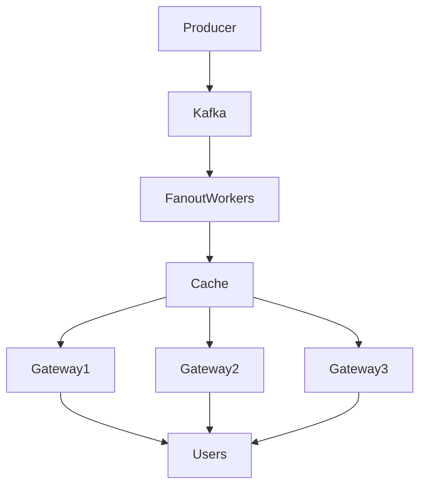

Strategies:

| Strategy        | Description            |
| --------------- | ---------------------- |
| Fanout on write | precompute timelines   |
| Fanout on read  | compute during fetch   |
| Hybrid          | celebrity optimization |

Large social networks typically use hybrid approaches.

---

# "How do you maintain message ordering across distributed servers?"

Perfect global ordering is expensive.

Usually systems choose:

## Per-room ordering

Chat room:

```text
room_1:
1
2
3
4
```

---

## Partition ordering

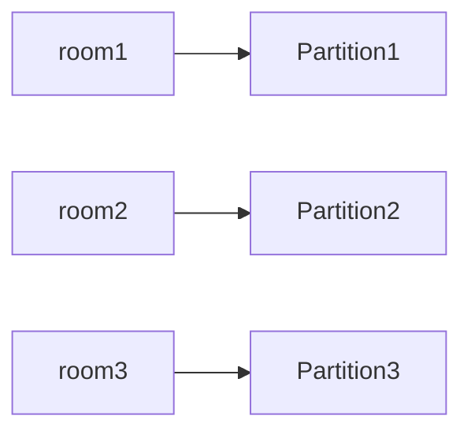

All messages for one room go to one partition.

Ordering guaranteed within partition.

---

## Sequence numbers

Server assigns:

```text
room_1:
101
102
103
```

Client buffers:

```text
received:
101
103

wait for:
102
```

---

## Formal tradeoff

```text
Global ordering
Scalability
Availability
```

Choose two.

---

# Conclusion

Real-time communication is fundamentally choosing a point in a multidimensional tradeoff space:

```text
Latency
Bandwidth
Complexity
Ordering
Scalability
Reliability
Cost
```

A useful compression is:

```text
Polling:
client repeatedly asks.

Long polling:
client waits.

SSE:
server streams.

WebSocket:
both stream.

WebRTC:
clients stream directly.
```
