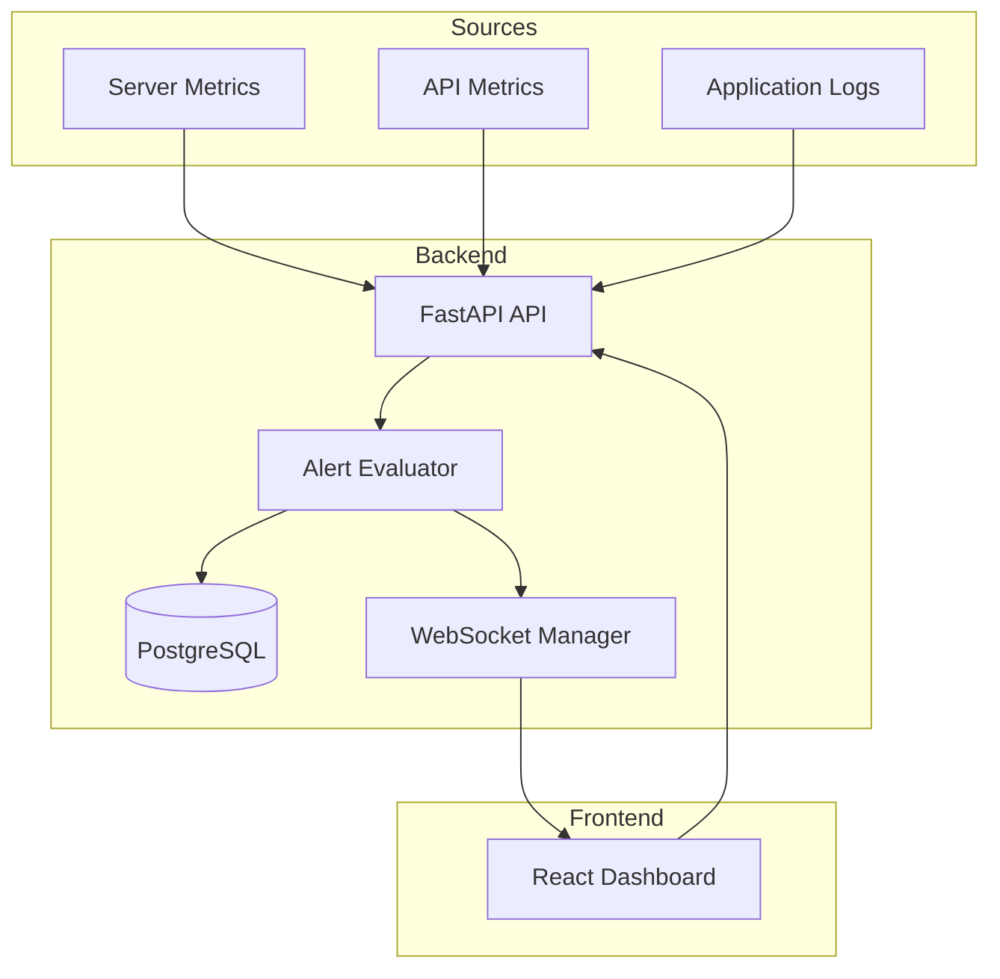
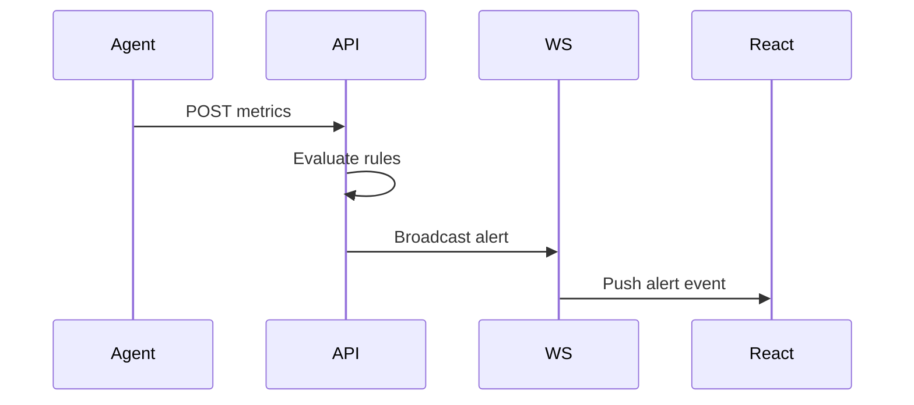
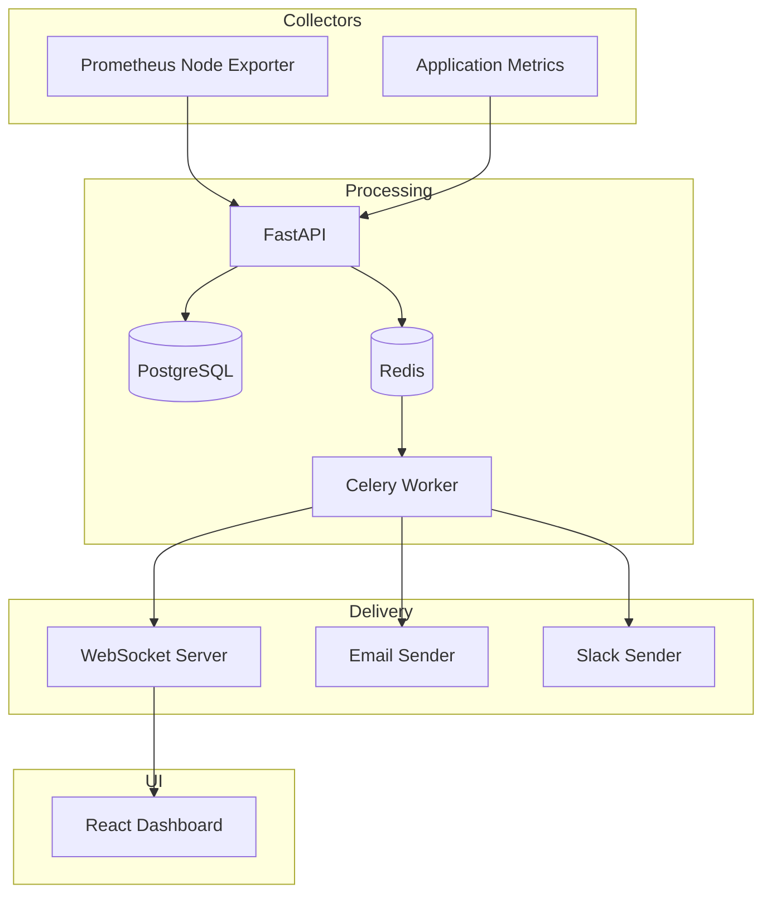

For a simple monitoring alert system, the architecture becomes much smaller because you usually have:

```text
Metric changes
    ↓
Threshold evaluation
    ↓
Alert generation
    ↓
Push notification to users
```

The fundamental computational problem is:

```text
Metric Stream × Alert Rules → Alert Events
```

---

# Example

Suppose you monitor:

```text
CPU Usage
Memory Usage
Disk Usage
API Latency
Error Rate
```

Alert rules:

```text
CPU > 90% for 5 minutes
Latency > 500ms for 2 minutes
Error rate > 5%
```

---

# Minimal Stack

| Layer                | Technology                           |
| -------------------- | ------------------------------------ |
| Frontend             | React                                |
| Backend API          | FastAPI                              |
| Database             | PostgreSQL                           |
| Background Scheduler | APScheduler or Celery                |
| Real-time Updates    | WebSockets                           |
| Metrics Source       | Prometheus exporter or custom agents |
| Deployment           | Docker                               |

For a toy project you can even remove Postgres:

```text
React
↓ websocket
FastAPI
↓
SQLite
```

---

# Architecture



---

# Components

## 1. Metric Ingestion

Simple endpoint:

```http
POST /metrics

{
    "server": "api-1",
    "cpu": 95,
    "memory": 82,
    "latency_ms": 700
}
```

FastAPI receives and stores.

---

## 2. Rule Engine

Pseudo-code:

```python
if metric.cpu > 90:
    create_alert("cpu high")

if metric.latency_ms > 500:
    create_alert("latency high")
```

More realistic:

```python
if average(cpu_last_5_minutes) > 90:
    trigger_alert()
```

---

## 3. Persistence

Metrics table:

```text
metrics
--------
timestamp
server_id
cpu
memory
latency
```

Alerts table:

```text
alerts
------
id
type
severity
status
created_at
resolved_at
```

---

## 4. Real-Time Push

When alert created:

```python
await websocket_manager.broadcast(alert)
```

Frontend immediately updates.

---

# WebSocket Manager



---

# Backend Example

FastAPI:

```python
connections = []

@app.websocket("/ws")
async def ws_endpoint(ws: WebSocket):
    await ws.accept()
    connections.append(ws)

@app.post("/metrics")
async def ingest(metric: Metric):
    if metric.cpu > 90:
        for conn in connections:
            await conn.send_json({
                "type": "cpu_alert",
                "value": metric.cpu
            })
```

---

# React Example

```javascript
const ws = new WebSocket("ws://localhost:8000/ws")

ws.onmessage = (event) => {
    const alert = JSON.parse(event.data)

    setAlerts(prev => [alert, ...prev])
}
```

---

# Polling Alternative

Instead of websockets:

```text
React
↓ every 5 sec
GET /alerts
```

For monitoring dashboards, polling every 5–10 seconds is often sufficient and much simpler.

Many internal dashboards intentionally use polling because:

* easier deployment
* no connection management
* easier load balancing
* simpler debugging

---

# Slightly More Production Version



Redis acts as:

* task queue
* pub/sub bus
* cache

Celery performs:

* alert deduplication
* cooldown windows
* retries
* notification fanout

---

# Typical Evolution Path

```text
Stage 1
React
FastAPI
SQLite
Polling

↓

Stage 2
PostgreSQL
WebSockets

↓

Stage 3
Redis
Celery
Prometheus

↓

Stage 4
Kafka
Multiple websocket gateways
Distributed alert engine
```

For learning purposes, a surprisingly complete monitoring system can be built with only:

* React
* FastAPI
* SQLite
* WebSockets

in roughly a few hundred lines of code while covering:

* REST APIs
* background jobs
* persistence
* pub/sub
* real-time updates
* state synchronization
* alerting systems
* frontend state management

which makes it an excellent small-scale systems design project.
